# Cours GNU/Linux

Support de cours d'introduction à GNU/Linux : histoire et philosophie d'UNIX, ligne de commande, fichiers, gestion des droits, filtres et scripts shell. Les travaux pratiques associés sont listés dans la partie [Mise en route](#mise-en-route).

## Sommaire

- [Mise en route](#mise-en-route)
  - [Accéder à un système Linux](#accéder-à-un-système-linux)
  - [Travaux pratiques](#travaux-pratiques)
- [GNU/Linux](#gnulinux)
  - [Présentation](#présentation)
  - [Notion de système d'exploitation](#notion-de-système-dexploitation)
  - [Composants d'un système GNU/Linux](#composants-dun-système-gnulinux)
- [Histoire d'UNIX et de la famille UNIX](#histoire-dunix-et-de-la-famille-unix)
  - [Aux origines : Multics et les Bell Labs](#aux-origines--multics-et-les-bell-labs)
  - [UNIX et le langage C](#unix-et-le-langage-c)
  - [BSD, l'UNIX de Berkeley](#bsd-lunix-de-berkeley)
  - [Les UNIX commerciaux et la normalisation](#les-unix-commerciaux-et-la-normalisation)
  - [Le projet GNU et le logiciel libre](#le-projet-gnu-et-le-logiciel-libre)
  - [Linux](#linux)
  - [La famille UNIX aujourd'hui](#la-famille-unix-aujourdhui)
  - [Les grandes figures](#les-grandes-figures)
  - [Chronologie](#chronologie)
  - [Culture du logiciel libre](#culture-du-logiciel-libre)
  - [UNIX en images et en vidéos](#unix-en-images-et-en-vidéos)
- [Philosophie UNIX](#philosophie-unix)
  - [« L'univers a 50 ans »](#-lunivers-a-50-ans-)
  - [Des programmes qui effectuent une seule chose et qui le font bien](#des-programmes-qui-effectuent-une-seule-chose-et-qui-le-font-bien)
  - [Le silence est d'or](#le-silence-est-dor)
  - [Des programmes qui collaborent](#des-programmes-qui-collaborent)
  - [Des programmes pour gérer des flux de texte](#des-programmes-pour-gérer-des-flux-de-texte)
  - [Citations](#citations)
  - [Conclusion](#conclusion)
- [Manipuler sous Linux](#manipuler-sous-linux)
  - [L'interface homme-machine (IHM)](#linterface-homme-machine-ihm)
  - [Conventions](#conventions)
  - [Conseils](#conseils)
  - [Structure d'une commande](#structure-dune-commande)
  - [Différents types de commande](#différents-types-de-commande)
  - [Obtenir de l'aide](#obtenir-de-laide)
  - [Environnement de travail](#environnement-de-travail)
  - [Shell Bash](#shell-bash)
  - [Historique des commandes](#historique-des-commandes)
  - [Groupement de commandes](#groupement-de-commandes)
  - [Gérer les processus](#gérer-les-processus)
  - [Installer des logiciels : les paquets](#installer-des-logiciels--les-paquets)
  - [Une liste de commandes de base](#une-liste-de-commandes-de-base)
- [Manipuler des fichiers](#manipuler-des-fichiers)
  - [Système de fichiers](#système-de-fichiers)
  - [Chemin d'accès](#chemin-daccès)
  - [Structure de l'arborescence Unix/Linux](#structure-de-larborescence-unixlinux)
  - [Les Fichiers](#les-fichiers)
  - [Les Fichiers « texte »](#les-fichiers--texte-)
  - [L'encodage des caractères](#lencodage-des-caractères)
  - [Créer un répertoire (dossier) et se déplacer dans l'arborescence](#créer-un-répertoire-dossier-et-se-déplacer-dans-larborescence)
  - [Créer un fichier texte](#créer-un-fichier-texte)
  - [Afficher le contenu d'un fichier texte](#afficher-le-contenu-dun-fichier-texte)
  - [Examiner le contenu d'un fichier texte](#examiner-le-contenu-dun-fichier-texte)
  - [Modifier le contenu d'un fichier texte](#modifier-le-contenu-dun-fichier-texte)
  - [Éditer un fichier texte (vim)](#éditer-un-fichier-texte-vim)
  - [Manipuler des fichiers et des répertoires](#manipuler-des-fichiers-et-des-répertoires)
- [Gestion des droits](#gestion-des-droits)
  - [Utilisateurs et groupes](#utilisateurs-et-groupes)
  - [Afficher les permissions](#afficher-les-permissions)
  - [Les permissions de base](#les-permissions-de-base)
  - [Les droits spéciaux : SUID, SGID et sticky bit](#les-droits-spéciaux--suid-sgid-et-sticky-bit)
  - [Modifier les permissions : chmod](#modifier-les-permissions--chmod)
  - [Les droits par défaut : umask](#les-droits-par-défaut--umask)
  - [Changer de propriétaire : chown et chgrp](#changer-de-propriétaire--chown-et-chgrp)
  - [Pour aller plus loin sur les droits](#pour-aller-plus-loin-sur-les-droits)
- [Caractères spéciaux et filtres](#caractères-spéciaux-et-filtres)
  - [Les caractères génériques du shell](#les-caractères-génériques-du-shell)
  - [Les expressions régulières](#les-expressions-régulières)
  - [Les standards BRE, ERE et PCRE](#les-standards-bre-ere-et-pcre)
  - [Protéger les caractères spéciaux](#protéger-les-caractères-spéciaux)
  - [Les filtres grep, sed et awk](#les-filtres-grep-sed-et-awk)
- [Automatiser des tâches](#automatiser-des-tâches)
  - [Objectifs](#objectifs)
  - [Les shell scripts](#les-shell-scripts)
  - [Les variables](#les-variables)
  - [Les substitutions de variables](#les-substitutions-de-variables)
  - [Les substitutions de commandes](#les-substitutions-de-commandes)
  - [L'évaluation arithmétique](#lévaluation-arithmétique)
  - [Les variables internes du shell](#les-variables-internes-du-shell)
  - [La gestion des options](#la-gestion-des-options)
  - [Les commentaires](#les-commentaires)
  - [L'affichage sur la sortie standard](#laffichage-sur-la-sortie-standard)
  - [La saisie de données](#la-saisie-de-données)
  - [Les commandes internes utiles](#les-commandes-internes-utiles)
  - [Les tests et conditions](#les-tests-et-conditions)
  - [Les structures conditionnelles](#les-structures-conditionnelles)
  - [Les contrôles itératifs (les boucles for, while et until)](#les-contrôles-itératifs-les-boucles-for-while-et-until)
  - [Les fonctions](#les-fonctions)
- [Annexe 1 : Une liste de commandes de base](#annexe-1--une-liste-de-commandes-de-base)
- [Annexe 2 : L'arborescence Unix/Linux](#annexe-2--larborescence-unixlinux)

---

## Mise en route

### Accéder à un système Linux

Plusieurs solutions permettent de disposer d'un système Linux pour suivre le cours et réaliser les TP :

- **Un Linux « live »** : le système démarre directement depuis une clé USB, sans rien installer sur le disque. On prépare une clé USB **vierge** de 8 Go en y « flashant » l'image de la distribution avec **Rufus** ou **balenaEtcher** ; la même clé permet aussi d'installer Linux sur une machine. Il faut parfois désactiver le *Secure Boot* dans l'UEFI de la machine, et le système est lent puisque tout est lu depuis la clé.
- **Une machine virtuelle** : un hyperviseur exécute Linux à l'intérieur du système habituel. On utilise par exemple **Hyper-V** (inclus dans Windows Pro, hyperviseur de type 1) ou **VirtualBox** (hyperviseur de type 2). Une clé USB permet de transporter l'image d'installation.
- **Un serveur VPS** : un accès à un serveur Linux distant peut être fourni. On s'y connecte en ligne de commande avec `ssh`.

> **Remarque** : sous Windows, WSL (*Windows Subsystem for Linux*) permet aussi d'utiliser un shell Linux sans machine virtuelle à gérer soi-même.

### Travaux pratiques

| Ressource | Contenu |
|---|---|
| [Commandes de base](linux_commandes_base.md) | Mémento des commandes de base, condensé du manuel Linux |
| [TP « Commandes de base Linux »](tp_start/readme.md) | Parcours progressif et guidé, vérifié automatiquement par un script |
| [TP1 - Les fichiers textes](tp/tp1-fichiers-texte.md) | Manipuler des fichiers « texte » et comprendre leur contenu |
| [TP2 - Les fichiers exécutables](tp/tp2-fichiers-executables.md) | L'éditeur `vim`, scripts et programmes exécutables |
| [TP3 - Ligne de commande](tp/tp3-ligne-de-commande.md) | Se déplacer dans l'arborescence, trouver de l'aide, rechercher des fichiers, obtenir des informations sur le système |
| [TP4 - Gestion des droits](tp/tp4-gestion-des-droits.md) | Gérer les droits sur les fichiers et les répertoires, `umask`, droits spéciaux |
| [TP5 - Commandes](tp/tp5-commandes.md) | Codes de retour, caractères génériques, expressions régulières, `grep`, `sed` et `awk` |
| [Serveur LAMP](serveur_LAMP/README.md) | Installer un serveur de développement Linux, Apache, MySQL, PHP |

Deux progressions pédagogiques organisent ces ressources en séances :

- [Progression 1](progression_pedagogique1.md) : initiation à la ligne de commande en 2 séances (présentation sans les expressions régulières ni les scripts shell, mémento des commandes de base, TP « Commandes de base Linux ») ;
- [Progression 2](progression_pedagogique2.md) : de la ligne de commande au serveur LAMP en 5 séances (progression 1, puis expressions régulières, scripts shell et TP Serveur LAMP).

---

## GNU/Linux

### Présentation

Linux est le nom couramment donné à tout système d'exploitation (*operating system*) libre fonctionnant avec le noyau Linux. C'est une implémentation libre du système UNIX respectant les spécifications POSIX (normes techniques de l'IEEE).

> **Remarque** : un système d'exploitation est une couche logicielle (software) qui permet et coordonne l'utilisation du matériel (hardware) entre les différents programmes d'application.

**GNU/Linux** est le nom parfois donné à un système d'exploitation associant des éléments essentiels (*shell*, compilateurs, bibliothèques C, commandes, etc...) du projet **GNU** (*GNU's Not UNIX*) et d'un noyau (*kernel*) Linux. C'est une terminologie créée par le projet Debian et reprise notamment par **Richard Stallman**, à l'origine du projet de travail collaboratif GNU et de la licence libre **GPL** (*General Public Licence*).

*Par exemple : Android est un système basé sur Linux mais pas sur GNU.*

Le noyau Linux a été initialement écrit par Linus Torvalds, un étudiant finlandais au début des années 90. Depuis, des centaines de développeurs et des entreprises de toutes tailles participent au projet, dont Linus Torvalds est toujours le coordinateur.

Le système avec les applications est le plus souvent distribué sous la forme de **distributions Linux** comme Debian, **Ubuntu**, Linux Mint, Red Hat (RHEL), Fedora, Arch Linux ou Slackware...

La différence essentielle de Linux par rapport à d'autres systèmes d'exploitation concurrents (comme Mac OS, Microsoft Windows et Solaris) est d'être un système d'exploitation libre, apportant quatre libertés aux utilisateurs, définies par la licence GNU GPL, les rendant indépendants de tout éditeur et encourageant l'entraide et le partage :

- « utiliser le logiciel sans restriction »
- « étudier le logiciel »
- « modifier pour l'adapter à ses besoins »
- « redistribuer sous certaines conditions précises »

> **Remarque** : Un logiciel libre n'est pas nécessairement gratuit, et inversement un logiciel gratuit n'est pas forcément libre.

### Notion de système d'exploitation

De manière générale, un système d'exploitation :

- permet l'exploitation des périphériques matériels dont il coordonne et optimise l'utilisation ;
- propose aux logiciels applicatifs des interfaces de programmation standardisées qui simplifient l'utilisation des matériels et des services qu'il offre ;
- coordonne l'utilisation du ou des processeur(s), et accorde un certain temps pour l'exécution de chaque processus (multi-tâche) ;
- gère l'espace mémoire pour les besoins des programmes ;
- organise le contenu des disques durs ou d'autres mémoires de masse en fichiers et répertoires ;
- fournit les interfaces homme-machine des différents programmes ;
- réalise enfin différentes fonctions visant à assurer la fiabilité (tolérance aux pannes, isolation des fautes) et la sécurité informatique (traçabilité, confidentialité, intégrité et disponibilité).

UNIX, et donc GNU/Linux, est un système d'exploitation **multitâche** (plusieurs programmes s'exécutent en même temps) et **multi-utilisateur** (plusieurs utilisateurs peuvent travailler simultanément sur la même machine).

### Composants d'un système GNU/Linux

Le système d'exploitation GNU/Linux est composé :

- d'un **noyau** (*kernel*) ;
- d'un **shell** et des **applications** (espace utilisateur, *user space*) ;
- d'un **système de fichiers** ;
- de la **mémoire virtuelle**, composée de la RAM physique et de la zone d'échange (*swap*).

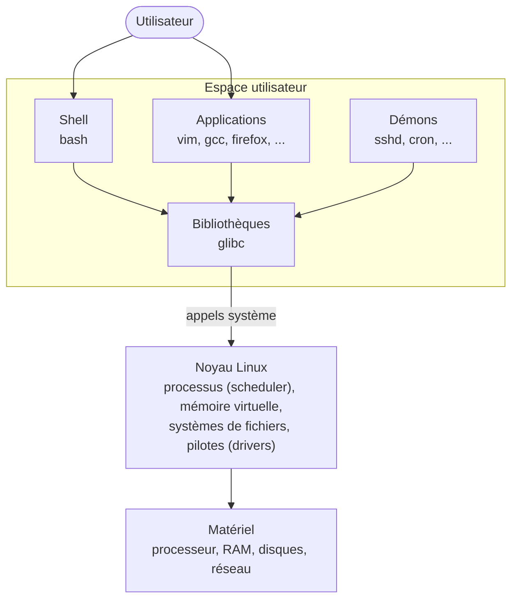

Les tâches (services) du système d'exploitation sont assurées par des processus qui fonctionnent en permanence en tâche de fond : les **démons** (*daemons*). Leur nom se termine souvent par un `d` : `sshd`, `cron`, `systemd`, ...

**Le noyau** est en charge des opérations de base :

- la gestion des périphériques (à travers les pilotes de périphériques, *drivers*), de la mémoire, des processus et des démons ;
- le contrôle des échanges de données (par exemple TCP/IP) entre les programmes et le matériel ;
- l'ordonnancement des processus et le partage du temps processeur (*scheduler*) ;
- la gestion de la mémoire virtuelle.

**Le shell** constitue l'interface entre le noyau et l'utilisateur. Les shells les plus courants sont :

- le **Bourne Shell** (`sh`) : le shell historique d'UNIX, référence pour l'écriture de scripts portables ;
- le **C Shell** (`csh`) : une variante avec une syntaxe proche du langage C ;
- le **Bourne Again Shell** (`bash`) : compatible avec le Bourne Shell, il ajoute l'historique des commandes, les alias et l'édition de la ligne de commande. C'est le shell par défaut de la plupart des distributions Linux (Debian, Ubuntu, Fedora, ...).

**Le système de fichiers** organise les données en une hiérarchie unique de répertoires, sous-répertoires et fichiers dont le sommet est la racine `/` (voir [Manipuler des fichiers](#manipuler-des-fichiers)).

**La zone de swap** est utilisée lorsque la mémoire physique (RAM) est pleine : les pages mémoire (blocs de taille fixe) inactives depuis un certain temps sont déplacées dans la zone de swap, sur le disque. Elle peut être une partition dédiée ou un simple fichier (`/swapfile`). La commande `free -h` affiche l'occupation de la RAM et du swap.

---

## Histoire d'UNIX et de la famille UNIX

### Aux origines : Multics et les Bell Labs

Au milieu des années 1960, le MIT, General Electric et les Bell Labs d'AT&T développent **Multics**, un système d'exploitation à temps partagé très ambitieux. Jugé trop complexe et trop coûteux, le projet est abandonné par les Bell Labs en 1969.

La même année, deux chercheurs des Bell Labs, **Ken Thompson** et **Dennis Ritchie**, écrivent sur un mini-ordinateur **PDP-7** de DEC inutilisé un système beaucoup plus simple. Brian Kernighan le baptise par jeu de mots *Unics* (par opposition à Multics), nom qui devient **UNIX**. Le premier système UNIX date donc de **1969**.

### UNIX et le langage C

UNIX est porté dès 1970 sur le **PDP-11**, puis connaît une évolution décisive : en 1973, son noyau est réécrit dans un nouveau langage, le **C**, créé par Dennis Ritchie à partir du langage B de Ken Thompson. Jusque-là, un système d'exploitation était écrit en assembleur et donc lié à un modèle de machine : écrit en C, UNIX devient **portable** et peut être adapté à d'autres ordinateurs. La même année, Doug McIlroy fait ajouter les **tubes** (*pipes*), qui fondent la [philosophie UNIX](#philosophie-unix) de programmes qui collaborent.

À cause d'une décision antitrust, AT&T n'a pas le droit de commercialiser des logiciels. L'entreprise distribue donc UNIX aux universités pour un prix symbolique, **avec son code source**. Après la publication de l'article *The UNIX Time-Sharing System* en 1974, UNIX se répand dans les universités du monde entier, où des générations d'étudiants l'étudient et l'améliorent. La **Version 7** (1979), qui introduit le Bourne shell (`sh`) et `awk`, est l'ancêtre commun de tous les UNIX.

### BSD, l'UNIX de Berkeley

À partir de 1977, l'université de Californie à Berkeley distribue ses propres améliorations d'UNIX sous le nom de **BSD** (*Berkeley Software Distribution*). L'étudiant **Bill Joy** y écrit l'éditeur `vi` et le C shell (`csh`). BSD fonctionne sur les **VAX** de DEC avec une gestion de la mémoire virtuelle (3BSD, 1979).

Financé par l'armée américaine (DARPA), BSD intègre en 1983 (4.2BSD) une **pile TCP/IP** et l'interface des *sockets* : c'est grâce à BSD que les protocoles d'Internet se diffusent sur les ordinateurs du monde entier.

Au début des années 1990, un procès intenté par AT&T freine BSD pendant deux ans. Il se conclut en 1994 par la publication de 4.4BSD-Lite, libéré de tout code AT&T, dont dérivent **FreeBSD**, **NetBSD** et **OpenBSD**.

### Les UNIX commerciaux et la normalisation

Au début des années 1980, AT&T commercialise UNIX sous le nom de **System V** (1983), puis son démantèlement en 1984 lui ouvre pleinement le marché de l'informatique. Les constructeurs développent alors leur propre UNIX à partir de System V ou de BSD : SunOS puis **Solaris** (Sun Microsystems, cofondée par Bill Joy), **HP-UX** (HP), **AIX** (IBM), **IRIX** (SGI) ou encore Xenix (Microsoft).

Ces UNIX propriétaires deviennent peu à peu incompatibles entre eux : c'est la « guerre des UNIX ». Pour y remédier, l'IEEE publie en 1988 la norme **POSIX** (*Portable Operating System Interface*), qui définit l'interface commune (appels système, shell, commandes) que doit offrir un système de type UNIX. Aujourd'hui, le nom « UNIX » est une marque déposée de l'**Open Group**, qui certifie les systèmes conformes à la *Single UNIX Specification*.

### Le projet GNU et le logiciel libre

En 1983, **Richard Stallman**, chercheur au MIT, annonce le projet **GNU** (*GNU's Not UNIX*) : écrire un système d'exploitation complet, compatible avec UNIX, mais entièrement **libre**. Il crée en 1985 la *Free Software Foundation* (FSF) puis, en 1989, la licence **GNU GPL** qui garantit les quatre libertés présentées plus haut.

Le projet GNU produit les outils essentiels d'un système UNIX : le compilateur GCC, le débogueur GDB, l'éditeur GNU Emacs, le shell `bash`, les commandes de base (`ls`, `cp`, `grep`, ...), la bibliothèque C... Au début des années 1990, il ne manque plus que le **noyau** : GNU Hurd, commencé en 1990, n'est toujours pas utilisable.

### Linux

En 1987, le professeur **Andrew Tanenbaum** publie **Minix**, un petit UNIX destiné à l'enseignement. En l'utilisant, **Linus Torvalds**, étudiant à l'université d'Helsinki, écrit son propre noyau et l'annonce le 25 août 1991 sur le forum de Minix :

> « Je fais un système d'exploitation (gratuit) (juste un passe-temps, ce ne sera pas gros et professionnel comme GNU) pour les clones AT 386(486). »

En 1992, Linux passe sous licence GPL. Le noyau Linux associé aux outils GNU forme enfin un système complet et libre : **GNU/Linux**. Les **distributions** apparaissent rapidement : Slackware et Debian (1993), Red Hat (1994), puis Ubuntu (2004)...

### La famille UNIX aujourd'hui

UNIX désigne une super-famille de systèmes (souvent notée **\*NIX**) qui se compose de trois grandes branches :

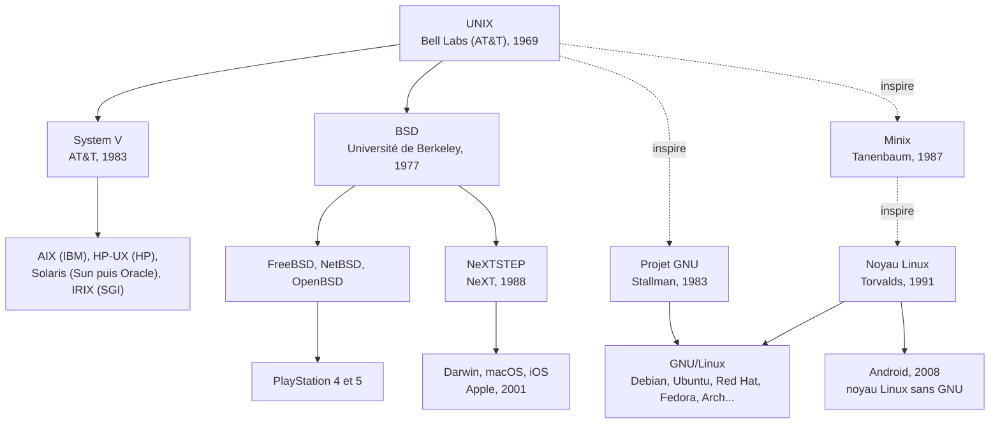

| Branche | Origine | Systèmes actuels | Utilisation |
|---|---|---|---|
| **System V** | AT&T | AIX, HP-UX, Solaris | serveurs d'entreprise (en déclin) |
| **BSD** | Université de Berkeley | FreeBSD, NetBSD, OpenBSD, macOS, iOS | serveurs, réseau, sécurité, ordinateurs et téléphones Apple, consoles de jeu |
| **Clones** (*Unix-like*) | réécrits sans le code d'AT&T | Minix, GNU/Linux, Android | serveurs, cloud, superordinateurs, embarqué, smartphones |

On nomme « famille UNIX », « systèmes de type UNIX » (*Unix-like*) ou simplement « systèmes UNIX » l'ensemble de ces systèmes. Ils respectent plus ou moins les normes **POSIX** et la *Single UNIX Specification* : macOS est officiellement certifié UNIX, alors que Linux, sans être certifié, est largement compatible POSIX.

Linux est aujourd'hui le plus répandu de la famille : il équipe la majorité des serveurs du web et du cloud, la totalité des 500 superordinateurs les plus puissants du monde (depuis 2017), une grande partie des objets connectés (box, télévisions, voitures...) et, avec **Android**, la majorité des smartphones.

> **Remarque** : Android utilise le noyau Linux mais pas les outils GNU (il a sa propre bibliothèque C, *Bionic*). C'est pourquoi on parle de système « basé sur Linux mais pas sur GNU ».

Un arbre généalogique complet des UNIX est maintenu par Éric Lévénez : [www.levenez.com/unix](http://www.levenez.com/unix/).

### Les grandes figures

| Personne | Contributions |
|---|---|
| [Ken Thompson](https://fr.wikipedia.org/wiki/Ken_Thompson) | UNIX, langage B, [Plan 9](https://fr.wikipedia.org/wiki/Plan_9_from_Bell_Labs), [UTF-8](https://fr.wikipedia.org/wiki/UTF-8), langage Go |
| [Dennis Ritchie](https://fr.wikipedia.org/wiki/Dennis_Ritchie) | UNIX, langage C, Plan 9 |
| [Brian Kernighan](https://fr.wikipedia.org/wiki/Brian_Kernighan) | le nom « UNIX », le livre *The C Programming Language* (avec Dennis Ritchie), `awk` (le « k » de awk) |
| Doug McIlroy | les tubes (*pipes*), la philosophie UNIX |
| [Bill Joy](https://fr.wikipedia.org/wiki/Bill_Joy) | BSD, `vi`, `csh`, la pile TCP/IP de BSD, cofondateur de Sun Microsystems (Java) |
| Richard Stallman | projet GNU, licence GPL, FSF, GNU Emacs, GCC, GDB, GNU make, GNU Hurd |
| Andrew Tanenbaum | Minix |
| Steve Jobs | Apple, NeXT (NeXTcube, NeXTSTEP), puis macOS |
| Linus Torvalds | noyau Linux, Git |

> **Remarque** : Ken Thompson et Dennis Ritchie ont reçu en 1983 le prix Turing, la plus haute distinction en informatique, pour la création d'UNIX.

### Chronologie

| Année | Événement |
|---|---|
| 1964 | Lancement de Multics (MIT, General Electric, Bell Labs) |
| 1969 | Ken Thompson et Dennis Ritchie écrivent le premier UNIX sur un PDP-7 aux Bell Labs d'AT&T |
| 1971 | UNIX fonctionne sur PDP-11 ; première édition du manuel UNIX |
| 1972 | Dennis Ritchie crée le langage C |
| 1973 | Le noyau UNIX est réécrit en C ; apparition des tubes (*pipes*) |
| 1974 | Publication de l'article *The UNIX Time-Sharing System* : UNIX se diffuse dans les universités |
| 1976 | Apple I de Steve Jobs et Steve Wozniak : débuts de la micro-informatique |
| 1977 | Début de BSD à l'université de Berkeley |
| 1978 | Brian Kernighan et Dennis Ritchie publient *The C Programming Language* |
| 1979 | UNIX Version 7 (Bourne shell, `awk`) ; 3BSD fonctionne sur les VAX de DEC |
| 1982 | Fondation de Sun Microsystems ; AT&T tourne le film *The UNIX System* |
| 1983 | System V d'AT&T ; 4.2BSD intègre TCP/IP ; Richard Stallman annonce le projet GNU |
| 1985 | Création de la Free Software Foundation ; Steve Jobs fonde NeXT |
| 1987 | Andrew Tanenbaum publie Minix |
| 1988 | Norme POSIX |
| 1989 | Licence GNU GPL ; shell `bash` |
| 1990 | Tim Berners-Lee crée le Web au CERN sur une station NeXT |
| 1991 | Linus Torvalds annonce Linux (25 août) |
| 1992 | Linux passe sous licence GPL ; Ken Thompson et Rob Pike conçoivent l'encodage UTF-8 |
| 1993 | Slackware, Debian, FreeBSD, NetBSD |
| 1994 | Linux 1.0 ; 4.4BSD-Lite |
| 1995 | OpenBSD |
| 1997 | Apple rachète NeXT |
| 1998 | Apparition du terme « open source » |
| 2001 | Mac OS X, basé sur Darwin (BSD) |
| 2004 | Ubuntu |
| 2005 | Linus Torvalds crée Git |
| 2007 | Licence GPL version 3 ; iPhone |
| 2008 | Premier smartphone Android |
| 2017 | Linux équipe les 500 superordinateurs les plus puissants du monde |
| 2019 | UNIX fête ses 50 ans |

> **Remarque** : UNIX compte le temps en secondes écoulées depuis le 1er janvier 1970 à 0 h UTC (l'*epoch*). La commande `date +%s` affiche cette valeur.

### Culture du logiciel libre

Quelques textes fondateurs de la culture UNIX, Internet et logiciel libre :

- **La licence GPL** (*GNU General Public License*, 1989, version 3 en 2007) : elle garantit les quatre libertés du logiciel libre et impose le *copyleft* : toute version modifiée et redistribuée d'un logiciel sous GPL doit rester sous GPL. Les licences BSD ou MIT sont au contraire dites **permissives** : elles autorisent la réutilisation du code dans un logiciel propriétaire (ce qu'ont fait Apple pour macOS ou Sony pour la PlayStation).
  [opensource.org/licenses/GPL-3.0](https://opensource.org/licenses/GPL-3.0) - [Wikipédia : Licence publique générale GNU](https://fr.wikipedia.org/wiki/Licence_publique_g%C3%A9n%C3%A9rale_GNU)
- **La cathédrale et le bazar** (Eric S. Raymond, 1997) : compare le développement « cathédrale », mené par un petit groupe fermé, au modèle « bazar » de Linux, ouvert à tous avec des publications fréquentes. Le texte énonce la « loi de Linus » : « avec suffisamment d'yeux, tous les bugs sont superficiels ».
  [Texte original](http://www.catb.org/~esr/writings/cathedral-bazaar/cathedral-bazaar/index.html) - [Wikipédia : La Cathédrale et le Bazar](https://fr.wikipedia.org/wiki/La_Cath%C3%A9drale_et_le_Bazar)
- **Homesteading the Noosphere** (« À la conquête de la noosphère », Eric S. Raymond, 1998) : analyse les règles implicites de propriété et la culture du don dans les projets open source (réputation, droit de modifier un projet, *forks*).
  [Wikipédia (en)](https://en.wikipedia.org/wiki/Homesteading_the_Noosphere) - [Article (archive)](https://web.archive.org/web/20100701065515/http://opensource.mit.edu/papers/stewartgosain2.pdf)
- **Déclaration d'indépendance du cyberespace** (John Perry Barlow, 1996) : texte fondateur de la culture libertaire d'Internet, écrit par l'un des fondateurs de l'EFF (*Electronic Frontier Foundation*).
  [eff.org/cyberspace-independence](https://www.eff.org/cyberspace-independence) - [Wikipédia : Déclaration d'indépendance du cyberespace](https://fr.wikipedia.org/wiki/D%C3%A9claration_d'ind%C3%A9pendance_du_cyberespace)

### UNIX en images et en vidéos

- Vidéo : [AT&T Archives: The UNIX Operating System](https://www.youtube.com/watch?v=tc4ROCJYbm0) : le film d'AT&T de 1982, avec Ken Thompson, Dennis Ritchie et Brian Kernighan
- Vidéo : [Where GREP Came From - Computerphile](https://www.youtube.com/watch?v=NTfOnGZUZDk) : Brian Kernighan raconte la naissance de `grep`
- Les machines d'UNIX : le [PDP-7](https://fr.wikipedia.org/wiki/PDP-7) (1969), le [PDP-11](https://fr.wikipedia.org/wiki/PDP-11) (1970) et le [VAX](https://fr.wikipedia.org/wiki/VAX) de BSD ([photo d'un VAX 11/780](https://virtuallyfun.com/wp-content/uploads/2009/06/vax.jpg))
- [L'Apple I](https://i0.wp.com/www.apple2history.org/wp-content/uploads/2008/11/applei.jpg?ssl=1) (1976)
- [Le NeXT de Tim Berners-Lee](https://static.techno-science.net/illustration/Definitions/1200px/f/first-web-server_0451b7775b0ff60c530e897c31ea3ad1.jpg), premier serveur web de l'histoire
- [L'annonce de Linux](https://next.ink/wp-content/uploads/2025/08/image-97.png) par Linus Torvalds (1991)
- [Wikipédia : Unix](https://fr.wikipedia.org/wiki/Unix)

---

## Philosophie UNIX

### « L'univers a 50 ans »

UNIX a marqué à jamais l'histoire de l'informatique et continue à le faire, ceci pour une raison très simple : derrière cette famille de systèmes, il y a une idée ou plutôt un ensemble d'idées et de préceptes. Derrière UNIX, il y a une philosophie qui sert de ligne de conduite et de fil d'Ariane. Comprendre cette philosophie et la respecter le mieux possible assure une stabilité et une pérennité sans précédent.

Résumer la philosophie d'UNIX n'est pas chose évidente. Il s'agit d'un ensemble de principes. Nombreux sont ceux qui ont essayé de les résumer ou les lister (taper « philosophie UNIX » ou « *less is more* » dans un moteur de recherche).

### Des programmes qui effectuent une seule chose et qui le font bien

Voilà la base de toutes choses dans le monde UNIX (« dans le monde » tout court peut-être également).

### Le silence est d'or

En d'autres termes, lorsqu'un programme n'a rien à dire, il doit garder le silence. Ce n'est que lorsqu'il y a un problème qu'un outil doit devenir bavard et signaler explicitement une erreur. Un programme qui fait ce qu'on lui demande n'affiche rien, ne signale rien. C'est le cas de la plupart des outils de base en ligne de commande.

### Des programmes qui collaborent

Si tous les programmes ne font, chacun, qu'une chose et qu'ils la font bien, ceci implique qu'ils doivent alors fonctionner de concert pour pouvoir achever des tâches plus importantes. Ces « briques » doivent alors collaborer les unes avec les autres du mieux possible. Le but est de former un système complet où la somme des parties est supérieure à l'ensemble. Lorsqu'on dispose d'un ensemble de briques fiables, il est possible de construire un mur solide.

### Des programmes pour gérer des flux de texte

Les flux de texte représentent une interface universelle (la seule ?). La notion de flux de texte est véritablement caractéristique des UNIX.

### Citations

> « Il est plus facile de définir un système d'exploitation par ce qu'il fait que par ce qu'il est. » **J.L. Peterson**

> « Unix est convivial. Cependant Unix ne précise pas vraiment avec qui. » **Steven King**

> « Unix ne dit jamais 's'il vous plaît'. » **Rob Pike**

> « Unix est simple. Il faut juste être un génie pour comprendre sa simplicité. » **Dennis Ritchie**

> « Unix n'a pas été conçu pour empêcher ses utilisateurs de commettre des actes stupides, car cela les empêcherait aussi des actes ingénieux. » **Doug Gwyn**

### Conclusion

Si je devais répondre à la question « Qu'est-ce qu'un UNIX? », je répondrais par ce type de commande (pleine de magie et d'intelligence) :

```bash
$ history | grep -v " h" | sed 's/[ \t]*$//' | sort -k 2 -r | uniq -f 1 | sort -n
```

*[Extrait d'un article de Denis Bodor dans GNU/Linux Magazine HS n°46]*

Chaque programme n'effectue qu'une seule tâche, et le tube `|` les fait collaborer en transmettant la sortie de l'un à l'entrée du suivant. Le résultat : l'historique des commandes, sans les doublons.


---

## Manipuler sous Linux

### L'interface homme-machine (IHM)

L'interface homme-machine (IHM) permet à un utilisateur de dialoguer avec la machine. On distingue deux types d'IHM :

- **GUI** (*Graphical User Interface*) ou « interface utilisateur graphique » : les parties les plus typiques de ce type d'environnement sont le pointeur de souris, les fenêtres, le bureau, les icônes, les boutons, les menus, les barres de défilement... Les systèmes d'exploitation grand public (Windows, MacOS, GNU/Linux, etc.) sont pourvus d'une interface graphique qui, dans un souci d'ergonomie, se veut conviviale, simple d'utilisation et accessible au plus grand nombre pour l'usage d'un ordinateur personnel.

- **CLI** (*Command Line Interface*) ou « interface en ligne de commande » est encore utilisée en raison de sa puissance, de sa grande rapidité, son uniformité, sa stabilité et du peu de ressources nécessaires à son fonctionnement. Le système d'exploitation permet cette possibilité par l'intermédiaire d'un interpréteur de commandes (le *shell*). Beaucoup de serveurs ne s'administrent qu'en ligne de commande.

### Conventions

Tous les exemples d'exécution des commandes sont précédés d'une invite utilisateur ou prompt spécifique au niveau des droits utilisateurs nécessaires sur le système :

- toute commande précédée de l'invite `$` ne nécessite aucun privilège particulier et peut être utilisée au niveau utilisateur simple ;
- toute commande précédée de l'invite `#` nécessite les privilèges du super-utilisateur (*root*).

Évidemment, il ne faudra jamais taper l'invite (`$` ou `#`) lorsque vous testerez par vous même les commandes indiquées.

### Conseils

**Travailler toujours en mode « plein écran ».**

N'utilisez pas la souris (ou très peu). Il existe beaucoup de raccourcis clavier et de touches « magiques » :

- la touche **tabulation** `→` (la plus utile) permet la complétion en ligne de commande. Le *shell* effectue la complétion en considérant successivement le texte comme une variable (s'il commence par `$`), un nom d'utilisateur (s'il commence par `~`), un nom d'hôte (s'il commence par `@`), ou une commande (y compris les alias et les fonctions). Si rien ne fonctionne, il essaye la complétion en nom de fichier.
- Les touches flèches `↑` et `↓` servent à parcourir l'historique des commandes déjà saisies.

**Utiliser plusieurs sessions shell** (ou onglets ou fenêtres) en parallèle. Par exemple, vous en utiliserez une pour saisir vos commandes et l'autre pour consulter les indispensables pages de manuel. Pour basculer de l'une à l'autre :

- en mode console : `Alt + Fx` (où x est un chiffre identifiant le terminal), ou `Ctrl + Alt + Fx` depuis l'interface graphique
- en mode graphique, avec 2 onglets : `Ctrl + Page↑` ou `Ctrl + Page↓`, `Shift + ←` ou `Shift + →`
- en mode graphique, avec 2 fenêtres : `Alt + Tab`

### Structure d'une commande

Une commande Unix est un ensemble de mots séparés par des espaces. Les caractères espace et tabulation sont interprétés comme des séparateurs par le shell (voir la variable `IFS`). La syntaxe d'une commande est la suivante :

```bash
$ commande [options] <parametres>
```

Le premier mot est le nom de la commande. Les autres mots sont des paramètres (ou arguments) de la commande. Certains mots sont des options qui changent le comportement de la commande. Les 2 crochets « `[` » et « `]` » indiquent que les options ne sont pas obligatoires. Il ne faut pas taper ces crochets sur la ligne de commande.

Une option courte est introduite par le signe « `-` » suivi d'une seule lettre : c'est la forme historique, toujours utilisée (et la seule définie par la norme POSIX). Les commandes GNU proposent en plus des options longues, plus lisibles : « `--` » suivi du nom de l'option (par exemple `ls -a` ou `ls --all`).

L'ordre des options n'a pas souvent d'importance :

```bash
$ ls --all -l --si
# ou
$ ls -l --si --all
$ ls -l $HOME/tmp
```

### Différents types de commande

Il existe plusieurs types de commandes :

- les **commandes internes** (au *shell*) : comme `history`, `test`, ...
- les **commandes externes** (donc des programmes) : comme `ls`, `mkdir`, ...
- les ***alias*** (voir plus loin) : comme `ll`, ...

Les commandes externes (donc des exécutables) sont généralement stockées dans un répertoire de nom `bin`. Il existe des exécutables dans :

- le répertoire `/sbin` : les commandes pour *root* (l'administrateur)
- le répertoire `/bin` : des commandes et des *shells*
- le répertoire `/usr/bin` : le répertoire de base des programmes

> **Remarque** : sur les distributions récentes, `/bin` et `/sbin` ne sont plus que des liens symboliques vers `/usr/bin` et `/usr/sbin` (voir l'[Annexe n°2](#annexe-2--larborescence-unixlinux)).

> **Remarque** : comme le système ne connaît pas les endroits où vous placez vos programmes, il faudra lui indiquer dans la variable d'environnement `$PATH`.

```bash
$ echo $PATH
/usr/local/sbin:/usr/local/bin:/usr/sbin:/usr/bin:/sbin:/bin

$ type echo
echo est une primitive du shell

$ type strings
strings est /usr/bin/strings

$ type ll
ll est un alias vers « ls -halF »
```

Il existe plusieurs modes d'exécution :

```bash
cmd      # exécute la commande cmd
cmd &    # exécute la commande cmd en tâche de fond (elle se détache alors du terminal)
! cmd    # inverse le code retour de la commande cmd (il y a un espace entre ! et cmd)
(cmd)    # exécute la commande cmd dans un sous-shell
```

### Obtenir de l'aide

Pour obtenir la page de manuel sur une commande, il faut taper par exemple :

```bash
$ man cat
```

On utilise les flèches pour se déplacer, la barre « espace » pour avancer d'une page et la touche `b` (*back*) pour reculer. La touche `q` (*quit*) permet de quitter. Vous pouvez faire une recherche en tapant `/motif` puis, vous pouvez vous déplacer sur les occurrences de motif en utilisant les touches `n` (*next*, en avant) et `N` (en arrière). La touche « Echap » `Esc` permet d'annuler la recherche.

La commande `man` donne accès aux pages de manuel qui sont réparties selon des sections comme suit :

- section 1 : commandes normales
- section 2 : appels systèmes
- section 3 : fonctions de programmation C
- section 4 : périphériques et pilotes de périphériques
- section 5 : format de fichiers
- section 6 : jeux
- section 7 : divers
- section 8 : administration du système

Par exemple, vous obtiendrez deux pages de manuel différentes :

```bash
$ man 1 mkdir
$ man 2 mkdir
```

Pour rechercher les pages faisant référence à un mot-clé ("mot-clé" peut être un mot simple ou le nom d'une commande), on utilise la commande :

```bash
$ apropos commande/mot-clé
```

Pour obtenir l'aide sur une commande, il faut taper par exemple :

```bash
$ cat --help
$ help echo
```

En résumé, **consultez le manuel** (*RTFM : Read The Fine Manual*) :

- `man` : les pages de manuel (`man man`, `man ls`, ...) ;
- `apropos` : recherche un mot-clé dans la totalité du manuel ;
- `whatis` : affiche la description courte d'une page de manuel ;
- `help` : affiche un court résumé des commandes internes du *shell* ;
- l'option `--help` : affiche l'aide-mémoire d'une commande ;
- `info` : la documentation au format *info* du projet GNU (`info info`, `info ls`, ...).

### Environnement de travail

Il vous faut ouvrir une **session** sur votre poste de travail. Vous pouvez utiliser soit le mode console (CLI) soit l'interface graphique (GUI). Dans les deux cas, vous pouvez travailler **« en ligne de commande »** (CLI).

> **Remarque** : Une « session » est l'ensemble des actions effectuées par l'utilisateur d'un système informatique, entre le moment où il se connecte à celui-ci et le moment où il s'en déconnecte.

- ouvrir une session locale : `login` (en mode console), `su` (changer d'utilisateur) ;
- ouvrir une session distante : `ssh` (connexion chiffrée ; l'ancien `telnet` transmettait tout en clair, y compris le mot de passe) ;
- l'invite de commande (*prompt*), définie par la variable `PS1`, se termine par `$` pour un utilisateur et par `#` pour *root* ;
- la variable `PATH` indique où chercher les commandes, la variable `SHELL` le *shell* de l'utilisateur ;
- fermer une session : `logout`, `exit` ou `Ctrl + D`.

> **Remarque** : on ne tape pas soi-même la commande `login` (lancée depuis un *shell*, elle échoue sans les droits *root*). C'est le système qui la lance : sur chaque console texte (accessible depuis l'interface graphique par `Ctrl + Alt + F3` à `F6`), le programme `getty` affiche l'invite `login:` puis passe la main à `login`, qui vérifie l'identifiant et le mot de passe avant de démarrer le *shell* de l'utilisateur. En mode graphique, c'est le gestionnaire de connexion (`gdm`, `sddm`, ...) qui joue ce rôle.

### Shell Bash

Bash (*Bourne-again shell*) est le shell du projet GNU. Bash est un logiciel libre publié sous GNU GPL. Il est l'interprète par défaut sur de nombreux Unix libres, notamment sur les systèmes GNU/Linux. Ce fut aussi le shell par défaut de Mac OS X (remplacé par `zsh` depuis macOS 10.15 en 2019) et il a été porté sous Windows par le projet Cygwin ; il est aussi disponible sous Windows avec WSL.

Aujourd'hui `bash` est le shell le plus répandu, bien qu'il existe beaucoup d'autres interpréteurs de commandes, comme `sh`, `ksh`, `csh`, `tcsh`, `zsh`, `ash`, ...

Un shell Unix, aussi nommé interface en ligne de commande Unix, est un shell destiné au système d'exploitation Unix et de type Unix. L'utilisateur lance des commandes sous forme d'une entrée texte exécutée ensuite par le shell. Celui-ci est utilisable en conjonction avec un terminal (souvent virtuel).

Sous Microsoft Windows, le programme analogue était `command.com` (MS-DOS) puis `cmd.exe` ; c'est aujourd'hui PowerShell.

Le shell (coquille) est une interface permettant d'accéder au noyau (kernel) d'un système d'exploitation.

Tout processus Unix/Linux démarre avec 3 flux déjà ouverts :

- un pour l'**entrée des données** (canal 0)
- un pour la **sortie des données** (canal 1)
- un pour les **messages d'erreur** (canal 2)

> **Remarque** : un processus (identifié par un PID) est un programme en cours d'exécution.

Par défaut, ces flux sont :

- 0 : le **clavier** (*stdin* : *standard input*)
- 1 : l'**écran** (*stdout* : *standard output*)
- 2 : l'**écran** (*stderr* : *standard error*)

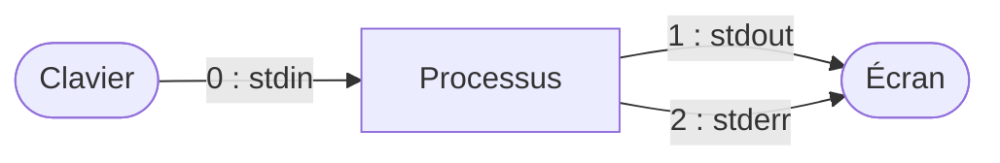

> **Remarque** : `/dev/null` est un fichier spécial qui fait disparaître tout ce qu'on y écrit. On l'utilise pour se débarrasser des messages d'erreur d'une commande : `commande 2> /dev/null`.

Il est possible de **rediriger ces flux** vers des fichiers (en utilisant les opérateurs `<`, `>`, `<<` et `>>`) ou vers des processus en utilisant un tube (*pipe*). Un tube (`|`) est un canal entre deux processus (redirection de la sortie d'un processus vers l'entrée d'un autre processus).

Par exemple, la ligne `cmd1 < fichier.txt 2> erreurs.txt | cmd2 > resultat.txt` réalise les redirections suivantes :

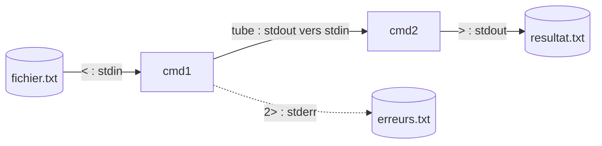

### Historique des commandes

Le shell permet de rappeler les commandes précédemment exécutées. Pour cela, vous pouvez utiliser les touches flèches `↑` et `↓`.

```bash
# Visualiser l'ensemble de l'historique :
$ history
# ou
$ history | more

# Rechercher une commande : (voir aussi Ctrl + r)
$ history | grep commandeRecherchée

# Rappeler une commande et l'exécuter :
$ !ls     # rappelle la dernière commande commençant par ls
$ !100    # rappelle la commande n° 100
$ !!      # rappelle la dernière commande
$ !10:p   # rappelle la commande n°10 et l'affiche (aucune exécution)

# Formes syntaxiques :
# !$  : correspond au dernier argument de la dernière commande
# !*  : représente tous les arguments de la dernière commande (sans le nom de la commande)

# Effacer l'historique
$ history -c
```

Vous pouvez également rechercher une commande précédemment tapée via le raccourci `Ctrl + r`. Tapez les premières lettres de la commande recherchée, et la recherche se met à jour au fur et à mesure. Vous pouvez alors appuyer à nouveau sur `Ctrl + r` afin de sélectionner un résultat plus ancien. Enfin, tapez `Enter` pour valider, ou `Ctrl + g` pour annuler.

L'aide de la commande interne `history` se trouve dans :

```bash
$ help history

$ man bash
# Pour rechercher dans l'aide faire : /history
# puis on se déplace avec n (en avant) ou N (en arrière)

# Ou :
$ man bash | colcrt | grep -E -A 5 history

# Les options -A (After) -B (Before) -C (autour) -n (numéro de ligne) de la commande grep
```

### Groupement de commandes

Il est possible de grouper plusieurs commandes :

```bash
cmd1 ; cmd2    # exécution séquentielle de cmd1 puis cmd2
cmd1 | cmd2    # tube (pipe) entre cmd1 et cmd2
cmd1 && cmd2   # si cmd1 retourne VRAI alors cmd2 sera exécuté
cmd1 || cmd2   # si cmd1 retourne FAUX alors cmd2 sera exécuté
```

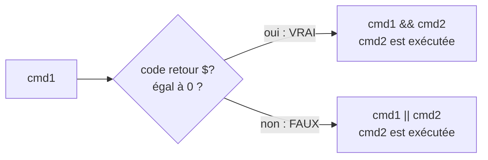

Le groupement `||` est notamment adapté à l'envoi conditionné de messages d'erreurs :

```bash
$ rm fff || echo "Houston, on a un problème !"
$ ls || echo "Houston, on a un problème !"
```

Le groupement `&&` est notamment adapté à l'exécution d'un programme (cmd2) conditionné par la bonne exécution d'un autre programme (cmd1) :

```bash
$ ls *.txt && rm -f *.txt
$ ls *.log && rm -f *.log
```

La commande `test` permet de réaliser de nombreux tests et de retourner le résultat du test sous forme d'un code retour (`$?`) :

```bash
$ touch test.log  # crée un fichier vide

$ test -s test.log || echo "le fichier est vide"
le fichier est vide

$ test -e test.log && echo "le fichier existe"
le fichier existe

$ test -x test.log && echo "le fichier est executable"

$ help test
```

Tous les processus se terminant renvoient un **code de retour** au *shell*. Ce code de retour est accessible par la variable **`$?`** et traduit (le plus souvent) l'état de l'exécution du programme. On utilise un programme pour remplir une tâche (processus) et celui-ci nous donne un rapport booléen par le code retour : VRAI (la tâche a été accomplie avec succès) et FAUX (la tâche a rencontré une erreur). Au minimum sous Unix/Linux, le code de retour sera 0 (ok) ou 1 (erreur), mais dans le cas d'une autre valeur numérique, il pourra aussi traduire un type d'erreur :

```bash
$ ls ; echo $?
0

$ rm zzz* ; echo $?
1

$ ls zzz ; echo $?
2
```

### Gérer les processus

Une commande, une fois lancée, devient un **processus** : l'image en cours d'exécution d'un programme (son code, ses données et les informations que le noyau conserve sur lui).

Chaque processus est identifié par un **PID** (*Process IDentifier*) et connaît le PID de son parent, le **PPID** (*Parent Process IDentifier*). Les processus sont donc organisés en arbre : chacun d'eux a un seul et unique parent, et l'ancêtre de tous les autres porte le PID 1 (historiquement le programme `init`, aujourd'hui `systemd` sur la plupart des distributions). Dans un système multitâche, c'est l'**ordonnanceur** (*scheduler*) du noyau qui répartit le temps processeur entre les processus.

Exemple (simplifié) d'arbre des processus, tel que l'affiche `pstree` :

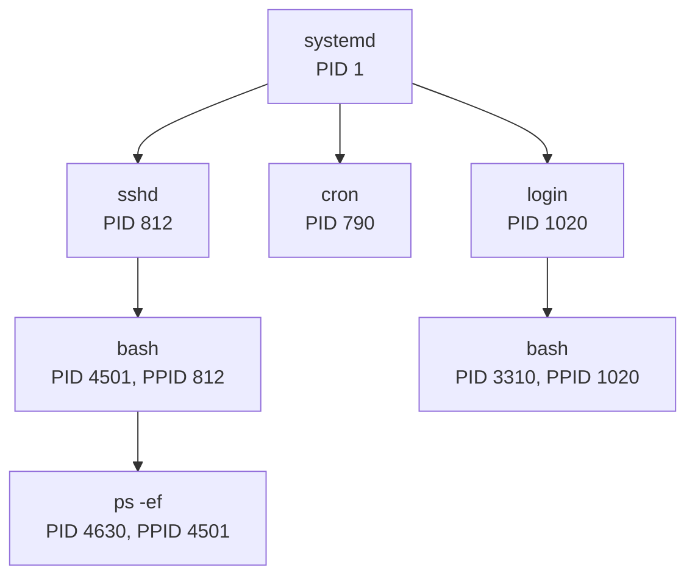

> **Remarque** : dans cet arbre, `login` est le processus qui a authentifié un utilisateur sur une console texte, puis lancé son `bash` ; de la même façon, `sshd` a lancé le `bash` d'une connexion à distance. Dans une session graphique, `pstree` affiche à la place le gestionnaire de connexion (`gdm`) et le terminal graphique (`gnome-terminal`).

```bash
$ ps -ef                  # liste tous les processus (voir aussi ps aux)
$ pstree                  # affiche l'arbre des processus
$ top                     # affiche les processus en temps réel (q pour quitter)
$ pidof bash              # affiche le PID des processus bash (voir aussi pgrep)

$ sleep 300 &             # lance une commande en arrière-plan
[1] 12345
$ jobs                    # liste les tâches lancées depuis ce shell
[1]+  En cours d'exécution   sleep 300 &
$ kill %1                 # envoie le signal TERM à la tâche n°1 (ou kill 12345)
$ kill -l                 # liste les signaux disponibles
```

- `kill`, `killall`, `pkill` : envoient un **signal** à un ou plusieurs processus pour l'interrompre, le stopper, le terminer (`TERM`, par défaut) ou le tuer (`KILL`, `kill -9`) ;
- `&` à la fin de la ligne de commande : lance la commande en arrière-plan ;
- `nohup` : détache le processus du terminal (il continue après la fermeture de la session) ;
- `Ctrl + C` interrompt la commande au premier plan, `Ctrl + Z` la met en pause ; `fg` et `bg` la relancent au premier plan ou en arrière-plan (voir le diagramme ci-dessous) ;
- `at` : lance des commandes à une heure précise (exécution différée) ;
- `batch` : exécute des commandes lorsque la charge du système le permet ;
- `cron` (`crontab -e`) : planifie l'exécution périodique de commandes.

Les états d'une tâche lancée depuis le shell :

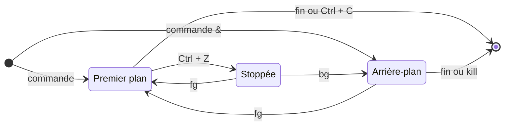

### Installer des logiciels : les paquets

Sous Linux, les logiciels sont fournis sous forme de **paquets** (*packages*), téléchargés depuis les **dépôts** (*repositories*) de la distribution. Sur Debian et Ubuntu, ce sont des fichiers `.deb`. Un paquet contient :

- des fichiers qui le décrivent (description, version, signature, dépendances, ...) ;
- les fichiers à installer ;
- des scripts qui s'exécutent avant ou après l'installation ou la suppression.

Les gestionnaires de paquets Debian :

- `dpkg` : l'outil de base pour installer, créer, supprimer et gérer des paquets `.deb` ;
- **APT** (`apt`, `apt-get`) : télécharge les paquets depuis les dépôts et gère automatiquement les dépendances ;
- `aptitude` : une autre interface en ligne de commande à APT ;
- `synaptic` : une interface graphique à APT.

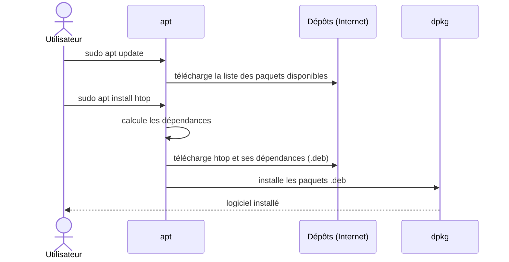

```bash
# apt update              # met à jour la liste des paquets disponibles
# apt upgrade             # met à jour les paquets installés
$ apt search htop         # recherche un paquet
# apt install htop        # installe un paquet et ses dépendances
# apt remove htop         # supprime un paquet
$ dpkg -l                 # liste les paquets installés
$ dpkg -L htop            # liste les fichiers installés par un paquet
```

> **Remarque** : les commandes précédées de `#` nécessitent les droits *root* : on les lance avec `sudo` (par exemple `sudo apt install htop`).

D'autres familles de distributions utilisent d'autres formats : **RPM** (*Red Hat Package Manager*) avec `dnf` sur Red Hat et Fedora, `pacman` sur Arch Linux, `.tgz` sur Slackware... Voir aussi [le mémo apt](serveur_LAMP/apt.md).

### Une liste de commandes de base

Voir l'[Annexe n°1](#annexe-1--une-liste-de-commandes-de-base) et le mémento des [commandes de base](linux_commandes_base.md).

---

## Manipuler des fichiers

### Système de fichiers

Un système de fichiers (*filesystem*) est une structure de données permettant de stocker les informations et de les organiser dans des fichiers sur ce que l'on appelle des mémoires secondaires ou de stockage (disque dur, disquette, CD-ROM, clé USB, etc.). Il faut faire une opération de **formatage** pour créer et initialiser un système de fichiers sur une partition. Une partition ne peut contenir qu'un seul système de fichiers.

> **Remarque** : Il faut préalablement partitionner son disque (avec `fdisk` par exemple) avant de pouvoir installer un système de fichiers.

Une telle gestion des fichiers permet de traiter, de conserver des quantités importantes de données ainsi que de les partager entre plusieurs programmes informatiques. Il offre à l'utilisateur une vue abstraite sur ses données et permet de les localiser à partir d'un chemin d'accès.

> **Remarque** : Il existe d'autres façons d'organiser les données, par exemple les bases de données.

Pour l'utilisateur, un système de fichiers est vu comme une arborescence : les fichiers sont regroupés dans des répertoires (concept utilisé par la plupart des systèmes d'exploitation). Ces répertoires contiennent soit des fichiers, soit d'autres répertoires. Il y a donc un répertoire racine et des sous-répertoires. Une telle organisation génère une hiérarchie de répertoires et de fichiers organisés en arbre.

Il existe de très nombreux systèmes de fichiers différents : FAT, NTFS, HFS, ext2, ext3, UFS, reiserfs, ISO 9660, etc.

Sous Linux, le plus courant est aujourd'hui **ext4** ; on rencontre aussi Btrfs et XFS, ainsi que exFAT sur les clés USB et APFS sur les Mac. La commande `df -Th` affiche le type des systèmes de fichiers montés.

### Chemin d'accès

Le chemin d'accès d'un fichier ou d'un répertoire est une chaîne de caractères décrivant la position de ce fichier ou répertoire dans le système de fichiers. Chemins d'accès selon le système d'exploitation :

| OS | Répertoire racine | Séparateur de répertoire |
|---|---|---|
| Système de type Unix/Linux | `/` | `/` |
| DOS et ses dérivés (OS/2 et Microsoft Windows) | `<lettredulecteur>:\` | `\` |
| Classic Mac OS | `<nomdudisque>:` | `:` |

> **Remarque** : les systèmes Unix/Linux disposent d'une arborescence unique.

On distingue deux types de chemins d'accès :

- le **chemin absolu** dont la référence est la **racine**. Sous UNIX/Linux, un chemin absolu commence toujours par `/`.
- le **chemin relatif** dont la référence est le **répertoire courant** (`.`), le **répertoire parent** (`..`) ou le répertoire personnel (`~`).

Les exemples suivants s'appuient sur l'arborescence ci-dessous (rectangles : répertoires, formes arrondies : fichiers) :

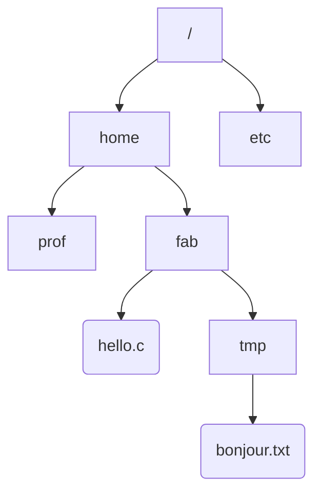

**Quel est le chemin d'accès à "hello.c"?**

- Avec un chemin d'accès absolu : `/home/fab/hello.c`
- Avec un chemin d'accès relatif : tout dépend de l'endroit où on exécute la commande, c'est-à-dire le répertoire de travail (ou répertoire courant). Pour cela, on peut utiliser deux références connues du système d'exploitation : le répertoire courant (noté `.`) ou le répertoire parent (noté `..`) :
  - Supposons que le répertoire courant est `prof`, on pourra désigner `hello.c` par `../fab/hello.c`
  - Supposons que le répertoire courant est `fab`, on pourra désigner `hello.c` par `./hello.c`

**Quel est le chemin d'accès à "bonjour.txt"?**

- Avec un chemin d'accès absolu : `/home/fab/tmp/bonjour.txt`
- Avec un chemin d'accès relatif : tout dépend de l'endroit où on exécute la commande, c'est-à-dire le répertoire de travail (ou répertoire courant). Pour cela, on peut utiliser deux références connues du système d'exploitation : le répertoire courant (noté `.`) ou le répertoire parent (noté `..`) :
  - Supposons que le répertoire courant est `prof`, on pourra désigner `bonjour.txt` par `../fab/tmp/bonjour.txt`
  - Supposons que le répertoire courant est `fab`, on pourra désigner `bonjour.txt` par `./tmp/bonjour.txt`

### Structure de l'arborescence Unix/Linux

Les principaux répertoires d'un système GNU/Linux :

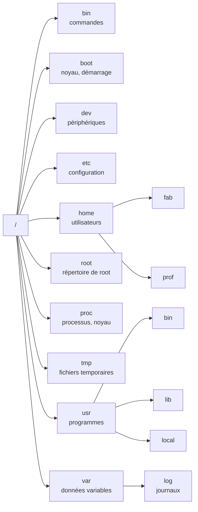

Voir l'[Annexe n°2](#annexe-2--larborescence-unixlinux) pour la liste détaillée.

### Les Fichiers

Un fichier est une suite d'octets portant un nom et conservé dans une mémoire.

Le contenu du fichier peut représenter n'importe quelle donnée binaire : un programme, une image, un texte, etc.

Les fichiers sont classés dans des groupes appelés répertoires, chaque répertoire peut contenir d'autres répertoires, formant ainsi une organisation arborescente appelée système de fichiers.

Les fichiers sont la plupart du temps conservés (stockés) sur des mémoires de masse tels que les disques durs mais il existe aussi des systèmes de fichiers en RAM (`ramfs` par exemple).

Dans un système d'exploitation multiutilisateurs, les programmes qui manipulent le système de fichier effectuent des contrôles d'accès (notion de droits).

**Quelques caractéristiques de base des fichiers :**

- Le nommage et ses restrictions (nombre de caractères, caractères autorisés)
- Le chemin d'accès est une "formule" qui sert à indiquer l'emplacement où se trouve un fichier dans l'arborescence du système de fichier. La syntaxe diffère d'un système d'exploitation à l'autre.
- La taille du fichier indique la quantité d'informations conservée (exprimée en octets) en sachant que la taille physique (réellement occupée) est légèrement supérieure à la taille du fichier en raison de l'utilisation de blocs d'allocation de taille fixe.
- L'extension est un suffixe (précédé d'un point '.') ajouté au nom du fichier pour indiquer la nature de son contenu. L'usage des extensions est une pratique généralisée sur les systèmes d'exploitation Windows et une pratique courante sur les systèmes d'exploitation Unix.
- Les données descriptives : la date de création et de modification, le propriétaire du fichier ainsi que les droits d'accès ...

Chaque fichier est vu par le système de fichiers de plusieurs façons :

- un descripteur de fichier (souvent un entier unique) permettant de l'identifier ;
- une entrée dans un répertoire permettant de le situer et de le nommer ;
- des métadonnées sur le fichier permettant de le définir et de le décrire ;
- un ou plusieurs blocs (selon sa taille) permettant d'accéder aux données du fichier (son contenu).

> **Métadonnées** : des données servant à définir ou décrire d'autres données

Le terme **inode** désigne le **descripteur d'un fichier** sous UNIX/Linux. Les inodes (contraction de « *index* » et « *node* », en français : nœud d'index) sont des structures de données contenant des informations concernant les fichiers stockés dans certains systèmes de fichiers (notamment de type Linux/Unix).

À chaque fichier correspond un numéro d'inode (*inumber*) dans le système de fichiers dans lequel il réside, unique au périphérique sur lequel il est situé. Un inode occupera 128 ou 256 octets (taille définie à la création du système de fichiers suivant la version).

**Les métadonnées les plus courantes sous UNIX sont :**

- les droits d'accès en lecture, écriture et exécution selon l'utilisateur, le groupe, ou les autres ;
- les dates de dernier accès, de modification des métadonnées (inode), de modification des données (block) ;
- les identifiants du propriétaire et groupe propriétaire du fichier ;
- la taille du fichier ;
- le nombre d'autres inodes (liens) pointant vers le fichier ;
- le nombre et numéros de blocs utilisés par le fichier ;
- le type de fichier : fichier simple, lien symbolique, répertoire, périphérique, etc.

> **Remarque** : par défaut, un bloc a une taille de 4096 octets (4 KiO).

> **Remarque** : l'inode ne contient pas le nom du fichier. C'est le répertoire qui associe un nom à un numéro d'inode : un même inode peut donc avoir plusieurs noms (liens physiques, créés avec `ln`).

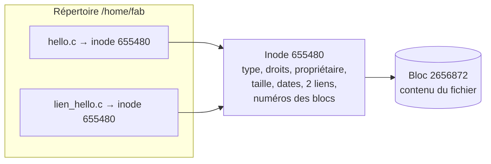

> **Attention** : la commande `stat` compte les blocs en unités de 512 octets (`stat --printf="%b blocs de %B octets\n" fichier`). Dans l'exemple ci-dessous, « Blocs : 8 » correspond donc à 8 × 512 = 4096 octets, soit un seul bloc du système de fichiers.

```bash
# Crée un fichier vide
$ touch fichier

# Affiche le numéro d'inode (-i)
$ ls -il fichier
655480 -rw-rw-r-- 1 fab fab 0 sept. 5 12:13 fichier

# Écrit dans un fichier
$ echo "helloworld" >> fichier

# Vide le tampon (force l'écriture dans le FS)
$ sync

# Affiche les informations contenues dans un inode
$ stat fichier
Fichier : «fichier»
Taille : 11         Blocs : 8          Blocs d'E/S : 4096   fichier
Périphérique : 812h/2066d	Inœud : 655480      Liens : 1
Accès : (0664/-rw-rw-r--)  UID : ( 1026/     fab)   GID : (65536/     fab)
Accès : 2015-09-05 12:13:05.615190874 +0200
Modif. : 2015-09-05 12:14:08.019191386 +0200
Changt : 2015-09-05 12:14:08.019191386 +0200
 Créé : -

# Affiche les informations complètes contenues dans un inode
$ echo "stat <655480>" | sudo debugfs /dev/sdb2
Inode: 655480   Type: regular    Mode:  0664   Flags: 0x0
Generation: 1177868735    Version: 0x00000000:
User:  1026   Group: 65536   Size: 11
File ACL: 0    Directory ACL: 0
Links: 1   Blockcount: 8
Fragment:  Address: 0    Number: 0    Size: 0
 ctime: 0x55eac070:04935968 -- Sat Sep  5 12:14:08 2015
 atime: 0x55eac031:92ac4568 -- Sat Sep  5 12:13:05 2015
 mtime: 0x55eac070:04935968 -- Sat Sep  5 12:14:08 2015
crtime: 0x55eac031:92ac4568 -- Sat Sep  5 12:13:05 2015
Size of extra inode fields: 28
EXTENTS:
(0):2656872

# Affiche (en hexa et en ASCII) les données contenues dans un bloc
$ sudo dd if=/dev/sdb2 bs=4096 skip=2656872 count=1 | hexdump -C
1+0 enregistrements lus
1+0 enregistrements écrits
00000000  68 65 6c 6c 6f 77 6f 72  6c 64 0a 00 00 00 00 00  |helloworld......|
00000010  00 00 00 00 00 00 00 00  00 00 00 00 00 00 00 00  |................|
*
4096 octets (4,1 kB) copiés, 0,0136829 s, 299 kB/s
00001000

# Efface un fichier
$ rm fichier

# Vide le tampon (force l'écriture dans le FS)
$ sync

# Les données du fichier ne sont pas vraiment effacées! Vérifions :
$ echo "stat <655480>" | sudo debugfs /dev/sdb2
Inode: 655480   Type: regular    Mode:  0664   Flags: 0x0
Generation: 1177868735    Version: 0x00000000:
User:  1026   Group:     0   Size: 0
File ACL: 0    Directory ACL: 0
Links: 0   Blockcount: 0
Fragment:  Address: 0    Number: 0    Size: 0
 ctime: 0x55eac21a:e0e00c3c -- Sat Sep  5 12:21:14 2015
 atime: 0x55eac031:92ac4568 -- Sat Sep  5 12:13:05 2015
 mtime: 0x55eac21a:e0e00c3c -- Sat Sep  5 12:21:14 2015
crtime: 0x55eac031:92ac4568 -- Sat Sep  5 12:13:05 2015
dtime: 0x55eac21a -- Sat Sep  5 12:21:14 2015
Size of extra inode fields: 28
EXTENTS:

# L'inode existe toujours mais des métadonnées ont été nettoyées (notamment le numéro de bloc occupé qui est maintenant déclaré libre)

# Mais les données sont bien toujours là!
$ sudo dd if=/dev/sdb2 bs=4096 skip=2656872 count=1 | hexdump -C
1+0 enregistrements lus
1+0 enregistrements écrits
4096 octets (4,1 kB) copiés, 4,1084e-05 s, 99,7 MB/s
00000000  68 65 6c 6c 6f 77 6f 72  6c 64 0a 00 00 00 00 00  |helloworld......|
00000010  00 00 00 00 00 00 00 00  00 00 00 00 00 00 00 00  |................|
*
00001000
```

### Les Fichiers « texte »

On distingue en général deux types de fichiers : **texte** et **binaire**.

> **Remarque** : "Un fichier binaire est un fichier informatique qui n'est pas assimilable à un fichier texte." (source wikipedia). Donc, tout ce qui n'est pas un fichier texte est un fichier binaire.

Le contenu d'un fichier binaire correspond souvent à un format précis lié à l'usage d'un logiciel : fichiers exécutables (code machine), bases de données, images, sons, vidéos, documents de traitement de texte, etc.

Deux cas particuliers de fichiers binaires sont très courants :

- un fichier **compressé** est un fichier (texte ou binaire) transformé par un algorithme pour diminuer sa taille (`gzip`, `bzip2`, `xz`, `zip`, ...) ;
- une **archive** regroupe en un seul fichier plusieurs fichiers ou le contenu de toute une arborescence, données et descriptions comprises (`tar`). Les archives sont souvent compressées (`.tar.gz`, `.tar.xz`).

Les fichiers texte ont un contenu pouvant être interprété directement comme du texte (une suite de bits représentant un caractère), selon un codage de caractères : historiquement l'ASCII (*American Standard Code for Information Interchange*), aujourd'hui le plus souvent UTF-8, qui est compatible avec l'ASCII (voir [L'encodage des caractères](#lencodage-des-caractères)).

> **Remarque** : L'ASCII est la norme de codage de caractères en informatique la plus ancienne et la plus connue. Avec l'avènement de la mondialisation des systèmes d'information, son usage se restreint progressivement à des domaines très techniques.

> **Remarque** : Comment sera interprété en ASCII l'octet `0x0A`? La réponse (et bien plus) est accessible dans le manuel en ligne de commande en faisant `man ascii`.

On utilise généralement un éditeur de texte (`vi`, `vim`, `emacs`, `nano`, `kwrite`, `kate`, `gedit`, `geany`, Notepad, Notepad++, UltraEdit, ...) pour manipuler ce type de fichiers.

> **Remarque** : L'éditeur de texte est le programme le plus important et le plus utilisé par un informaticien dans l'exercice de son métier (administration, programmation). Il ne faut pas confondre éditeur de texte et traitement de texte.

Quelques exemples de fichiers textes : code source d'un programme, fichiers de configuration, etc. Autres termes : fichier texte ou fichier texte brut ou fichier texte simple ou fichier ASCII.

En fait, les fichiers texte n'ont pas de structure car ce ne sont qu'une suite d'octets encodant des caractères. Par contre, la notion de "fin de ligne" est ambiguë. Historiquement, cela provient des premiers terminaux qui nécessitaient deux actions pour un "saut de ligne".

Dans un fichier texte, la fin d'une ligne est représentée par un caractère de contrôle (ou une paire). Plusieurs conventions coexistent :

- sous les systèmes Unix/Linux, la fin de ligne est indiquée par une nouvelle ligne (LF, *Line Feed*, 1 octet) ;
- sous les machines Apple II et Mac OS jusqu'à la version 9, la fin de ligne est indiquée par un retour chariot (CR, *Carriage Return*, 1 octet) ;
- sous les systèmes CP/M, MS-DOS, OS/2 ou Microsoft Windows, la fin de ligne est indiquée par un retour chariot suivi d'une nouvelle ligne (CRLF, 2 octets).

> **Remarque** : CRLF a été aussi adopté comme la fin de ligne standard pour les communications réseau (protocoles "Internet" comme HTTP, FTP, ...).

### L'encodage des caractères

Les éditeurs de texte peuvent créer des fichiers texte avec l'encodage de caractères de leur choix. Un codage de caractères définit une manière de représenter les caractères (lettres, chiffres, symboles) dans un système informatique.

Le premier codage largement répandu fut l'ASCII. Pour des raisons historiques (les grandes sociétés associées pour mettre au point l'ASCII étaient américaines) et techniques (7 bits disponibles seulement pour coder un caractère), ce codage ne prenait en compte que 2^7 soit 128 caractères. De ce fait, l'ASCII ne comporte pas les caractères accentués, les cédilles, etc. utilisés par des langues comme le français. Ceci devint vite inadapté et un certain nombre de méthodes furent utilisées pour l'étendre.

L'ISO a donc défini de nouvelles normes, ISO 8859-1, ISO 8859-2, etc. jusqu'à ISO 8859-15. Ces jeux de caractères permettent de coder la plupart des langues occidentales. Le français utilise le plus souvent ISO 8859-1, aussi nommé `latin1`, ou ISO 8859-15 (`latin9`), qui a l'avantage de contenir des caractères (ligatures) comme le « œ » ou le symbole « € ».

Il est indispensable pour l'échange d'information de connaître le codage utilisé. Ne pas le savoir peut rendre un document difficilement lisible (remplacement des lettres accentuées par d'autres suites de caractères, ...).

Le besoin de supporter de multiples écritures demandait un nombre nettement plus élevé de caractères supportés et nécessitait une approche systématique du codage de caractère utilisé. Le codage Unicode a pour ambition d'être un surensemble de tous les autres, et est souvent représenté en UTF-8 ou en UTF-16.

L'UTF-8, spécifié dans le RFC 3629, est le plus commun pour les applications Unix/Linux et Internet. L'UTF-16 est utilisé par Java et Windows.

La norme internationale ISO/CEI 10646 définit l'*Universal Character Set* (UCS) comme un jeu de caractères universel (représenter sans ambiguïté tous les signes écrits de toutes les langues humaines connues). Ce standard est le fondement d'Unicode. Plus de 150 000 caractères (symboles, lettres, nombres, idéogrammes, logogrammes, émojis) sont aujourd'hui recensés dans l'UCS.

> **Remarque** : L'ASCII (jeu standard sur 7 bits) n'est pas modifié par UTF-8, et les gens utilisant uniquement l'ASCII ne remarqueront aucun changement : ni dans le codage, ni dans les tailles de fichiers.

Il est conseillé de consulter les pages de manuel suivantes :

```bash
$ man ascii
$ man iso_8859-1    # et man iso_8859-15
$ man utf-8         # et man unicode
$ man charsets
```

**Quel est l'encodage utilisé par un fichier?**

```bash
$ file bonjour.txt
bonjour.txt: Unicode text, UTF-8 text
```

Il existe plusieurs commandes sous Linux qui permettent de convertir des fichiers texte d'un encodage vers un autre : `iconv`, `recode`, etc ...

**Comment convertir un fichier texte qui est en UTF-8 en ISO8859-1 (latin1)?**

```bash
$ iconv -f UTF-8 -t ISO8859-1 bonjour.txt -o bonjour_latin1.txt
```

La commande `iconv -l` permet de lister l'ensemble des jeux codes connus et supportés.

UTF-8 est aujourd'hui très largement majoritaire, mais on rencontre encore des fichiers dans d'autres encodages (anciens fichiers, exports de logiciels, fichiers Windows). Il y a donc des risques dans le cas d'échange entre systèmes hétérogènes. Cela concerne notamment :

- l'utilisation des flux de texte dans les programmes
- les échanges sur internet
- les noms de fichiers et de répertoires

Par précaution (et le technicien informatique est prudent !), il est donc conseillé de ne jamais utiliser de caractères étendus ou spéciaux (comme l'espace) dans les noms de fichiers et de répertoires, de privilégier l'encodage Unicode et d'être cohérent avec les fichiers qui permettent de déclarer l'encodage utilisé (cas des fichiers **html** et **xml** par exemple).

### Créer un répertoire (dossier) et se déplacer dans l'arborescence

La commande `mkdir` permet de créer un nouveau répertoire et la commande `cd` de se déplacer à l'intérieur de celui-ci :

```bash
$ mkdir tmp

$ ls -l
drwxrwxr-x 2 fab fab 4096 sept.  2 18:27 tmp

$ cd tmp

$ ls -al
drwxrwxr-x 2 fab fab 4096 sept.  2 18:27 .
drwxrwxr-x 3 fab fab 4096 sept.  2 18:27 ..

$ cd ..

$ ll
drwxrwxr-x  3 fab fab 4,0K sept.  2 18:27 ./
drwx------ 13 fab fab 4,0K sept.  2 18:27 ../
drwxrwxr-x  2 fab fab 4,0K sept.  2 18:27 tmp/

$ alias
alias ll='ls -halF'
```

> **Remarque** : La commande `ls` permet de lister le contenu d'un répertoire. `ll` est un alias sur la commande `ls -halF`.

Le nom de répertoire "`..`" indique, où que vous soyez, le répertoire qui se trouve immédiatement au-dessus. On l'appelle le répertoire parent. Un autre nom de répertoire particulier est "`.`" : c'est le répertoire dans lequel vous êtes actuellement. On l'appelle le répertoire courant. Ils sont très utilisés pour créer des chemins relatifs dans l'arborescence.

Si vous voulez connaître le chemin absolu où vous vous trouvez, vous pouvez utiliser la commande `pwd` :

```bash
$ pwd
/home/fab/tmp
```

> **Remarque** : un chemin absolu est toujours référencé par rapport à la racine de votre arborescence et commence donc toujours par un slash `/`.

### Créer un fichier texte

**Vide :**

```bash
$ touch vide

$ ls -l vide
-rw-rw-r-- 1 fab fab 0 sept.  2 18:30 vide

$ file vide
vide: empty
```

**Avec un contenu :**

```bash
$ echo "Hello world" > bonjour.txt
$ ls -l bonjour.txt
-rw-rw-r-- 1 fab fab 12 sept.  2 18:31 bonjour.txt

$ file bonjour.txt
bonjour.txt: ASCII text
```

> **Remarque** : Les redirections d'entrées/sorties
>
> Par défaut, les commandes récupèrent les données tapées par l'utilisateur au clavier (stdin). Le résultat de leur exécution s'affiche à l'écran (stdout). En cas d'erreur à l'exécution, les messages d'erreur apparaissent aussi à l'écran (stderr). Il est possible d'indiquer à l'interpréteur de commandes de rediriger ces flux d'E/S vers (ou depuis) un fichier. Par exemple : `> sortie` signifie que les données générées par la commande seront écrites dans le fichier de nom `sortie` plutôt qu'à l'écran. Si le fichier `sortie` existait déjà, son ancien contenu est effacé, sinon ce fichier est créé au lancement de la commande.

### Afficher le contenu d'un fichier texte

Il existe de nombreuses possibilités pour afficher le contenu d'un fichier texte. En voici quelques-unes :

```bash
$ cat bonjour.txt
$ cat -n bonjour.txt ; nl bonjour.txt
$ strings bonjour.txt
$ more bonjour.txt
$ less bonjour.txt
```

Sous Unix/Linux, il est possible de "relier" des commandes :

```bash
$ cat bonjour.txt | wc -c
```

> **Remarque** : Le shell Unix dispose d'un mécanisme appelé **tube** (ou pipe). Ce mécanisme permet de chaîner des processus (commandes en cours d'exécution) de sorte que la sortie d'un processus (stdout) alimente directement l'entrée (stdin) du suivant. Le symbole utilisé pour créer des tubes dans les shells Unix est la barre verticale `|`, appelée communément pipe. Le pipe est très utilisé sur Unix pour associer plusieurs commandes dont on enchaîne les traitements. C'est un mécanisme de communication inter-processus (IPC).

Une dernière qui illustre bien la philosophie UNIX/Linux :

```bash
$ while read ligne ; do echo "contenu : $ligne"; done < bonjour.txt
```

> **Remarque** : Les redirections d'entrées/sorties
>
> Ici l'utilisation de `<` permet de rediriger le flux d'E/S depuis un fichier (bonjour.txt).

### Examiner le contenu d'un fichier texte

Un fichier texte contient fondamentalement une suite de bits. La particularité d'un fichier texte est que l'ensemble du fichier respecte un codage de caractères standard. Il existe de nombreux standards de codage de caractères, ce qui peut rendre problématique la compatibilité des fichiers texte.

La norme ASCII (*American Standard Code for Information Interchange*) est la norme de codage de caractères en informatique la plus connue et la plus largement compatible. L'ASCII définit 128 caractères numérotés de 0 à 127 et codés en binaire de 0000000 à 1111111. Sept bits suffisent donc pour représenter un caractère codé en ASCII. Toutefois, les ordinateurs travaillant (presque) tous sur huit bits (un octet), chaque caractère d'un texte en ASCII est stocké dans un octet dont le 8e bit est 0. Les caractères 0 à 31 et le 127 ne sont pas affichables. Ils correspondent à des caractères (commandes) de contrôle de terminal informatique.

Pour en savoir plus :

- `man ascii`
- [fr.wikipedia.org/wiki/Ascii](http://fr.wikipedia.org/wiki/Ascii)
- [la table ASCII complète](https://fr.wikipedia.org/wiki/Fichier:ASCII-Table-wide.svg)

Pour afficher le contenu brut d'un fichier (texte ou binaire), on utilisera soit la commande `od` soit la commande `hexdump` :

```bash
$ od -ca -t x1 bonjour.txt
$ hexdump -C bonjour.txt
```

### Modifier le contenu d'un fichier texte

Le système d'exploitation ne permet que de très simples modifications d'un fichier : on peut soit modifier un (ou plusieurs) octet soit ajouter des octets en fin de fichier.

Vous pouvez modifier 'w' en 'W' :

```bash
$ hexedit bonjour.txt
$ cat bonjour.txt
```

> **Remarque** : il est impossible en utilisant les services de l'OS de supprimer ou d'insérer du texte dans un fichier (sauf à la fin). Ce sont des opérations bien trop complexes car elles nécessiteraient un décalage d'un ensemble d'octets dans le fichier. Pour réaliser cela, il faut soit utiliser un éditeur de texte soit écrire soi-même un programme équivalent.

Ou on peut ajouter du texte à la fin du fichier :

```bash
$ date +"le %A %d %B %Y à %T" >> bonjour.txt
$ echo "by $USER" >> bonjour.txt
$ cat bonjour.txt
```

> **Remarque** : Les redirections d'entrées/sorties
>
> `>> sortie` semblable à la redirection `>` sauf que si le fichier `sortie` existait déjà, son ancien contenu est conservé et les nouvelles données sont copiées à la suite.

### Éditer un fichier texte (vim)

`vi` est l'éditeur de texte standard d'Unix et il a été l'éditeur favori de nombreux hackers jusqu'à l'arrivée d'Emacs en 1984. Tout système se conformant aux spécifications Unix intègre `vi` et il est donc encore largement utilisé par les utilisateurs (surtout les administrateurs et programmeurs) des différentes variantes d'Unix.

La version incluse actuellement dans les Linux est le plus souvent `vim` (*vi improved*), un clone de `vi` qui comporte quelques différences avec celui-ci. `vi`/`vim` comprend trois modes de fonctionnement : le mode normal, le mode commande et le mode insertion. Après le lancement de `vi`/`vim`, c'est le mode normal qui est actif. Pour passer en mode insertion (de texte évidemment) il faut appuyer sur la touche `i` ou `o`. On sait que l'on est en mode insertion par l'affichage de `-- INSERT --` (`-- INSERTION --` en français) en bas de la fenêtre. Pour sortir de ce mode, il faut appuyer sur la touche `Esc` et cet affichage disparaît. Pour passer en mode commande, il faut taper ':'.

**Quelques commandes intéressantes :**

```
:q!                  : sortie sans sauvegarde
:wq                  : sortie avec sauvegarde
:x                   : sortie avec sauvegarde
$                    : se déplacer sur le dernier caractère de la ligne
ZZ                   : sortie avec sauvegarde
:w                   : sauvegarde sans sortie
Ctrl f               : afficher la page suivante
Ctrl b               : afficher la page précédente
Ctrl d               : afficher la demi-page suivante
Ctrl u               : afficher la demi-page précédente
e                    : se déplacer à la fin du mot
b                    : se déplacer au début du mot
w                    : se déplacer au début du mot suivant
H                    : se déplacer en haut de l'écran
L                    : se déplacer en bas de l'écran
M                    : se déplacer au milieu de l'écran
z.                   : décaler l'affichage avec la ligne courante au centre
z (Entrée)           : décaler l'affichage avec la ligne courante en haut
z-                   : décaler l'affichage avec la ligne courante en bas
:num_ligne           : se déplacer à la ligne num_ligne
G (ou :$)            : aller à la fin du fichier
u                    : annulation de la dernière modification
dd                   : suppression de la ligne courante
2dd                  : suppression de la ligne courante et de la suivante
D                    : suppression de la fin de la ligne à partir du curseur
:3,7 d               : suppression des lignes 3 à 7
:3,7 t 10            : copie des lignes 3 à 7 après la ligne 10
:3,7 m 10            : transfert des lignes 3 à 7 après la ligne 10
yy                   : mémorisation de la ligne courante (copier)
3yy                  : mémorisation de la ligne courante et des 2 suivantes (copier)
p                    : copie ce qui a été mémorisé après le curseur
P                    : copie ce qui a été mémorisé avant le curseur
:set nu              : affichage des numéros de ligne
/mot                 : recherche le mot mot (on se déplace avec n ou N ou *)
```

> **Remarque** : Il existe en réalité une quantité astronomique de commandes dans `vi`, et en particulier dans `vim`, et chaque personne n'utilise, en général, qu'une petite partie d'entre elles en fonction de ses habitudes (et souvent, pas les mêmes que vous...).

### Manipuler des fichiers et des répertoires

```bash
# Se déplacer dans l'arborescence :
$ cd $HOME/tmp

# Créer le répertoire temp:
$ mkdir temp

# Se déplacer dans le répertoire temp:
$ cd temp

# Copier le fichier /etc/passwd dans le répertoire courant (désigné par un .) :
$ cp /etc/passwd .

# Lister le contenu du répertoire :
$ ls
```

> **Remarque** : le fichier `passwd` contient la liste des utilisateurs de la machine (sans les mots de passe) et le répertoire `/etc` contient l'ensemble des fichiers de configuration de la machine (ce sont presque tous des fichiers texte)

```bash
# Faire une copie de sauvegarde d'un fichier :
$ sudo cp -a /etc/passwd ../passwd.bak

$ ls -l ..

# Copier un fichier :
$ cp ./passwd ./utilisateurs

# Renommer un fichier :
$ mv ./utilisateurs ./listeUtilisateurs.txt

# Visualiser le contenu d'un fichier texte ASCII :
$ more listeUtilisateurs.txt
$ cat listeUtilisateurs.txt
$ less listeUtilisateurs.txt

# Rechercher un fichier dans son répertoire personnel :
$ find $HOME -name listeUtilisateurs.txt -print
$ find $HOME -name "*.txt" -print
$ find $HOME -name "*.txt" -exec ls -l {} \;
```

> **Remarque** : l'étoile `*` est un caractère joker qui a la particularité de remplacer n'importe quel caractère autant de fois que nécessaire

> **Attention** : le motif `"*.txt"` doit être entre guillemets pour être transmis tel quel à `find`. Sans guillemets, le shell remplacerait `*.txt` par la liste des fichiers `.txt` du répertoire courant avant de lancer `find` (voir [Caractères spéciaux et filtres](#caractères-spéciaux-et-filtres)).

```bash
# Effacer un fichier :
$ rm listeUtilisateurs.txt
```

> **Remarque** : le fichier a été supprimé de manière définitive (il n'y a pas de corbeille en ligne de commande) ! L'option `-f` force la suppression, sans jamais demander de confirmation.

```bash
# Copier un répertoire :
$ cd ..

$ cp -r ./temp ./temp1

# Renommer un répertoire :
$ mv ./temp1 ./temp2

# Déplacer un répertoire :
$ mv ./temp2 ./temp

# Déplacer un fichier :
$ mv ~/tmp/passwd.bak $HOME

# Effacer un répertoire :
$ cd ..

$ rm -rf $HOME/tmp/temp
```

> **Remarque** : Le répertoire (et tout son contenu avec l'option `-r`) a été supprimé définitivement!

```bash
# Effacer un fichier :
$ rm $HOME/passwd.bak
```

---

## Gestion des droits

Sous UNIX, il existe deux types de sécurité pour les fichiers et répertoires : les droits et permissions UNIX, disponibles sur tous les UNIX et les ACL (*Access Control List*), plus complets.

Il est primordial de connaître la sécurité UNIX standard, dont le fonctionnement est très simple, car elle suffit le plus souvent.

### Utilisateurs et groupes

UNIX est un système multi-utilisateur : les droits d'accès reposent sur l'identité de l'utilisateur qui lance une commande.

Chaque utilisateur est identifié par un nom et par un **UID** (*User IDentifier*), et rattaché à un groupe principal identifié par un **GID** (*Group IDentifier*). Il peut appartenir à plusieurs groupes, eux-mêmes identifiés par un nom et par un GID. Le super-utilisateur *root* a l'UID 0 : il n'est soumis à aucune restriction de droits.

Les comptes locaux sont définis dans trois fichiers :

- `/etc/passwd` : la liste des comptes (nom, UID, GID, répertoire personnel, *shell*), lisible par tous ;
- `/etc/shadow` : les mots de passe hachés, lisible seulement par *root* ;
- `/etc/group` : la liste des groupes et de leurs membres.

```bash
$ id
uid=1000(fab) gid=1000(fab) groupes=1000(fab),4(adm),27(sudo)

$ groups
fab adm sudo

# Format : nom:x:UID:GID:commentaire:répertoire personnel:shell
$ grep fab /etc/passwd
fab:x:1000:1000:,,,:/home/fab:/bin/bash

$ ls -l /etc/shadow
-rw-r----- 1 root shadow 1450 sept. 26 10:12 /etc/shadow
```

> **Remarque** : le `x` du deuxième champ de `/etc/passwd` indique que le mot de passe est stocké dans `/etc/shadow`.

Commandes utiles : `id`, `groups`, `whoami`, `who`, `who am i`, `w`, `last`, `users`.

### Afficher les permissions

Pour afficher les permissions, il faut utiliser la commande `ls` avec l'option `-l` :

```bash
$ ls -l /kernel*
-r-xr-xr-x  1 root  wheel  1926444 Jul 13 11:15 /kernel
-rwx---r-x  1 root  wheel  5606172 Jul 13 11:59 /kernel.GENERIC
```

Le premier caractère (ici '`-`') correspond au type de fichier :

- '`-`' pour un fichier normal ;
- '`d`' pour un répertoire,
- '`l`' pour un lien symbolique ;
- '`s`' pour une *socket* ;
- '`c`' pour un fichier spécial de type "périphérique caractère" ;
- '`b`' pour un fichier spécial de type "périphérique bloc" ;
- '`p`' pour un tube nommé (*named pipe* ou FIFO).

Le type de fichier est enregistré dans l'inode (voir la commande `stat`).

> **Remarque** : sous Unix, TOUT EST FICHIER. Ce principe offre une interface générique pour manipuler n'importe quelle ressource (cf. les appels `open`, `read`, `write` et `close`).

`rwxrwxrwx` correspond aux droits, de, respectivement : l'utilisateur propriétaire (rwx), le groupe propriétaire (rwx) et "les autres" (rwx). Les fichiers, dans cet exemple, appartiennent à l'utilisateur `root` et au groupe `wheel`.

> **Remarque** : cet exemple provient d'un système FreeBSD, où l'administrateur appartient au groupe `wheel`.

### Les permissions de base

Il y a trois types de permissions :

- `r` : accès en lecture (*read*)
- `w` : accès en écriture (*write*)
- `x` : possibilité d'exécution pour un fichier ou de "traversée" pour un répertoire

> **Remarque** : il faut distinguer les permissions qui s'appliquent aux fichiers et aux répertoires. Par exemple : pour modifier le contenu d'un fichier (c'est-à-dire "écrire dedans"), il vous faut le droit `w` sur ce fichier. Par contre, pour créer, supprimer ou renommer un fichier, il vous faudra le droit `w` sur le répertoire dans lequel vous voulez faire l'opération.

| Droit | Sur un fichier | Sur un répertoire |
|---|---|---|
| `r` | lire le contenu | lister le contenu (`ls`) |
| `w` | modifier le contenu | créer, supprimer ou renommer des fichiers dans le répertoire |
| `x` | exécuter le fichier (programme ou script) | traverser le répertoire (`cd`, accès aux fichiers qu'il contient) |

Chacune de ces permissions peut être attribuée à :

- `u` : *user*, l'utilisateur
- `g` : *group*, le groupe
- `o` : *other*, les autres
- `a` : *all*, tout le monde

> **Remarque** : attention, la vérification des droits d'accès se fait dans l'ordre `u` `g` `o`. Dès qu'une concordance est trouvée, elle s'applique!

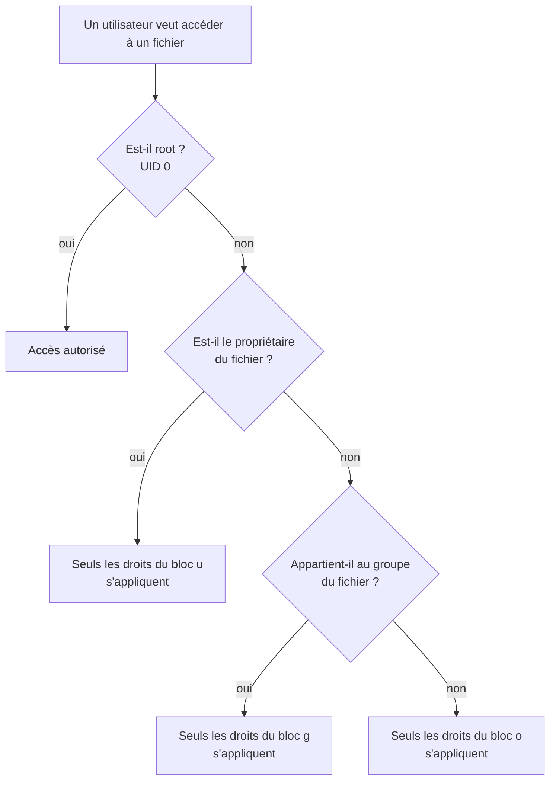

Conséquence : avec les droits `----rwx---` (`chmod 070`), le propriétaire n'a aucun accès au fichier, même s'il fait partie du groupe.

### Les droits spéciaux : SUID, SGID et sticky bit

En plus de ces droits de base, il existe aussi des droits spéciaux pour les fichiers :

- le droit `s` (dans le bloc `u`) : utilise l'UID (identifiant) du propriétaire (*Set-UID* ou *SUID*) lors de l'exécution du fichier à la place de l'UID de l'utilisateur
- le droit `s` (dans le bloc `g`) : utilise l'ID (identifiant) du groupe propriétaire (*Set-GID* ou *SGID*) lors de l'exécution du fichier
- le droit `t` (dans le bloc `o`) : pour la conservation du code en mémoire lors de l'arrêt de l'exécution

C'est grâce au bit *SUID* que `sudo` permet d'exécuter des commandes en "*root*" :

```bash
$ ls -lh /usr/bin/sudo
-rwsr-xr-x 1 root root 276K mars  12 17:35 /usr/bin/sudo
```

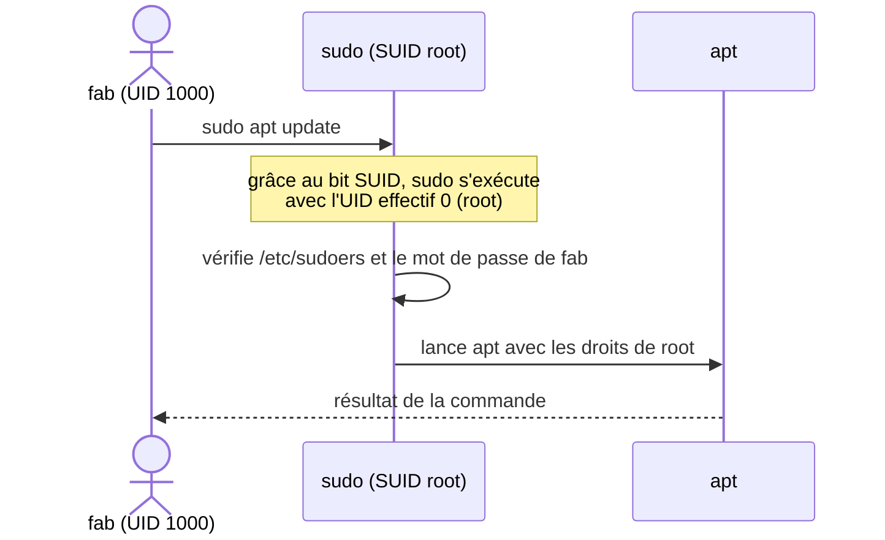

> **Attention** : attribuer le droit `s` (Set-User-ID) abusivement peut entraîner de sérieuses failles de sécurité (par exemple ne jamais le faire pour le programme `cat`, sinon n'importe qui pourra visualiser TOUS les fichiers du système !).

Des droits spéciaux s'appliquent aussi pour les répertoires :

- le droit `s` (dans le bloc `g`) : (*SGID bit*) lorsqu'un fichier ou un sous-répertoire sera créé dans ce répertoire, il le sera avec le GID du répertoire et non avec le groupe principal de l'utilisateur qui le crée (modification du fonctionnement par défaut et permet un travail collaboratif)
- le droit `t` (dans le bloc `o`) : (*sticky bit*) seul le propriétaire d'un fichier pourra le supprimer (restriction du droit `w` pour tous)

C'est le cas du répertoire `/tmp`, où tout le monde peut écrire mais où chacun ne peut supprimer que ses propres fichiers :

```bash
$ ls -ld /tmp
drwxrwxrwt 20 root root 4096 sept. 26 10:12 /tmp
```

> **Remarque** : avec le SGID sur un répertoire, tous les fichiers et sous-répertoires créés à l'intérieur héritent du groupe du répertoire : c'est la base d'un répertoire partagé par une équipe. Le SUID n'a aucun effet sur un répertoire. Enfin, le sticky bit sur un fichier est un usage historique : Linux l'ignore aujourd'hui.

> **Remarque** : un `S` ou un `T` majuscule dans l'affichage de `ls -l` indique que le droit spécial est positionné sans le droit `x` correspondant (par exemple `-rwSr--r--`).

### Modifier les permissions : chmod

La commande `chmod` permet de changer les permissions en utilisant un mode littéral :

```bash
$ ls -l .Xdefaults
-rw-------  1 calimero  promo00  61 Aug  1 13:29 .Xdefaults

$ chmod g+rx .Xdefaults
$ ls -l .Xdefaults
-rw-r-x---  1 calimero  promo00  61 Aug  1 13:29 .Xdefaults

$ chmod a-x .Xdefaults
$ ls -l .Xdefaults
-rw-r-----  1 calimero  promo00  61 Aug  1 13:29 .Xdefaults

$ chmod u=rx .Xdefaults
$ ls -l .Xdefaults
-r-xr-----  1 calimero  promo00  61 Aug  1 13:29 .Xdefaults
```

Vous pouvez aussi utiliser le mode octal pour changer les permissions. Les valeurs possibles sont :

```
0 → ---  : aucun droit
1 → --x  : exécution
2 → -w-  : écriture
3 → -wx  : écriture + exécution
4 → r--  : lecture
5 → r-x  : lecture + exécution
6 → rw-  : lecture + écriture
7 → rwx  : lecture + écriture + exécution
```

> **Remarque** : r (2^2 = 4) + w (2^1 = 2) + x (2^0 = 1) = 7, soit par exemple (644 → rw- r-- r--)

Par exemple :

```bash
$ ls -l .Xdefaults
-r-xr-----  1 calimero  promo00  61 Aug  1 13:29 .Xdefaults

$ chmod 750 .Xdefaults
$ ls -l .Xdefaults
-rwxr-x---  1 calimero  promo00  61 Aug  1 13:29 .Xdefaults
```

> **Remarque** : Pour la valeur du mode, on peut fournir 3 ou 4 chiffres (le premier chiffre étant facultatif). Le premier chiffre (facultatif) correspond au droit `s` ou `t`, le deuxième chiffre à `u`, le troisième à `g` et le quatrième à `o`.

Les droits spéciaux se positionnent de la même façon :

| Droit spécial | Valeur octale | Mode littéral | Exemple |
|---|---|---|---|
| SUID | 4 | `u+s` | `chmod 4755 programme` → `rwsr-xr-x` |
| SGID | 2 | `g+s` | `chmod 2775 projet` → `rwxrwsr-x` (répertoire d'équipe) |
| sticky bit | 1 | `+t` | `chmod 1777 partage` → `rwxrwxrwt` (comme `/tmp`) |

L'option `-R` applique la modification récursivement à toute une arborescence : `chmod -R g+w projet`.

### Les droits par défaut : umask

Lorsqu'un nouveau fichier est créé, on distingue deux situations particulières :

- la création d'un fichier : quels sont les droits par défaut?
- la copie d'un fichier : quels sont les droits du fichier copié?

Les droits par défaut d'un nouveau fichier sont définis par rapport à un masque des droits défini pour chaque utilisateur avec la commande `umask`. La commande `umask` permet donc d'afficher ou de modifier le masque de création de fichier de l'utilisateur.

```bash
$ help umask

# En octal :
$ umask
0022

# En littéral :
$ umask -S
u=rwx,g=rx,o=rx

# On indique donc :
# - avec un bit '0' les droits que l'on autorise et
# - avec un bit '1' les droits que l'on interdit

# Exemple : 2 -> 010 soit r-x (le droit w sera bloqué par le masque)
```

> **Remarque** : sur Ubuntu et Debian, le masque par défaut d'un utilisateur est souvent `0002` (chaque utilisateur a son propre groupe privé) : les fichiers sont alors créés en `rw-rw-r--` et les répertoires en `rwxrwxr-x`, comme dans les exemples de la partie [Manipuler des fichiers](#manipuler-des-fichiers).

Un fichier est toujours créé par un programme : une commande (`touch`, `cat`, `cp`, ...), un éditeur (`vim`, `geany`, ...), un compilateur (`gcc`), ou tout autre application (`nautilus`, `syslog`, ...).

**Exemple :**

a) Le programme utilisé définit les droits qu'il désire pour le fichier à créer, par exemple :

- `rw-rw-rw-` (666) pour des fichiers réguliers (non exécutable)
- `rwxrwxrwx` (777) pour des fichiers exécutables

b) Puis le système applique le masque défini par `umask` pour créer les droits du fichier :

Soit l'opération suivante : 666 & ~022 = 644 = rw- r-- r--

De même, pour un répertoire (créé avec les droits 777) : 777 & ~022 = 755 = rwx r-x r-x

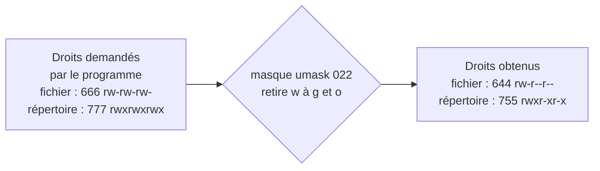

Lors de la copie d'un fichier, c'est le même principe qui est appliqué en utilisant cette fois les droits du fichier source. Il existe des options (`-p`, `-a`, ...) qui modifient ce comportement et permettent de préserver les propriétés du fichier source.

> **Remarque** : par contre si le fichier destination existe (écrasement), son contenu est remplacé mais ses droits ne changent pas : le fichier destination conserve ses propres droits (sauf avec les options `-p` ou `-a`).

### Changer de propriétaire : chown et chgrp

Les commandes `chown` et `chgrp` permettent de changer, respectivement, l'utilisateur propriétaire et le groupe.

```bash
# chown fab fichier            # change le propriétaire
# chown fab:promo00 fichier    # change le propriétaire et le groupe
$ chgrp promo00 fichier        # change le groupe
# chown -R fab:fab /home/fab   # récursivement sur toute une arborescence
```

> **Remarque** : seul *root* peut changer le propriétaire d'un fichier. Un utilisateur peut changer le groupe de ses propres fichiers, uniquement vers un groupe auquel il appartient.

### Pour aller plus loin sur les droits

- **`sudo`** : permet à un utilisateur autorisé (membre du groupe `sudo` ou `wheel`, voir `/etc/sudoers`) d'exécuter une commande en tant que *root*. On préfère `sudo` à une session *root* permanente : chaque commande privilégiée est volontaire et journalisée.
- **Les ACL** (*Access Control List*) : elles complètent les droits UNIX en donnant des droits à des utilisateurs ou des groupes supplémentaires (`getfacl`, `setfacl`). Un `+` à la fin des permissions affichées par `ls -l` (`-rw-rw-r--+`) signale la présence d'ACL.
- La partie « Droits & permissions » du mémento des [commandes de base](linux_commandes_base.md) et le [TP4 - Gestion des droits](tp/tp4-gestion-des-droits.md).

Vidéos :

- [Sticky bit, SetUID, SetGID](https://www.youtube.com/watch?v=Wuv5S2IqiWQ) - Thomas Boutry
- [Special Linux Permissions (Linux Permissions Part 4)](https://www.youtube.com/watch?v=zU43cReOBsc) - Ed Walsh
- [umask: Linux Permissions Part 5](https://www.youtube.com/watch?v=cbNoaC6CSO0)

---

## Caractères spéciaux et filtres

Les caractères spéciaux ou génériques (*wildcard characters*) permettent de désigner un ensemble d'objets et notamment un ensemble de noms de fichiers (le caractère `*` étant le plus connu et le plus utilisé).

Ils peuvent aussi désigner un ensemble de chaînes de caractères. On parle alors d'**expressions rationnelles** (ou **expressions régulières**) qui s'appliquent aux commandes d'édition (`vi`, `sed`, ...) ou à des filtres (`grep`, `egrep`, `awk`, ...).

Une expression rationnelle (ou expression régulière) est une chaîne de caractères que l'on appelle parfois un motif et qui décrit un ensemble de chaînes de caractères possibles selon une syntaxe précise. Elles sont notamment aujourd'hui utilisées dans l'édition et le contrôle de texte.

En savoir plus : `$ man 7 regex`

### Les caractères génériques du shell

**Les caractères associés aux noms de fichier sont interprétés par le shell avant le lancement de la commande :**

```
*         désigne toutes les chaînes de caractères (y compris la chaîne vide)
?         désigne un caractère quelconque
[...]     désigne un caractère quelconque appartenant à la liste
[!...]    désigne une liste de caractères à exclure
{...,...} génère une liste de mots (voir la remarque ci-dessous)
```

> **Remarque** : les accolades ne sont pas un motif de noms de fichiers : `{a,b,c}` produit tous les mots de la liste, que les fichiers correspondants existent ou non (`echo fichier{1,2,3}.txt` affiche `fichier1.txt fichier2.txt fichier3.txt` ; `mkdir -p projet/{src,doc}` crée deux répertoires). Enfin, si aucun fichier ne correspond à un motif, bash le transmet tel quel à la commande.

**Exemples :**

```bash
$ touch abc.s codage codage.c fichier.txt texte

$ ls *
abc.s  codage  codage.c  fichier.txt  texte

$ ls *.*
abc.s  codage.c  fichier.txt

$ ls *.?
abc.s  codage.c

$ ls ?.?
ls: impossible d'accéder à '?.?': Aucun fichier ou dossier de ce nom

$ ls f*
fichier.txt

$ ls a?c*
abc.s

$ ls *[ac]*
abc.s  codage  codage.c  fichier.txt

$ ls [^a]*
codage  codage.c  fichier.txt  texte

$ ls *.???
fichier.txt

$ ls *{abc,cod}*
abc.s  codage  codage.c

$ ls [a-c]*
abc.s  codage  codage.c

$ ls *.{c,txt}
codage.c  fichier.txt
```

### Les expressions régulières

Les expressions régulières (*regular expressions*) sont beaucoup utilisées sous UNIX, notamment avec les éditeurs de texte et les filtres (`grep`, `sed`, `awk`, ...). Une expression régulière est une suite de caractères, appelée **motif** (*pattern*), qui permet de trouver une correspondance (*match*) dans un texte, pour une recherche ou un remplacement. Un motif se construit avec des caractères spéciaux de substitution, de groupement et de quantification.

**Les caractères associés aux expressions régulières :**

```
.         désigne un caractère
*         remplace zéro fois ou n fois le caractère qui le précède
\+        remplace 1 fois ou n fois le caractère qui le précède
\?        remplace zéro fois ou une fois le caractère qui le précède
\b        désigne une limite de mot (le début ou la fin d'un mot)
[...]     désigne un caractère quelconque appartenant à la liste
^         désigne le début de la ligne
$         désigne la fin de la ligne
[^...]    désigne une liste de caractères à exclure
\{m\}     désigne un nombre exact m d'occurrences d'un caractère
\{m,\}    désigne un nombre minimum m d'occurrences d'un caractère
\{m,n\}   désigne un nombre d'occurrences d'un caractère compris entre un min m et un max n
\(...\)   désigne une chaîne de caractère ou une expression régulière
\|        désigne une alternative
\<mot\>   délimitation d'un mot
```

**Les quantificateurs** indiquent combien de fois l'élément qui les précède doit apparaître (ici en notation étendue, voir plus bas) :

| Quantificateur | Signification | Exemple | Correspond à | Ne correspond pas à |
|---|---|---|---|---|
| `?` | zéro ou une fois | `toto?` | « tot », « toto » | « totoo » |
| `*` | zéro, une ou plusieurs fois | `toto*` | « tot », « toto », « totoo », ... | |
| `+` | une ou plusieurs fois | `toto+` | « toto », « totoo », ... | « tot » |
| `{n}` | exactement n fois | `a{3}` | « aaa » | « aa », « aaaa » |
| `{n,m}` | entre n et m fois | `a{2,4}` | « aa », « aaa », « aaaa » | « a », « aaaaa » |
| `{n,}` | au moins n fois | `a{3,}` | « aaa », « aaaa », ... | « aa » |

**Les opérateurs de base :**

| Opérateur | Signification | Exemple | Correspond à | Ne correspond pas à |
|---|---|---|---|---|
| (concaténation) | une expression suivie d'une autre | `ab` | « ab » | « a », « b » |
| `.` | un caractère quelconque, et un seul | `.` | « a », « b », ... | chaîne vide, « ab » |
| `\|` | alternative : l'une ou l'autre des expressions | `a\|b` | « a », « b » | « ab », « c » |
| `[...]` | un des caractères de la liste (classe de caractères) | `[aeiou]`, `[a-d]` | « a », « e », ... | « b », « ae » |
| `[^...]` | un caractère qui n'est pas dans la liste | `[^aeiou]` | « b », ... | « a », « bc » |
| `(...)` | groupement | `(détecté)` | « détecté » | « détect », « détectés » |
| `^` | début de ligne | `^a` | « a » en début de ligne | « ba » |
| `$` | fin de ligne | `a$` | « a » en fin de ligne | « ab » |

Dans ces tableaux, « correspond à » s'entend pour la chaîne entière. Attention : `grep` cherche le motif n'importe où dans la ligne. La ligne « totoo » est donc affichée par `grep -E 'toto?'`, car elle contient « toto » ; pour imposer la ligne entière, on encadre le motif par `^` et `$` (`grep -E '^toto?$'`).

Entre crochets `[]`, les caractères spéciaux perdent leur signification : `[.?*]` désigne l'un des trois caractères « . », « ? » ou « * ». Pour neutraliser un caractère spécial ailleurs, il faut l'« échapper » en le faisant précéder d'un `\` (anti-slash). Enfin, les groupes placés entre `(` et `)` peuvent être rappelés par leur numéro d'ordre précédé de `\` : `\1`, `\2`, ...

### Les standards BRE, ERE et PCRE

La norme POSIX définit deux syntaxes d'expressions régulières :

- **BRE** (*Basic Regular Expressions*) : la syntaxe par défaut de `grep` et `sed`. Les caractères `?`, `+`, `{`, `}`, `(`, `)` et `|` n'y sont pas spéciaux : pour leur donner leur rôle, il faut les échapper (`\?`, `\+`, `\{m\}`, `\(...\)`, `\|`). C'est la notation utilisée dans le tableau des caractères ci-dessus.
- **ERE** (*Extended Regular Expressions*) : ces caractères y sont spéciaux sans échappement (et doivent être échappés pour être utilisés littéralement). C'est l'option `-E` de `grep` et de `sed` (ou `-r` pour `sed`). Les tableaux des quantificateurs et des opérateurs ci-dessus utilisent cette notation.

Les expressions régulières de **Perl** sont également un standard de fait, en raison de leur richesse (elles ont donné la bibliothèque PCRE, utilisée par de nombreux langages) : c'est l'option `-P` de `grep`.

**Exemple :** rechercher les villes du Vaucluse (84) et des Bouches-du-Rhône (13) dans un fichier de codes postaux :

```bash
$ cat liste.txt
Sarrians 84260
Avignon 84000
Carpentras 84200
Jonquières 84150
Marseille 13000
Istres 13800
Vitrolles 13127
Paris 75000

# grep en mode BRE (par défaut) :
$ grep '\(84\|13\)[[:digit:]]\{3\}' liste.txt

# grep en mode ERE :
$ grep -E '(84|13)[[:digit:]]{3}' liste.txt

# sed en mode ERE :
$ sed -En '/(84|13)[[:digit:]]{3}/p' liste.txt

# Les trois commandes affichent :
Sarrians 84260
Avignon 84000
Carpentras 84200
Jonquières 84150
Marseille 13000
Istres 13800
Vitrolles 13127
```

Avec `[[`, le shell `bash` permet aussi de tester une expression régulière (ERE) grâce à l'opérateur `=~` :

```bash
$ cp=84260
$ [[ $cp =~ ^(84|13)[0-9]{3}$ ]] && echo "Vaucluse ou Bouches-du-Rhône"
Vaucluse ou Bouches-du-Rhône
```

### Protéger les caractères spéciaux

Il est possible d'annuler l'interprétation d'un caractère spécial ou de contrôle de trois manières en utilisant des caractères de protection :

```
\         : l'antislash annule la signification du caractère suivant
'...'     : les simples quotes annulent tous les caractères
"..."     : les doubles quotes annulent tous les caractères sauf ` (accent grave), \ et $
```

### Les filtres grep, sed et awk

`grep`, `egrep`, `fgrep` permettent d'afficher les lignes correspondant à un motif donné. C'est l'une des commandes les plus utilisées (notamment dans des tubes) pour des recherches dans du texte.

> **Remarque** : `egrep` et `fgrep` sont aujourd'hui obsolètes : on utilise `grep -E` (expressions régulières étendues) et `grep -F` (recherche d'une chaîne fixe). Le nom `grep` vient de la commande `g/re/p` de l'éditeur `ed` (*global / regular expression / print*) : voir la vidéo [Where GREP Came From - Computerphile](https://www.youtube.com/watch?v=NTfOnGZUZDk).

`grep` peut utiliser des classes de caractères prédéfinies comme : `[:digit:]` (chiffres), `[:lower:]` (minuscules), `[:print:]` (affichables), `[:punct:]` (ponctuation), `[:space:]` (espace), `[:upper:]` (majuscules), et `[:xdigit:]` (chiffres hexadécimaux).

Par exemple, `[[:alnum:]]` correspond à `[0-9A-Za-z]`.

D'autres classes POSIX sont disponibles : `[:alpha:]` (lettres), `[:alnum:]` (lettres et chiffres) et `[:blank:]` (espace et tabulation). Une classe s'utilise toujours entre crochets : `[[:digit:]]`.

`sed` est un éditeur ligne non interactif. Il reçoit du texte en entrée, que ce soit à partir de stdin ou d'un fichier, réalise certaines opérations sur les lignes spécifiées de l'entrée, une ligne à la fois, puis sort le résultat vers stdout ou vers un fichier. À l'intérieur d'un script shell, `sed` est habituellement un des différents outils composant un tube. De toutes les opérations de la boîte à outil `sed`, on utilise principalement : *printing* (affichage vers stdout), *deletion* (suppression) et *substitution* (substitution).

**Quelques exemples avec `sed` :**

```
1d                     : supprime la première ligne de l'entrée.
/^$/d                  : supprime toutes les lignes vides.
/Linux/p               : affiche seulement les lignes contenant Linux (avec l'option -n : sed -n '/Linux/p')
s/Windows/Linux/       : substitue Linux à chaque première instance de Windows
s/Windows/Linux/g      : substitue Linux à chaque instance de Windows
s/ *$//                : supprime tous les espaces à la fin de toutes les lignes.
s/00*/0/g              : compresse toutes les séquences consécutives de zéros en un seul zéro.
/Windows/d             : supprime toutes les lignes contenant Windows.
s/Windows //g          : supprime toutes les instances de Windows, en laissant le reste de la ligne intact.
```

`awk` est un langage d'examen et de traitement de motifs. `awk` possède un langage de manipulation de texte plein de fonctionnalités avec une syntaxe proche du C. `awk` découpe chaque ligne d'entrée en champs. Par défaut, un champ est une chaîne de caractères consécutifs délimités par des espaces (bien qu'il existe des options pour changer le délimiteur). `awk` analyse et opère sur chaque champ, ce qui le rend idéal pour gérer des fichiers texte structurés, particulièrement des tableaux, des données organisées en ensembles cohérents, tels que des lignes et des colonnes.

```bash
# Taille des partitions montées (sed 1d supprime la ligne d'en-tête) :
$ df -h | sed 1d | awk '{print $1 " = " $2}'
/dev/sda5 = 12G
/dev/sda7 = 34G
/dev/sda1 = 100M
/dev/sda2 = 49G
/dev/sda4 = 51G

# Espace disponible sur les partitions montées :
$ df -h | sed 1d | awk '{print $1 " = " $4}'
/dev/sda5 = 912M
...

# Afficher toutes les lignes contenant au moins une majuscule :
$ getent passwd | grep '[A-Z]'
$ getent passwd | grep '[[:upper:]]'

# Afficher toutes les lignes commençant par la lettre a:
$ getent passwd | grep '^[a]'

# Afficher toutes les lignes contenant bash:
$ getent passwd | grep bash

# Remplacer le shell bash par le shell csh pour tous les utilisateurs :
$ getent passwd | grep bash | sed 's/bash/csh/g'

# Afficher les comptes dont le shell se termine par bash ou sh :
$ getent passwd | grep '\(bash\|sh\)$'

# Exploiter un motif :
$ echo "prenom.nom@example.fr" | sed 's/\(.*\)@\(.*\)/nom:\1 domain:\2/'
nom:prenom.nom domain:example.fr

# Extraire les adresses IPv4 de la machine :
$ ip -4 addr | grep -Eo "([0-9]{1,3}\.){3}[0-9]{1,3}"
127.0.0.1
192.168.52.2
192.168.52.255
```

> **Remarque** : l'ancienne commande `ifconfig` a été remplacée par `ip` et n'est plus installée par défaut sur la plupart des distributions.

---

## Automatiser des tâches

### Objectifs

Les administrateurs (ou parfois les programmeurs) ont souvent le besoin d'automatiser des traitements (surveillance, sauvegarde, maintenance, installation, ...). Pour cela, ils peuvent :

- saisir des commandes ou faire des groupement de commandes à partir d'un *shell* : fréquent
- **créer des scripts** (avec le *shell* ou avec un autre langage de script comme Perl, Python, PHP, etc...) : très fréquent

L'automatisation des tâches est un domaine dans lequel les scripts shell prennent toute leur importance. Il peut s'agir de préparer des travaux que l'on voudra exécuter ultérieurement (voir `at`, `batch`) grâce à un système de programmation horaire (voir `crontab`) mais on utilise aussi les scripts pour simplifier l'utilisation de logiciels complexes ou écrire de véritables petites applications.

Les scripts sont aussi très utiles lorsqu'il s'agit de faire coopérer plusieurs utilitaires système pour réaliser une tâche complète. On peut ainsi écrire un script qui parcourt le disque à la recherche des fichiers modifiés depuis moins d'une semaine, en stocke le nom dans un fichier, puis prépare une archive `tar` contenant les données modifiées, les sauvegarde sur une bande, puis envoie un e-mail à l'administrateur pour rendre compte de son action, etc ... Ce genre de programme est couramment employé pour automatiser les tâches administratives répétitives.

Les shells proposent un véritable langage de programmation, comprenant toutes les structures de contrôle, les tests et les opérateurs arithmétiques nécessaires pour réaliser de petites applications. En revanche, il faut être conscient que les shells n'offrent qu'une bibliothèque de routines internes très limitée. Nous ferons alors fréquemment appel à des utilitaires système externes.

**En résumé, les scripts sont utilisés surtout pour :**

- automatiser les tâches administratives répétitives
- simplifier l'utilisation de logiciels complexes
- mémoriser la syntaxe de commandes à options nombreuses et utilisées rarement
- réaliser des traitements simples

### Les shell scripts

Les scripts sont des suites de commandes exécutées par un shell. Les commandes internes d'un shell forment ainsi un véritable langage de programmation, souvent appelé langage de commandes.

Ces scripts sont surtout utilisés par les administrateurs et les développeurs car ils permettent de créer très rapidement des programmes, des nouvelles commandes ou des "moulinettes" (utilitaires).

**Un shell script est :**

- un fichier texte ASCII (on utilisera un éditeur de texte)
- exécutable par l'OS (le droit `x` sous Unix/Linux)
- interprété par un *shell* (`/bin/bash` par exemple sous Linux)

> **Remarque** : on a l'habitude de mettre l'extension `.sh` au fichier script.

**Exemple d'un *shell script* :**

```bash
# Édition d'un script
$ vim script.sh
#!/bin/bash
echo "je suis un script"

# Ajout du droit d'exécution
$ chmod ugo+x script.sh

# Vérification
$ ls -l script.sh
-rwxr-xr-x 1 fab fab 37 sept.  5 11:22 script.sh

# Exécution du script
$ ./script.sh
je suis un script
```

> **Remarque** : un script se doit de commencer par une ligne "shebang" qui contient les caractères `#!` (les deux premiers caractères du fichier) suivi par l'exécutable de l'interpréteur. Cette première ligne permet d'indiquer le chemin (de préférence en absolu) de l'interpréteur utilisé pour exécuter ce script sinon le shell par défaut sera utilisé.

**Avec un shell script, il est possible :**

- d'exécuter et/ou grouper des commandes
- d'utiliser des variables prédéfinies (`$?`, ...), des variables d'environnement (`$HOME`, `$USER`, ...)
- de gérer ses propres variables
- de faire des traitements conditionnels (`if`, `case`) et/ou itératifs (`while`, `for`)

**Il existe plusieurs manières d'exécuter un script :**

- le rendre exécutable :
  ```bash
  $ chmod +x monscript
  $ ./monscript
  ```
- passer son nom en paramètre d'un *shell* :
  ```bash
  $ sh monscript
  ```
- utiliser une fonction de lancement de commande du *shell* :
  ```bash
  $ source monscript
  $ . monscript
  ```

La différence est importante : `./monscript` et `sh monscript` exécutent le script dans un **nouveau processus** (un sous-shell), alors que `source` l'exécute dans le **shell courant**.

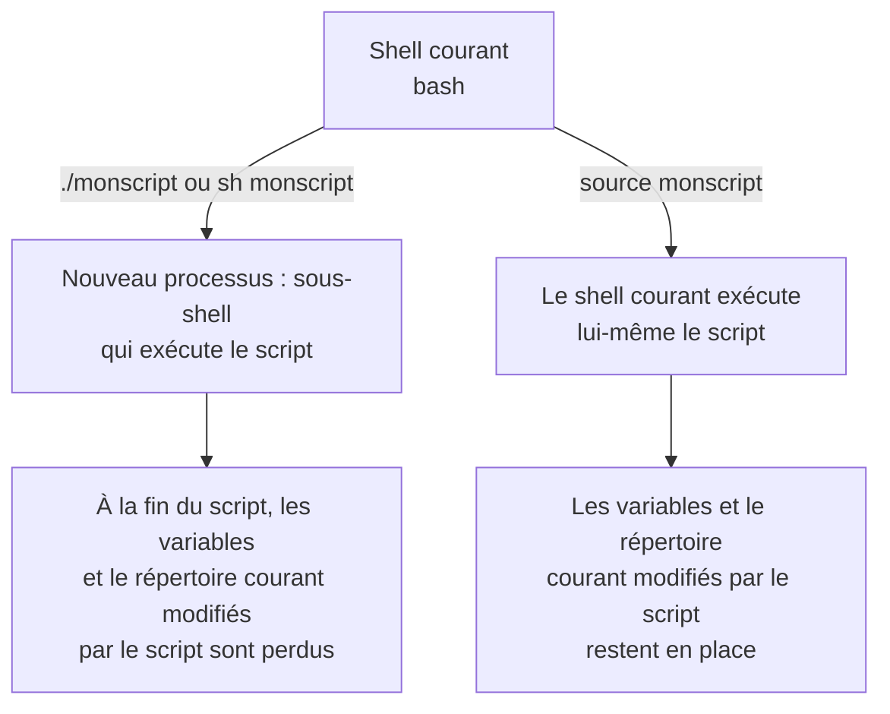

### Les variables

Une variable est un espace de stockage pour un résultat.

> **Rappel** : Une variable est un symbole (habituellement un nom qui sert d'identifiant) qui renvoie à une position de mémoire (adresse) dont le contenu peut prendre successivement différentes valeurs pendant l'exécution d'un programme.

De manière générale, la plupart des langages de scripts admettent :

- qu'une variable puisse changer de type au cours de son existence. On parle de **typage faible**.
- que ce ne sont pas les variables qui ont un type, mais les valeurs. On parle de **typage dynamique**.

Dans un shell Unix/Linux, une variable existe dès qu'on lui attribue une valeur (par défaut le type sera une chaîne de caractères). Une chaîne vide est une valeur valide. Une fois qu'une variable existe, elle ne peut être détruite qu'en utilisant la commande interne `unset`.

Une variable peut recevoir une valeur par une affectation de la forme :

```bash
nom=[valeur]
```

Si aucune valeur n'est indiquée, la variable reçoit une chaîne vide.

Le caractère `$` permet d'introduire le remplacement des variables. Le nom de la variable peut être encadré par des accolades, afin d'éviter que les caractères suivants ne soient considérés comme appartenant au nom de la variable.

```bash
# Créer une variable :
$ chaine=bonjour

# Afficher une variable :
$ echo $chaine
$ echo ${chaine}
$ echo $HOME

# Manipuler des variables :
$ chaine=
$ echo $chaine
$ chaine="hello world"
$ echo $chaine
$ chaine='hello world'
$ echo $chaine
$ chaine=2+2
$ echo $chaine

$ unset chaine
$ echo $chaine

# Manipuler des chaînes de caractères :
$ nom=fab
$ echo $nom
$ chaine="hello $nom"
$ echo $chaine
$ chaine='hello $nom'
$ echo $chaine
$ chaine="hello \$nom"
$ echo $chaine
```

> **Remarque** : Il existe une différence d'interprétation par le shell des chaînes de caractères. Les protections (quoting) permettent de modifier le comportement de l'interpréteur. Il y a trois mécanismes de protection : le caractère d'échappement, les apostrophes (quote) et les guillemets (double-quote).
>
> - Le caractère `\` (backslash) représente le caractère d'échappement. Il préserve la valeur littérale du caractère qui le suit, à l'exception du `CR` (<retour-chariot>).
> - Encadrer des caractères entre des apostrophes simples (quote) préserve la valeur littérale de chacun des caractères. Une apostrophe ne peut pas être placée entre deux apostrophes, même si elle est précédée d'un backslash.
> - Encadrer des caractères entre des guillemets (double-quote) préserve la valeur littérale de chacun des caractères sauf `$`, `` ` ``, et `\`. Les caractères `$` et `` ` `` conservent leurs significations spéciales, même entre guillemets. Le backslash ne conserve sa signification que lorsqu'il est suivi par `$`, `` ` ``, `"`, `\`, ou `EOL` (<fin-de-ligne>). Un guillemet peut être protégé entre deux guillemets, à condition de le faire précéder par un backslash.

Par défaut, les variables sont locales au shell. Les variables n'existent donc que pour le shell courant. Si on veut les rendre accessible aux autres shells, il faut les exporter avec la commande `export` (pour bash), ou utiliser la commande `setenv` (csh).

Il existe aussi des **variables d'environnement** qui sont des variables dynamiques utilisées par les différents processus d'un système d'exploitation (Windows, Unix, etc.).

Elles sont généralement définies en MAJUSCULES :

```bash
$PATH      # sous Unix/Linux
%PATH%     # sous Windows
```

### Les substitutions de variables

Les substitutions de paramètres (ou expressions de variables) sont décrites ci-dessous :

```
$nom              La valeur de la variable.
${nom}            Idem.
${#nom}           Le nombre de caractères de la variable.
${nom:-mot}       Mot si nom est nulle ou renvoie la variable.
${nom:=mot}       Affecte mot à la variable si elle est nulle et renvoie la variable.
${nom:?mot}       Affiche mot et réalise un exit si la variable est non définie.
${nom:+mot}       Mot si non nulle.
${nom#modèle}     Supprime le petit modèle à gauche.
${nom##modèle}    Supprime le grand modèle à gauche.
${nom%modèle}     Supprime le petit modèle à droite.
${nom%%modèle}    Supprime le grand modèle à droite.
```

Les formes les plus utilisées sont :

```bash
# Obtenir la longueur d'une variable :
$ PASSWORD="secret"
$ echo ${#PASSWORD}
6

# Fixer la valeur par défaut d'une variable nulle :
$ echo ${nom_utilisateur:=$(whoami)}

# Utiliser des tableaux :
$ tableau[1]=fab
$ echo ${tableau[1]}

# Supprimer une partie d'une variable :
$ fichier=texte.htm
$ echo ${fichier%htm}html
$ echo ${fichier##*.}
```

### Les substitutions de commandes

La substitution de commandes permet de remplacer le nom d'une commande par son résultat. Il en existe deux formes :

```bash
$(commande)     # ou
`commande`
```

Cette syntaxe effectue la substitution en exécutant la commande et en la remplaçant par sa sortie standard, dont les derniers sauts de lignes sont supprimés.

On utilise très souvent la substitution de commandes pour récupérer le résultat d'une commande dans une variable :

```bash
# Déterminer le nombre de fichiers présents dans le répertoire courant :
$ NB=$(ls | wc -l)
$ echo $NB

# Récupérer le chemin d'accès :
$ CHEMIN=`dirname /un/long/chemin/vers/toto.txt`
$ echo $CHEMIN
/un/long/chemin/vers

# Récupérer le nom du fichier :
$ NOM_FICHIER=`basename /un/long/chemin/vers/toto.txt`
$ echo $NOM_FICHIER
toto.txt

# Afficher le chemin absolu de son répertoire personnel :
$ getent passwd | grep "^$(whoami):" | cut -d: -f6
$ echo $HOME
```

### L'évaluation arithmétique

L'évaluation arithmétique permet de remplacer une expression par le résultat de son évaluation. Le format d'évaluation arithmétique est :

```bash
$((expression))
```

Par exemple, pour calculer la somme de deux entiers :

```bash
$ somme=$((2+2))
$ echo $somme
4
```

Pour manipuler des expressions arithmétiques, on pourra utiliser aussi :

```bash
# la commande expr :
$ expr 2 + 3
5

# la commande interne let :
$ let res=2+3
$ echo $res
5

# l'expansion arithmétique ((...)) (syntaxe style C) :
$ (( res = 2 + 2 ))
$ echo $res
4

# la calculatrice bc (notamment pour des calculs complexes ou sur des réels)
$ echo "scale=2; 2500/1000" | bc -lq
2.50
$ VAL=1.3
$ echo "scale=2; ${VAL}+2.5" | bc -lq
3.8
```

### Les variables internes du shell

Ces variables sont très utilisées dans la programmation des scripts :

```
$0           : nom du script ou de la commande
$1, $2, ...  : paramètres du shell ou du script
$*           : tous les paramètres
$@           : idem (mais "$@" eq. à "$1" "$2"...)
$#           : nombre de paramètres
$-           : options du shell
$?           : code retour de la dernière commande
$$           : le PID du shell
$!           : le PID du dernier processus shell lancé en arrière-plan
$_           : le dernier argument de la commande précédente. Cette variable est également mise
               dans l'environnement de chaque commande exécutée et elle contient le chemin complet
               de la commande.
```

Comme n'importe quel programme, il est possible de passer des paramètres (arguments) à un script. Les arguments sont séparés par un espace (ou une tabulation) et récupérés dans les variables internes `$0`, `$1`, `$2` etc ... (voir le `man bash` et la commande `shift`).

```bash
# Afficher quelques variables internes :
#!/bin/bash
echo "Ce script se nomme : $0"
echo "Il a reçu $# paramètre(s)"
echo "Les paramètres sont : $@"
echo
echo "Le PID du shell est $$"

$ chmod +x variablesInternes.sh

$ ./variablesInternes.sh
Ce script se nomme : ./variablesInternes.sh
Il a reçu 0 paramètre(s)
Les paramètres sont :

Le PID du shell est 8807

$ ./variablesInternes.sh le petit chat est mort
Ce script se nomme : ./variablesInternes.sh
Il a reçu 5 paramètre(s)
Les paramètres sont : le petit chat est mort

Le PID du shell est 8078
```

> **Remarque** : un script commence par une ligne dite "shebang" qui contient les caractères "`#!`" (les deux premiers caractères du fichier) suivi par l'exécutable de l'interpréteur, de préférence avec son chemin complet.

### La gestion des options

Il arrive souvent qu'un script ait besoin de traiter des options passées en arguments (avec « `-` » ou « `--` ») ce qui lui permet d'exécuter des actions différentes. Il existe plusieurs techniques pour traiter des options :

- le faire soi-même avec des `if`... (déconseillée car solution lourde et complexe)
- utiliser la commande interne `getopts` (`man bash`)
- utiliser la commande externe `getopt` (`man getopt`)

> **Remarque** : `getopt()` existe aussi en langage C (`man 3 getopt`).

### Les commentaires

Les commentaires sont introduits par le caractère '`#`'. On peut aussi utiliser l'instruction nulle '`:`'.

### L'affichage sur la sortie standard

Pour afficher du texte, on pourra utiliser `echo` ou `printf` :

```bash
#!/bin/bash

CHAINE="world"

echo -n "Un message : hello $CHAINE"

echo -e "\tUn message : hello $CHAINE"

echo 'hello $CHAINE'

echo "hello \$CHAINE"

printf "Un message : hello %s\n" $CHAINE
```

### La saisie de données

Pour réaliser la saisie sur le périphérique d'entrée (généralement le clavier), on utilisera `read` :

```bash
#!/bin/bash
# Saisie du nom
echo -n "Entrez votre nom: "
read nom

# Affichage du nom
echo "Votre nom est $nom."

# Lecture silencieuse d'une et une seule touche avec un timeout de 5s
read -s -n 1 -t 5 TOUCHE
echo $TOUCHE

exit 0
```

> **Remarque** : les options `-s`, `-n` et `-t` de `read` sont propres à `bash` : avec `#!/bin/sh` (qui lance `dash` sur Debian et Ubuntu), ce script échouerait (`read: Illegal option -s`).

### Les commandes internes utiles

Un certain nombre de commandes sont exécutées directement par le shell et ne sont pas des programmes externes (`help` affiche leur aide). Les plus utiles dans un script :

- `echo`, `printf` : affichent sur la sortie standard ;
- `read` : lit l'entrée standard et stocke dans des variables les mots tapés au clavier ;
- `exit` : termine le script immédiatement en retournant un code de retour (`0` par défaut) ;
- `let`, `(( ))` : évaluent des expressions arithmétiques ;
- `eval` : exécute ses arguments comme s'ils formaient une commande ;
- `shift` : décale les paramètres (`$2` devient `$1`, ...) ;
- `export`, `unset` : exportent ou suppriment une variable ;
- `source` (ou `.`) : exécute un script dans le shell courant.

Quelques autres commandes sont aussi très utilisées dans les scripts : `test` (tests sur les fichiers, les chaînes de caractères et les nombres, commande interne de bash qui existe aussi en commande externe `/usr/bin/test`), et les commandes externes `expr` (évaluation d'expressions) et `bc` (calculatrice pour des calculs complexes ou sur des réels).

### Les tests et conditions

Les tests peuvent être lancés par la commande interne `test` qui prend en argument les conditions, et renvoie `0` si le test est vrai, et `1` sinon.

La forme la plus courante est l'utilisation de crochets (`[` ou `[[` depuis la version 2) qui encadrent le test.

Pour connaître la syntaxe des tests sur les fichiers, les chaînes de caractère, les valeurs et les associations, faire :

```bash
help test
help [[
```

> **Remarque** : Chaque élément du test, et les crochets, doivent être bien délimités par au moins un espace. C'est une erreur courante que d'oublier les espaces.

Avec `[[`, l'opérateur `=~` permet de tester une expression régulière étendue (voir [Les standards BRE, ERE et PCRE](#les-standards-bre-ere-et-pcre)).

### Les structures conditionnelles

#### La structure if-then-else

Il existe plusieurs formes syntaxiques autorisées :

```bash
# Cas 1 :
if liste de commandes
then liste de commandes
fi

# Cas 2 :
if liste de commandes ;then liste de commandes ;fi

# Cas 3 :
if liste de commandes
then liste de commandes
else liste de commandes
fi

# Cas 4 :
if liste de commandes
then liste de commandes
elif liste de commandes
then liste de commandes
else liste de commandes
fi
```

La « condition » est le code retour de la liste de commandes : `0` signifie VRAI.

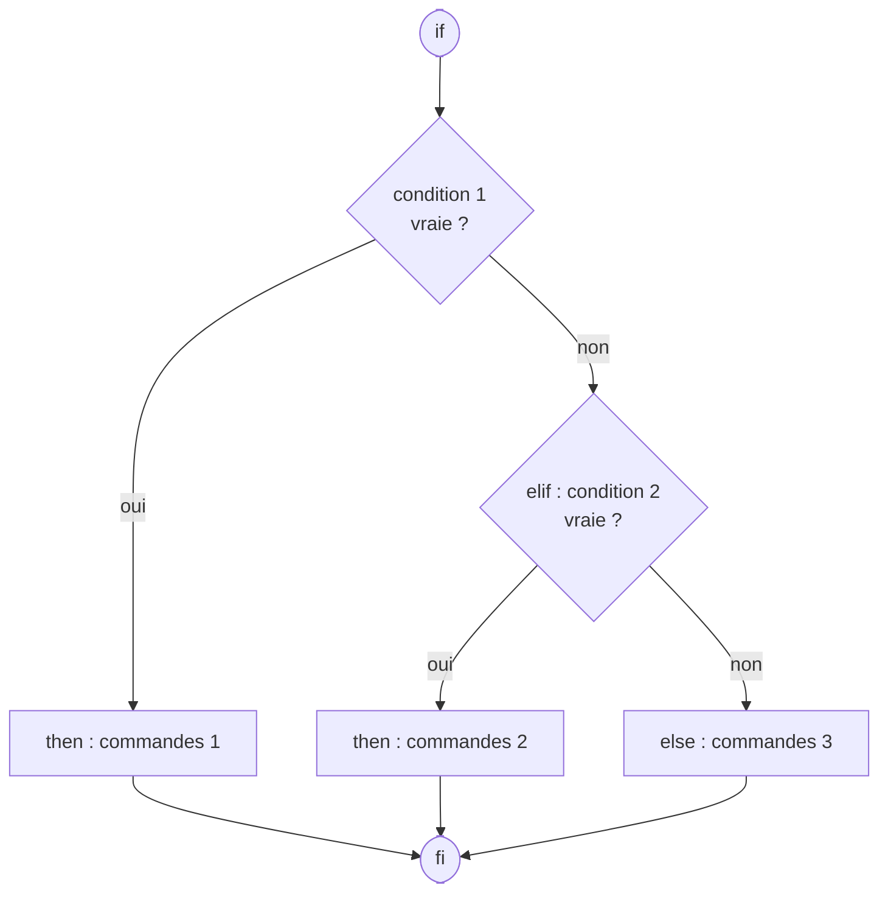

**Exemples :**

```
SI le répertoire n'existe pas
ALORS
    on le crée
FIN
```

```bash
# shell script: if1.sh <nom_repertoire>
if [ ! -d "$1" ]
then
    mkdir "$1"
fi

# shell script : if2.sh

# depuis la version 2, on peut utiliser la syntaxe étendue [[
# [[ est un mot clé, pas une commande
if [[ $# != 1 ]]   # ou: if [ $# -ne 1 ]
then echo "Usage: $(basename $0) <nom_fichier>"; exit 1
fi

# la commande test ou [
if [ -e $1 ]
then echo "Le fichier $1 existe"
else echo "Le fichier $1 n'existe pas"
fi

# shell script : if3.sh
# on peut utiliser directement des commandes dans le if
if cmp a b &> /dev/null
then echo "Les fichiers a et b sont identiques."
else echo "Les fichiers a et b sont différents."
fi
```

#### Les choix multiples case et select

Contrôle conditionnel à cas : les comparaisons se font au niveau des chaînes de caractères.

La structure `case` est alors :

```bash
case "$variable" in
    "motif1" ) action1 ;;
    "motif2" ) action2 ;;
    "motif3a" | "motif3b" ) action3 ;;
    ...
    * ) action_defaut ;;
esac
```

**Exemples :**

```bash
# shell script : case1.sh
case $1 in
    1|3|5|7|9) echo "chiffre impair";;
    2|4|6|8) echo "chiffre pair";;
    0) echo "zéro";;
    *) echo "c'est un chiffre qu'il me faut !!!";;
esac

# shell script : case2.sh
echo "Des vacances ?"
read reponse
case $reponse in
    [yYoO]) echo "fainéant !";;
    [nN]) echo "alors pas de vacances !";;
    *) echo "erreur saisie invalide";;
esac
```

La construction `select`, adoptée du Korn Shell, est souvent utilisée pour construire des menus :

```bash
select nom [ in mot ] ; do liste ; done

select variable [in liste]
do
    commande ...
    break
done
```

La liste de mots à la suite de `in` est développée, créant une liste d'éléments. Le symbole d'accueil `PS3` est affiché, et une ligne est lue depuis l'entrée standard.

Si la ligne est constituée d'un nombre correspondant à l'un des mots affichés, la variable nom est remplie avec ce mot. Si la ligne est vide, les mots et le symbole d'accueil sont affichés à nouveau. Si une fin de fichier (EOF) est lue, la commande se termine. Pour toutes les autres valeurs, la variable nom est vidée. La ligne lue est stockée dans la variable `REPLY`.

La liste est exécutée après chaque sélection, jusqu'à ce qu'une commande `break` ou `return` soit atteinte.

**Exemple :**

```bash
# Affiche l'invite
PS3='Menu: '
select choix in "création" "modification" "suppression" "quitter"
do
    echo "Votre choix est $choix"
    break  # il faut savoir s'arrêter!
done
```

### Les contrôles itératifs (les boucles for, while et until)

Il existe de nombreuses utilisations des boucles `for`, `while` et `until`.

#### La boucle for

```bash
# Cas 1 : Autant de tours de boucle que d'éléments dans la liste et variable prenant
# successivement chaque valeur
for variable in liste_de_valeurs
do liste de commandes
done

# Cas 2 : Autant de tours de boucle que de fichiers dans le répertoire courant et variable
# prenant successivement chaque nom de fichier (non caché)
for variable in *
do liste de commandes
done

# Cas 3 : Autant de tours de boucle que d'arguments dans $* et variable prenant
# successivement $1 $2 etc...
for variable
do liste de commandes
done
```

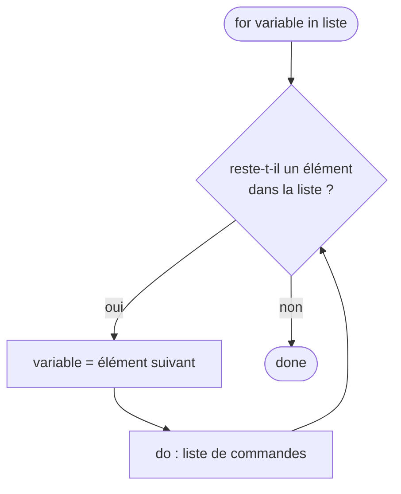

**Exemples :**

```bash
# shell script : for1a.sh
for i in 1 2 3 4 5 6 7 8 9 10
do
    echo "\$i=$i"
done

# shell script : for2.sh
for fic in *
do
    if [[ -f $fic ]]
    then echo "$fic est un fichier"
    elif [[ -d $fic ]]
    then echo "$fic est un répertoire"
    fi
done

# shell script : for1b.sh
# Syntaxe standard améliorée en utilisant la commande seq
START=1
LIMITE=10
SEQUENCE=$(seq -s ' ' $START $LIMITE)
for i in $SEQUENCE
do
    echo -n "$i "
done

# Idem (style C)
# Double parenthèses, et "LIMITE" sans le "$".
for ((i=START; i <= LIMITE; i++))
do
    echo -n "$i "
done

# Encore mieux : la virgule chaîne les opérations.
for ((i=START, j=LIMITE; i <= LIMITE; i++, j--))
do
    echo -n "$i-$j "
done

# shell script : for3.sh
# Autres boucles for simples
for PLANETE in Mercure Vénus Terre Mars Jupiter Saturne Uranus Neptune
do
    echo $PLANETE
done

# Possibilité de substitution de commande
EXT="sh"
for ligne in $( find . -type f -name "*.$EXT" | sort )
do
    echo "$ligne"
done

# Si la 'liste' est manquante, la boucle opère sur '$@'
for arg
do
    echo -n "$arg "
done
```

#### La boucle while

```bash
# Cas 1 : Tant que la condition est vraie.
while condition
do liste de commandes
done

# Cas 2 : Boucle infinie dans laquelle il faudra prévoir la sortie par exit, return ou break.
while true    # ou while :
do liste de commandes
done
```

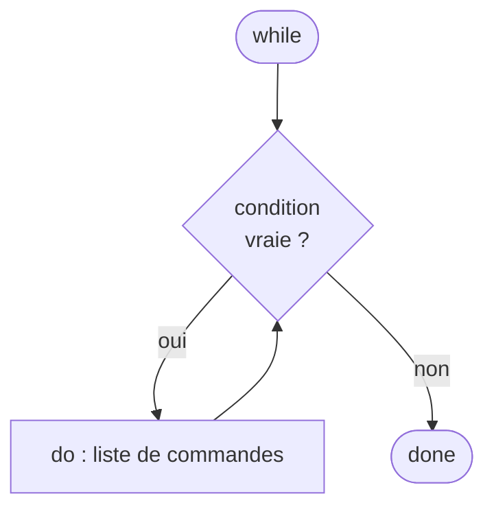

La boucle `until` fonctionne à l'inverse : elle répète la liste de commandes tant que la condition est **fausse**.

**Exemples :**

```bash
#!/bin/bash
# shell script : while.sh
# Compter jusqu'à 10 dans une boucle "while"

LIMITE=10
a=1
while [ "$a" -le $LIMITE ]
do
    echo -n "$a "
    let "a+=1"
done

# Idem : syntaxe C
((a = 1))  # a=1
while (( a <= LIMITE ))
do
    echo -n "$a "
    ((a += 1))  # let "a+=1"
done
```

#### La boucle until

```bash
# Cas 1 : Jusqu'à ce que la condition soit vraie
until liste de commandes
do liste de commandes
done

# Cas 2 : Boucle sans fin (idem while true)
until false
do liste de commandes
done
```

**Exemples :**

```bash
# shell script : until.sh
ctr=0
until (( ctr >= 10 ))
do
    ((ctr+=1))
    echo "tour numéro $ctr"
done
```

> **Remarque** : Les commandes de contrôle de boucle `break` et `continue` correspondent exactement à leur contrepartie dans d'autres langages de programmation. La commande `break` termine la boucle (en sort), alors que `continue` fait un saut à la prochaine itération de la boucle, oubliant les commandes restantes dans ce cycle particulier de la boucle.

### Les fonctions

Les fonctions permettent l'appel de commandes dans l'environnement courant (partage des variables du script père).

**Les propriétés des fonctions sont :**

- passage de paramètres possibles (`$1` `$2`... et `$#` ; `$0` reste le nom du script) ;
- variables locales possibles ;
- rapidité car la fonction est lue à la déclaration et non à l'exécution ;
- retourner une valeur de retour (`return`).

**Exemple :**

```bash
#!/bin/bash
# shell script : rootCheck.sh
CLEARSCR=clear

function root_check()
{
    # seul root peut executer ce script :)
    id | grep "uid=0(root)" > /dev/null 2>&1
    if [ $? != "0" ]
    then return 1
    else return 0
    fi
}

function say_hello()
{
    if [[ $1 == "true" ]]
    then
        $CLEARSCR
    fi
    echo -e "\x1B[49;34;1m
=======================================================
=======================================================\x1B[0m\n"
}

# main :
say_hello true
say_hello false

root_check
if [ $? = "1" ]
then
    echo -e "\x1B[49;31;1mERREUR: ce script ne peut etre execute que sous le compte root !\x1B[0m"
    exit 1;
fi

exit 0
```

> **Remarque** : on utilise ici des commandes d'échappement (Echap ou Esc dont le code ascii est `0x1B`) qui permettent de personnaliser le terminal notamment en utilisant des couleurs.

---

## Annexe 1 : Une liste de commandes de base

Voici quelques commandes usuelles :

```
dpkg          : un gestionnaire de paquet pour Debian
apt-get       : utilitaire APT pour la gestion des paquets (voir aussi aptitude)
apt           : interface APT simplifiée pour un usage interactif (apt install, apt search, ...)
alias         : crée ou supprime des alias de commandes
pwd           : affiche le chemin d'accès au répertoire courant
man           : permet de consulter les manuels de référence
clear         : efface l'écran
echo          : affiche une ligne de texte (et aussi des variables)
cd            : permet de se déplacer dans une arborescence
ls            : liste le contenu d'un répertoire
rm            : supprime un fichier (voir aussi rmdir)
cp            : permet la copie de fichier (voir aussi cp -a)
mv            : déplace ou renomme une partie d'une arborescence
mkdir         : crée un répertoire dans une arborescence
touch         : modifie l'horodatage d'un fichier (permet aussi de créer un fichier vide)
file          : affiche le type des fichiers
type          : indique le type pour une commande
locate        : localise un fichier
find          : recherche des fichiers sur le système
cat           : affiche et/ou concatène le(s) fichier(s) sur la sortie standard
more          : affiche à l'écran l'entrée standard (page par page)
less          : idem avec possibilité de retour en arrière
cut           : permet d'isoler des colonnes dans un fichier
head          : affiche les n première lignes
join          : joint les lignes de deux fichiers en fonction d'un champ commun
sort          : trie les lignes de texte en entrée
paste         : concatène les lignes des fichiers
tail          : affiche les n dernières lignes d'un fichier
tac           : concatène les fichiers en inversant l'ordre des lignes
uniq          : élimine les doublons d'un fichier trié
rev           : inverse l'ordre des caractères de chaque ligne
diff          : compare des fichiers texte
cmp           : compare deux fichiers octet par octet
tr            : remplace ou efface des caractères
grep          : recherche des chaines de caractères dans des fichiers
sed           : éditeur de flux pour le filtrage et la transformation de texte
                (soit un éditeur de texte non-interactif)
awk           : manipulation de fichiers texte pour des opérations de recherches,
                de remplacement et de transformations complexes
md5sum        : génère et vérifie un hachage MD5
whereis       : permet de trouver l'emplacement d'une commande
whatis        : donne une description d'une commande
which         : donne le chemin complet d'une commande
du            : affiche une arborescence et sa taille (du -h)
df            : fournit la quantité d'espace occupé par les systèmes de fichiers (df -Th)
od            : affiche le dump d'un fichier (voir aussi hexdump)
wc            : compte les caractères, les mots et les lignes en entrée
date          : affiche et modifie la date et l'heure
cal           : affiche le calendrier
bc            : calculatrice
ln            : crée des liens physiques et symboliques
mkfs          : crée un FS (file system)
fsck          : vérifie un FS
mount         : monte un FS
umount        : démonte un FS
mke2fs        : crée un FS ext2 (voir aussi dumpe2fs)
e2fsck        : vérifie un FS ext2
tune2fs       : paramètre un FS ext2
debugfs       : débogue un FS ext2
lsattr        : liste les attributs des fichiers
chattr        : change les attributs des fichiers
stat          : affiche des informations sur un fichier ou un système de fichier
lsof          : affiche des informations sur les fichiers ouverts
fuser         : identifie les processus utilisant des fichiers
fdisk         : gère les tables de partitions pour Linux
cfdisk        : manipule les tables de partitions pour Linux (voir aussi sfdisk)
dd            : convertit et copie un fichier physiquement
sync          : vider les tampons du système de fichiers (finalise les opérations d'écriture)
id            : affiche les identifiants d'utilisateur et de groupe effectifs et réels
whoami        : affiche l'identifiant d'utilisateur
who           : montre qui est connecté (voir aussi w et users)
last          : affiche une liste des utilisateurs dernièrement connectés
su            : change l'identifiant d'utilisateur ou permet de devenir un superutilisateur (root)
sudo          : exécute une commande sous un autre compte (voir /etc/sudoers)
uname         : affiche des informations sur le système
ps            : affiche les processus en cours
top           : affiche les tâches
kill          : envoie un signal à un processus
at            : permet d'exécuter ultérieurement des commandes (voir aussi batch, atq, atrm et cron)
time          : exécute un programme et affiche un résumé des ressources utilisées
uptime        : indique depuis quand le système a été mis en route
free          : affiche les quantités de mémoire libre et utilisée du système
vmstat        : affiche des statistiques sur la mémoire virtuelle
env           : exécute un programme dans un environnement modifié, liste les variables d'environnement
printenv      : affiche l'ensemble ou une partie des variables d'environnement
ip            : affiche et configure les interfaces réseau (remplace ifconfig)
ssh           : ouvre une session chiffrée sur une machine distante
systemctl     : gère les services (démons) avec systemd
```

**Exemples (on suppose le fichier `bonjour.txt` non vide) :**

```
a) $ wc -l bonjour.txt                                : compte le nombre de lignes
b) $ sort bonjour.txt                                 : trie les lignes d'un fichier texte
c) $ tac bonjour.txt                                  : affiche le fichier « à l'envers »
d) $ head -1 bonjour.txt                              : affiche la première ligne
e) $ tail -2 bonjour.txt                              : affiche les deux dernières lignes
f) $ md5sum bonjour.txt > bonjour.md5                 : génère un hachage MD5
g) $ md5sum -c bonjour.md5                            : vérifie un hachage MD5
h) $ echo "fin" >> bonjour.txt                        : ajoute la chaîne "fin" à la fin du fichier
i) $ md5sum -c bonjour.md5                            : vérifie un hachage MD5
j) $ touch bonjour.txt                                : met à jour l'horodatage du fichier
k) $ cat bonjour.txt | tr -s ' ' '.'                  : affiche le contenu en remplaçant
                                                         chaque suite d'espaces par un seul point
```

---

## Annexe 2 : L'arborescence Unix/Linux

Voici quelques répertoires usuels à la racine d'un système GNU/Linux :

```
/bin       : commandes accessibles à tous les utilisateurs nécessaires au démarrage
             et au fonctionnement minimum du système

/boot      : fichiers statiques du chargeur de démarrage (un fichier vmlinuz* est une
             image compressée du noyau et un fichier initrd.img* contient des modules
             du noyau (gestion des systèmes de fichiers, drivers, ...))

/dev       : fichiers spéciaux d'accès aux périphériques

/etc       : fichiers de configuration système spécifiques à la machine
             (ce sont presque tous des fichiers texte)

/home      : répertoires personnels des utilisateurs

/lib       : bibliothèques logicielles partagées nécessaires pour les exécutables
             de bin et sbin

/mnt       : point de montage pour des systèmes de fichiers temporaires

/media     : point de montage pour des systèmes de fichiers amovibles
             (cdrom, clé usb, ...)

/opt       : paquets de logiciels applicatifs supplémentaires et optionnels
             (non inclus dans la distribution)

/proc      : système de fichiers virtuel donnant accès aux variables du noyau
             et des différents processus

/root      : répertoire personnel du superutilisateur

/run       : données temporaires des processus depuis le démarrage (PID, sockets, ...)

/sbin      : commandes systèmes réservées au superutilisateur

/srv       : données des services fournis par la machine (web, ftp, ...)

/sys       : système de fichiers virtuel donnant accès aux périphériques et aux pilotes

/tmp       : fichiers temporaires

/usr       : hiérarchie secondaire (on retrouve des sous-répertoires comme bin, lib ...)

/usr/local : hiérarchie tertiaire pour les données locales, spécifiques à l'ordinateur
             (on retrouve des sous-répertoires comme bin, lib ...)

/var       : données variables de la machine sous forme de fichiers (base de données,
             logs, boîte aux lettres de messagerie, ...)
```

> **Remarque** : sur les distributions récentes (Debian, Ubuntu, Fedora, Arch, ...), `/bin`, `/sbin` et `/lib` ne sont plus que des liens symboliques vers `/usr/bin`, `/usr/sbin` et `/usr/lib` (fusion de `/usr`, *usrmerge*). Vérifiez avec `ls -l /`.

Voir [fr.wikipedia.org/wiki/Filesystem_Hierarchy_Standard](https://fr.wikipedia.org/wiki/Filesystem_Hierarchy_Standard)
