<!-- _class: lead -->
<!-- _paginate: false -->
<!-- _footer: "" -->

# Cours GNU/Linux


Introduction à GNU/Linux

Histoire et philosophie d'UNIX · ligne de commande · fichiers · droits · filtres · scripts shell

---

<!-- _class: sommaire -->

# Sommaire

1. Mise en route
2. GNU/Linux
3. Histoire d'UNIX
4. Philosophie UNIX
5. Manipuler sous Linux
6. Manipuler des fichiers
7. Gestion des droits
8. Caractères spéciaux et filtres
9. Automatiser des tâches

Le cours complet : [README.md](README.md)

---

<!-- _class: lead invert -->

# 1. Mise en route

---

# Accéder à un système Linux

- **Linux « live »** : démarrage depuis une clé USB **vierge** de 8 Go, préparée avec **Rufus** ou **balenaEtcher** (attention au *Secure Boot* ; système lent)
- **Machine virtuelle** : **Hyper-V** (Windows Pro, hyperviseur de type 1) ou **VirtualBox** (type 2)
- **Serveur VPS** : connexion à distance avec `ssh`
- **WSL** (*Windows Subsystem for Linux*) : un shell Linux directement sous Windows

---

# Machines virtuelles

- **type 1** : l'hyperviseur s'exécute directement sur le matériel (Hyper-V, VMware ESXi, KVM)
- **type 2** : l'hyperviseur est une application du système hôte (VirtualBox, VMware Workstation)


---

<!-- _class: lead invert -->

# 2. GNU/Linux

---

# Linux et GNU/Linux

- **Linux** : un système d'exploitation libre construit autour du **noyau Linux**, implémentation libre d'UNIX conforme **POSIX**
- **GNU/Linux** : le noyau Linux associé aux outils du projet **GNU** (*GNU's Not UNIX*) : shell, compilateurs, bibliothèque C, commandes...
- Noyau écrit en 1991 par **Linus Torvalds**, toujours coordinateur du projet
- Diffusé sous forme de **distributions** : Debian, Ubuntu, Linux Mint, Red Hat, Fedora, Arch Linux...

> Android est basé sur Linux, mais pas sur GNU.

---

# Un logiciel libre

Les quatre libertés garanties par la licence **GNU GPL** :

1. **utiliser** le logiciel sans restriction
2. **étudier** le logiciel
3. **modifier** le logiciel pour l'adapter à ses besoins
4. **redistribuer** le logiciel sous certaines conditions précises

> Un logiciel libre n'est pas nécessairement gratuit, et un logiciel gratuit n'est pas forcément libre.

---

# Le rôle d'un système d'exploitation

- exploite et coordonne les **périphériques** matériels
- offre aux applications des **interfaces de programmation** standardisées
- partage le **processeur** entre les processus (**multitâche**)
- gère la **mémoire**
- organise les disques en **fichiers** et **répertoires**
- fournit les **interfaces homme-machine**
- assure la **fiabilité** et la **sécurité**

UNIX est **multitâche** et **multi-utilisateur**.

---

<!-- _class: compact -->

# Les composants de GNU/Linux


- **Noyau** : pilotes, mémoire, processus, ordonnanceur (*scheduler*)
- **Shell** : interface entre l'utilisateur et le noyau (`sh`, `csh`, `bash`)
- **Système de fichiers** : une arborescence unique à partir de `/`
- **Mémoire virtuelle** : RAM + zone d'échange (**swap**), voir `free -h`
- **Démons** : services en tâche de fond (`sshd`, `cron`, `systemd`)

---

<!-- _class: lead invert -->

# 3. Histoire d'UNIX

---

# Aux origines (1964-1969)

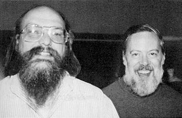
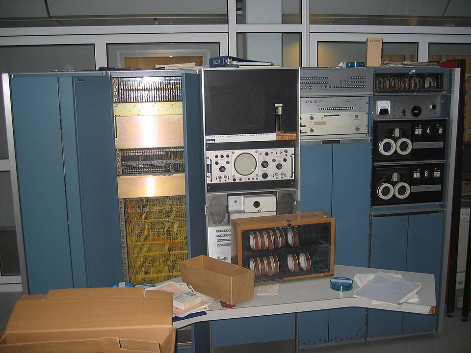

- **Multics** (MIT, General Electric, Bell Labs) : un système à temps partagé trop complexe, abandonné par les Bell Labs en 1969
- **1969** : **Ken Thompson** et **Dennis Ritchie** écrivent un système beaucoup plus simple sur un **PDP-7** inutilisé
- Brian Kernighan le baptise *Unics*, par jeu de mots avec Multics : **UNIX** est né

###### Photos : Ken Thompson (à gauche) et Dennis Ritchie ; un PDP-7

---

# UNIX et le langage C (1970-1979)

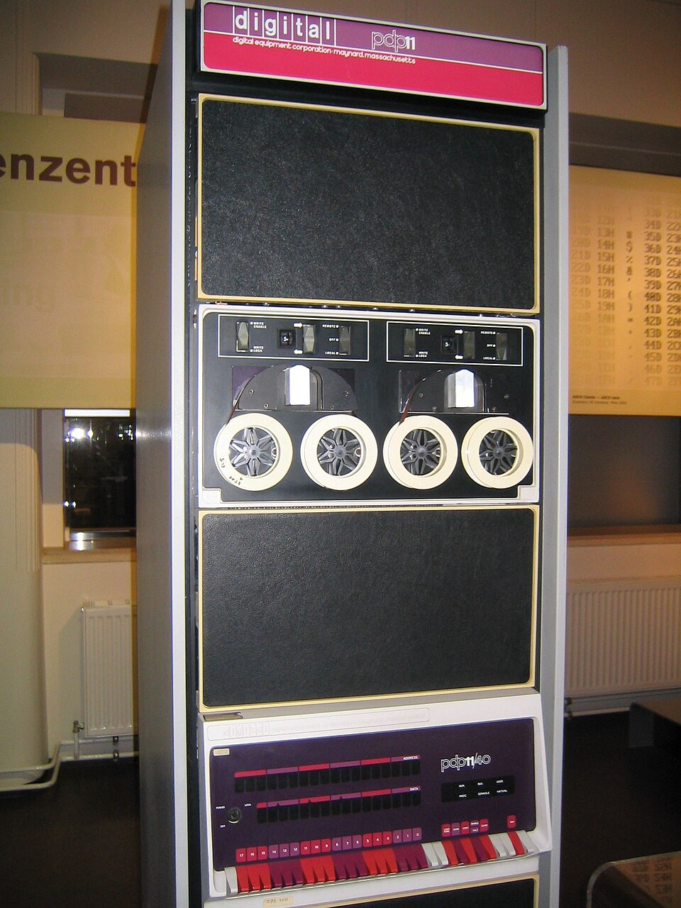
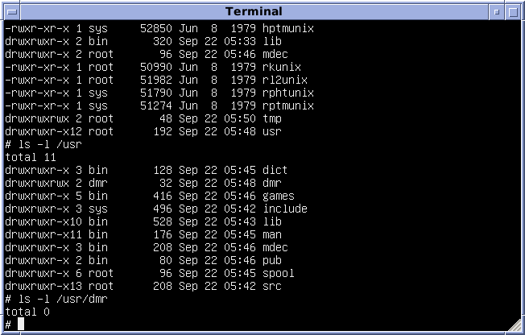

- 1970 : portage sur **PDP-11**
- **1973** : le noyau est réécrit en **C** (créé par Dennis Ritchie) : UNIX devient **portable**
- 1973 : Doug McIlroy introduit les **tubes** (*pipes*)
- AT&T n'a pas le droit de vendre de logiciels : UNIX est distribué aux universités **avec son code source**
- **1979** : la **Version 7** (Bourne shell `sh`, `awk`), ancêtre commun de tous les UNIX

###### Photos : un PDP-11/40 ; UNIX Version 7 dans l'émulateur SIMH

---

# BSD, l'UNIX de Berkeley

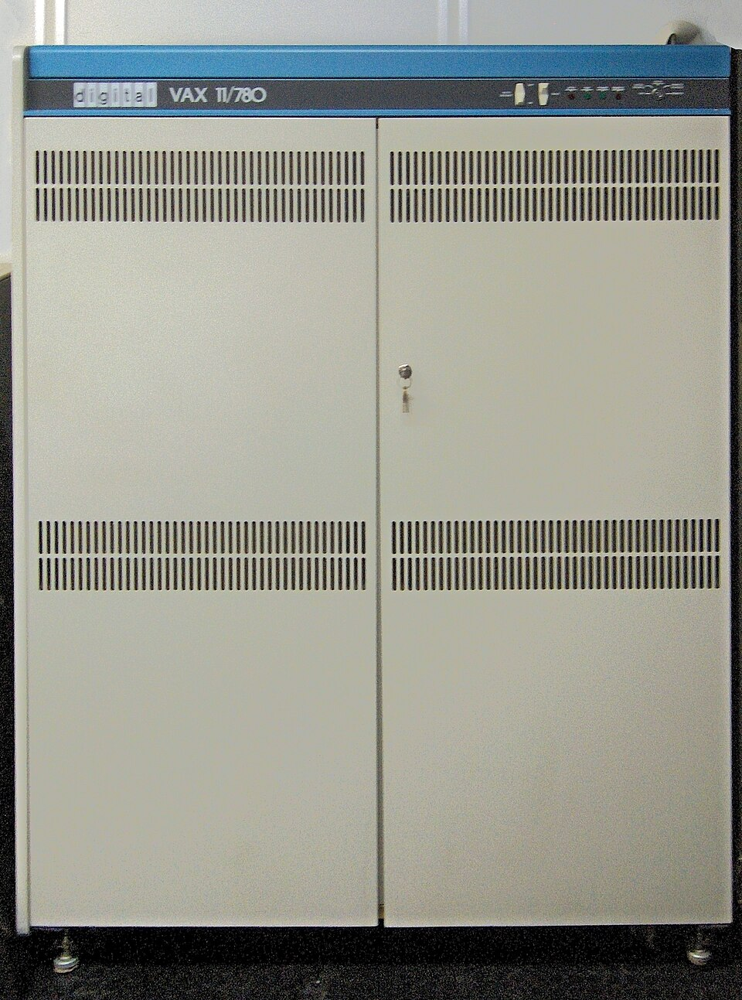

- **1977** : l'université de Berkeley distribue **BSD** (*Berkeley Software Distribution*)
- **Bill Joy** écrit `vi` et le C shell `csh` ; BSD fonctionne sur les **VAX** de DEC
- **1983** : 4.2BSD intègre la **pile TCP/IP** et les *sockets* : Internet se diffuse
- Procès d'AT&T (1992-1994), puis **4.4BSD-Lite**, libéré du code AT&T
- Descendants : **FreeBSD**, **NetBSD**, **OpenBSD**... et **macOS**

###### Photo : un VAX-11/780 de DEC

---

# Les UNIX commerciaux et POSIX

- **1983** : AT&T commercialise **System V**
- Chaque constructeur a son UNIX : **Solaris** (Sun), **HP-UX** (HP), **AIX** (IBM), **IRIX** (SGI)...
- Des systèmes incompatibles : la « **guerre des UNIX** »
- **1988** : la norme **POSIX** (IEEE) définit l'interface commune d'un système de type UNIX
- « UNIX » est une marque de l'**Open Group** (*Single UNIX Specification*)

---

# Le projet GNU


- **1983** : **Richard Stallman** annonce le projet **GNU** (*GNU's Not UNIX*) : un UNIX entièrement **libre**
- 1985 : *Free Software Foundation* ; **1989** : licence **GNU GPL**
- GNU écrit les outils : GCC, GDB, Emacs, `bash`, `ls`, `cp`, `grep`, la bibliothèque C...
- Il manque le **noyau** : GNU Hurd n'aboutit pas

###### Le logo du projet GNU ; Richard Stallman

---

# Linux (1991)


- 1987 : **Minix**, un petit UNIX d'enseignement (Andrew Tanenbaum)
- **25 août 1991** : **Linus Torvalds**, étudiant à Helsinki, annonce son noyau :

> « Je fais un système d'exploitation (gratuit) (juste un passe-temps, ce ne sera pas gros et professionnel comme GNU) pour les clones AT 386(486). »

- 1992 : Linux passe sous **GPL** : noyau Linux + outils GNU = **GNU/Linux**
- Distributions : Slackware, Debian (1993), Red Hat (1994), Ubuntu (2004)...

###### Tux, la mascotte de Linux ; Linus Torvalds

---

# La famille UNIX


---

# Trois branches

| Branche | Origine | Systèmes actuels |
|---|---|---|
| **System V** | AT&T | AIX, HP-UX, Solaris |
| **BSD** | Université de Berkeley | FreeBSD, NetBSD, OpenBSD, macOS, iOS |
| **Clones** (*Unix-like*) | réécrits sans le code d'AT&T | Minix, GNU/Linux, Android |

- macOS est officiellement **certifié UNIX**
- Linux n'est pas certifié, mais largement compatible **POSIX**

Arbre généalogique complet : [www.levenez.com/unix](http://www.levenez.com/unix/)

---

# Linux aujourd'hui

- la majorité des **serveurs** du web et du **cloud**
- les **500 superordinateurs** les plus puissants du monde (depuis 2017)
- l'**embarqué** : box, télévisions, voitures, objets connectés
- les **smartphones**, avec **Android** (noyau Linux, sans GNU)

---

<!-- _class: compact -->

# Les grandes figures

| Personne | Contributions |
|---|---|
| Ken Thompson | UNIX, langage B, Plan 9, UTF-8, langage Go |
| Dennis Ritchie | UNIX, langage C, Plan 9 |
| Brian Kernighan | le nom « UNIX », *The C Programming Language*, `awk` |
| Doug McIlroy | les tubes (*pipes*), la philosophie UNIX |
| Bill Joy | BSD, `vi`, `csh`, TCP/IP dans BSD, Sun Microsystems |
| Richard Stallman | projet GNU, licence GPL, FSF, GNU Emacs, GCC |
| Andrew Tanenbaum | Minix |
| Steve Jobs | Apple, NeXT, macOS |
| Linus Torvalds | noyau Linux, Git |

Prix Turing 1983 : Ken Thompson et Dennis Ritchie, pour UNIX.

---

<!-- _class: compact -->

# Chronologie (1/2)

| Année | Événement |
|---|---|
| 1969 | Premier UNIX sur PDP-7, aux Bell Labs d'AT&T |
| 1973 | UNIX réécrit en C ; les tubes |
| 1977 | Début de BSD |
| 1979 | UNIX Version 7 |
| 1983 | System V ; TCP/IP dans BSD ; projet GNU |
| 1985 | Free Software Foundation ; Steve Jobs fonde NeXT |
| 1987 | Minix |
| 1988 | Norme POSIX |
| 1989 | Licence GPL ; shell `bash` |
| 1990 | Tim Berners-Lee crée le Web au CERN sur un NeXT |
| 1991 | Linus Torvalds annonce Linux |

---

<!-- _class: compact -->

# Chronologie (2/2)

| Année | Événement |
|---|---|
| 1992 | Linux sous licence GPL ; encodage UTF-8 |
| 1993 | Slackware, Debian, FreeBSD, NetBSD |
| 1994 | Linux 1.0 ; 4.4BSD-Lite |
| 1995 | OpenBSD |
| 1998 | Apparition du terme « open source » |
| 2001 | Mac OS X, basé sur Darwin (BSD) |
| 2004 | Ubuntu |
| 2005 | Linus Torvalds crée Git |
| 2008 | Premier smartphone Android |
| 2017 | Linux équipe les 500 superordinateurs les plus puissants |
| 2019 | UNIX fête ses 50 ans |

---

# Culture du logiciel libre

- **Licence GPL** (1989) : *copyleft*, un logiciel modifié et redistribué reste sous GPL ; les licences **BSD** et **MIT** sont *permissives* (réutilisées par macOS, la PlayStation)
- **La cathédrale et le bazar** (Eric S. Raymond, 1997) : « avec suffisamment d'yeux, tous les bugs sont superficiels »
- **Homesteading the Noosphere** (Eric S. Raymond, 1998) : propriété et culture du don dans l'open source
- **Déclaration d'indépendance du cyberespace** (John Perry Barlow, 1996)

---

# UNIX en images et en vidéos

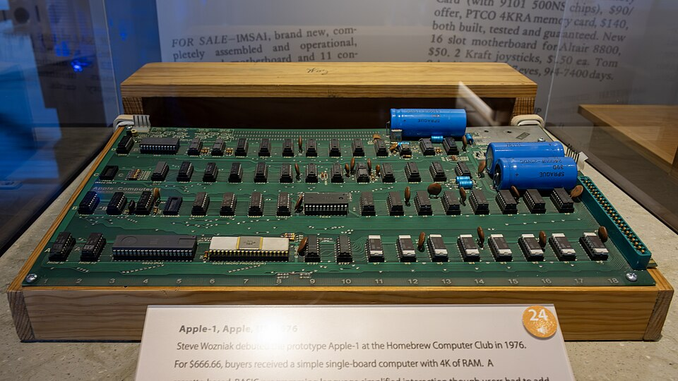
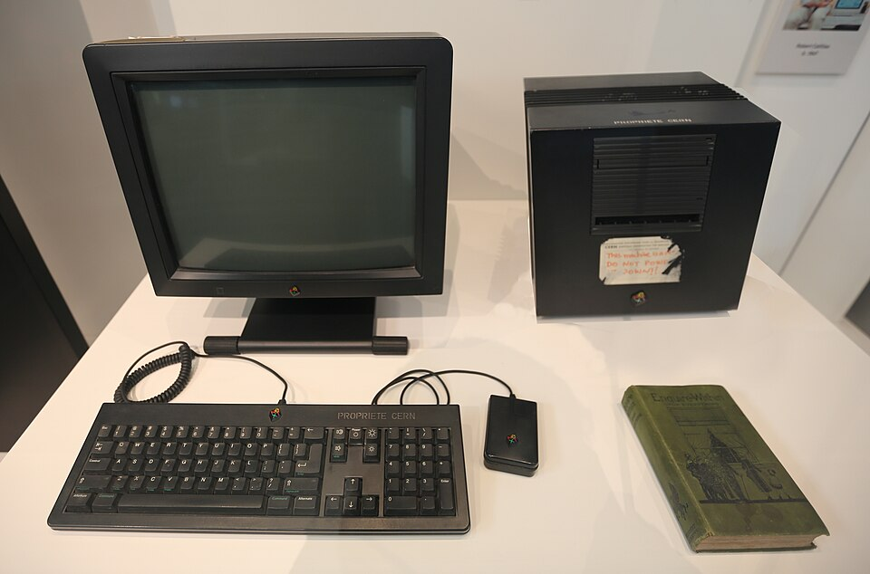

- Vidéo : [AT&T Archives: The UNIX Operating System](https://www.youtube.com/watch?v=tc4ROCJYbm0) (1982)
- Vidéo : [Where GREP Came From - Computerphile](https://www.youtube.com/watch?v=NTfOnGZUZDk)
- L'**Apple I** (1976) de Steve Jobs et Steve Wozniak
- Le **NeXTcube** de Tim Berners-Lee au CERN : le premier serveur web (1990)
- Les machines d'UNIX : [PDP-7](https://fr.wikipedia.org/wiki/PDP-7), [PDP-11](https://fr.wikipedia.org/wiki/PDP-11), [VAX](https://fr.wikipedia.org/wiki/VAX)
- [L'annonce de Linux](https://next.ink/wp-content/uploads/2025/08/image-97.png) (1991)

###### Photos : un Apple I ; le NeXTcube, premier serveur web

---

<!-- _class: lead invert -->

# 4. Philosophie UNIX

---

# « Less is more »

- Des programmes qui effectuent **une seule chose** et qui la font bien
- **Le silence est d'or** : un programme qui réussit n'affiche rien
- Des programmes qui **collaborent**
- Des programmes qui gèrent des **flux de texte**, l'interface universelle

---

<!-- _class: compact -->

# Citations

> « Il est plus facile de définir un système d'exploitation par ce qu'il fait que par ce qu'il est. » **J.L. Peterson**

> « Unix est convivial. Cependant Unix ne précise pas vraiment avec qui. » **Steven King**

> « Unix ne dit jamais 's'il vous plaît'. » **Rob Pike**

> « Unix est simple. Il faut juste être un génie pour comprendre sa simplicité. » **Dennis Ritchie**

> « Unix n'a pas été conçu pour empêcher ses utilisateurs de commettre des actes stupides, car cela les empêcherait aussi des actes ingénieux. » **Doug Gwyn**

---

# Qu'est-ce qu'un UNIX ?

```bash
$ history | grep -v " h" | sed 's/[ \t]*$//' | sort -k 2 -r | uniq -f 1 | sort -n
```


Chaque programme fait une seule chose ; le tube `|` les fait collaborer. Résultat : l'historique des commandes, sans les doublons.

---

<!-- _class: lead invert -->

# 5. Manipuler sous Linux

---

# Interfaces et conventions

- **GUI** (*Graphical User Interface*) : fenêtres, souris, icônes, menus
- **CLI** (*Command Line Interface*) : puissante, rapide, peu gourmande ; beaucoup de serveurs ne s'administrent qu'en ligne de commande
- L'interpréteur de commandes est le **shell**

Dans les exemples, l'invite (*prompt*) indique les droits nécessaires :

- `$ commande` : utilisateur ordinaire
- `# commande` : super-utilisateur *root*

> Ne jamais taper l'invite `$` ou `#` !

---

# Structure d'une commande

```
$ commande [options] <paramètres>
```

| `ls` | `-l --all` | `/etc` |
|---|---|---|
| commande | options | paramètre |

- des mots séparés par des espaces ; `[ ]` signale ce qui est facultatif (on ne tape pas les crochets)
- options courtes `-l` ou longues `--all` (standard GNU), dans un ordre quelconque :

```bash
$ ls --all -l --si
$ ls -l --si --all
```

---

# Types de commandes

- **internes** au shell : `cd`, `echo`, `history`, `test`
- **externes** (programmes) : `ls`, `mkdir`... dans `/bin`, `/usr/bin`, `/sbin`
- **alias** : `ll`
- `$PATH` : la liste des répertoires où le shell cherche les commandes

```bash
$ type echo
echo est une primitive du shell
$ type strings
strings est /usr/bin/strings
$ type ll
ll est un alias vers « ls -halF »
```

---

# Comment le shell trouve une commande


```bash
$ echo $PATH
/usr/local/sbin:/usr/local/bin:/usr/sbin:/usr/bin:/sbin:/bin
$ which ls
/usr/bin/ls
```

---

# Obtenir de l'aide

- `man ls` : la page de manuel (`/motif` pour chercher, `n` / `N`, `q` pour quitter)
- sections : 1 commandes, 2 appels système, 3 fonctions C, 5 formats de fichiers, 8 administration
- `man 1 mkdir` et `man 2 mkdir` : deux pages différentes
- `apropos mot-clé` : chercher dans tout le manuel ; `whatis ls` : description courte
- `help cd` (commandes internes), `ls --help`, `info ls`

> **RTFM** : *Read The Fine Manual*

---

# Le shell Bash et les sessions

- **Bash** (*Bourne-again shell*) : le shell du projet GNU, par défaut sur la plupart des distributions ; autres shells : `sh`, `ksh`, `csh`, `zsh`...
- ouvrir une session : `login`, `su` (changer d'utilisateur), **`ssh`** (à distance, chiffré)
- l'invite est définie par la variable `PS1`
- fermer une session : `exit`, `logout` ou **Ctrl + D**

> On ne tape pas `login` : sur une console texte (`Ctrl + Alt + F3`), le système le lance pour vérifier l'identifiant et le mot de passe, puis démarre le shell.


---

# Les flux standard


Tout processus démarre avec trois flux :

| n° | Flux | Par défaut |
|---|---|---|
| 0 | *stdin* | le clavier |
| 1 | *stdout* | l'écran |
| 2 | *stderr* | l'écran |

> Un **processus** est un programme en cours d'exécution, identifié par un PID.

---

# Redirections et tubes

```bash
$ ls > liste.txt                      # stdout vers un fichier (écrasé)
$ date >> journal.txt                 # stdout ajouté à la fin du fichier
$ wc -l < liste.txt                   # stdin depuis un fichier
$ find / -name passwd 2> /dev/null    # stderr supprimé
$ cat bonjour.txt | wc -c             # tube : stdout de cat vers stdin de wc
```


---

# L'historique des commandes

```bash
$ history              # tout l'historique
$ history | grep ls    # rechercher (voir aussi Ctrl + R)
$ !!                   # relance la dernière commande
$ !ls                  # relance la dernière commande commençant par ls
$ !100                 # relance la commande n°100
$ echo !$              # !$ : dernier argument de la commande précédente
$ history -c           # efface l'historique
```

---

# Groupement de commandes

```bash
cmd1 ; cmd2     # cmd1 puis cmd2
cmd1 | cmd2     # tube entre cmd1 et cmd2
cmd1 && cmd2    # cmd2 seulement si cmd1 réussit
cmd1 || cmd2    # cmd2 seulement si cmd1 échoue
```


```bash
$ rm fff || echo "Houston, on a un problème !"
```

---

# Le code de retour `$?`

Chaque commande renvoie un **code de retour** : `0` = succès (VRAI), autre valeur = erreur (FAUX)

```bash
$ ls ; echo $?
0
$ ls zzz ; echo $?
2
$ touch test.log
$ test -s test.log || echo "le fichier est vide"
le fichier est vide
$ test -e test.log && echo "le fichier existe"
le fichier existe
```

---

# Les processus


- un **processus** : un programme en cours d'exécution
- identifié par un **PID**, il connaît son parent (**PPID**)
- ancêtre de tous : le **PID 1** (`systemd`, autrefois `init`)
- l'**ordonnanceur** du noyau partage le processeur

```bash
$ ps -ef          # tous les processus
$ pstree          # l'arbre des processus
$ top             # en temps réel
$ pidof bash      # PID d'un programme
```

###### Dans l'arbre, `login` a authentifié l'utilisateur sur une console texte et lancé son `bash` ; `sshd` fait de même pour une connexion à distance. En mode graphique, on verrait `gdm` et `gnome-terminal`.

---

# Gérer les tâches

```bash
$ sleep 300 &     # lance en arrière-plan
[1] 12345
$ jobs            # tâches du shell
$ kill %1         # signal TERM (kill -9 : KILL)
```


`nohup` : détacher du terminal · `at`, `batch` : exécution différée · `cron` : planification

---

# Installer des logiciels : les paquets

- des **paquets** (`.deb` sur Debian et Ubuntu) téléchargés depuis des **dépôts**
- `dpkg` (bas niveau), **APT** (`apt`, `apt-get` : gère les dépendances), `synaptic` (graphique)

```bash
$ sudo apt update          # liste des paquets disponibles
$ sudo apt upgrade         # met à jour le système
$ apt search htop          # recherche un paquet
$ sudo apt install htop    # installe un paquet et ses dépendances
$ sudo apt remove htop     # supprime un paquet
$ dpkg -L htop             # fichiers installés par le paquet
```

Autres familles : RPM et `dnf` (Red Hat, Fedora), `pacman` (Arch Linux)

---

# APT en action

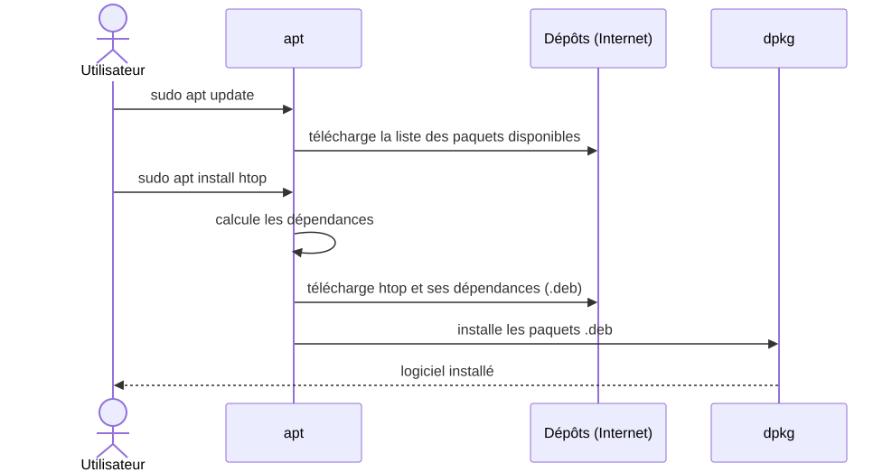

---

<!-- _class: lead invert -->

# 6. Manipuler des fichiers

---

# Le système de fichiers

- organise les données en **fichiers** et **répertoires** sur un support (disque, SSD, clé USB)
- on **partitionne** le disque (`fdisk`), puis on **formate** chaque partition
- types : **ext4** (Linux), Btrfs, XFS, FAT, exFAT, NTFS, APFS, ISO 9660...
- sous UNIX : une **arborescence unique** à partir de la racine `/`

```bash
$ df -Th       # systèmes de fichiers montés et leur type
```

---

# Partitions et montage

Chaque partition formatée est **montée** sur un répertoire de l'arborescence unique :


```bash
$ lsblk -f     # disques, partitions, types et points de montage
```

---

# L'arborescence


Autres répertoires : `/bin` et `/sbin` (commandes), `/boot` (noyau, démarrage), `/proc` et `/sys` (noyau et processus), `/root` (répertoire de root)

Norme **FHS** (*Filesystem Hierarchy Standard*)

---

<!-- _class: compact -->

# Chemins absolus et relatifs


- **absolu** : depuis la racine, commence toujours par `/`
- **relatif** : depuis le répertoire courant ; `.` courant, `..` parent, `~` personnel

| Répertoire courant | hello.c | bonjour.txt |
|---|---|---|
| (n'importe lequel) | `/home/fab/hello.c` | `/home/fab/tmp/bonjour.txt` |
| `/home/fab` | `./hello.c` | `./tmp/bonjour.txt` |
| `/home/prof` | `../fab/hello.c` | `../fab/tmp/bonjour.txt` |

```bash
$ pwd          # affiche le répertoire courant
$ cd ..        # remonte au répertoire parent
$ cd           # retourne dans le répertoire personnel
```

---

# Fichiers et inodes

- un fichier : une suite d'**octets** portant un nom
- son **inode** contient ses **métadonnées** : type, droits, propriétaire, taille, dates, nombre de liens, numéros des blocs
- le **nom** est dans le **répertoire**, pas dans l'inode


```bash
$ ls -i fichier ; stat fichier
```

---

# Fichiers texte et binaires

- **texte** : des caractères encodés (ASCII, UTF-8) : code source, scripts, configuration... On les modifie avec un **éditeur de texte**
- **binaire** : tout le reste : exécutables, images, sons, bases de données...
- **compressé** (`gzip`, `xz`, `zip`) et **archive** (`tar`, `.tar.gz`)
- fins de ligne : **LF** (UNIX), **CRLF** (Windows, protocoles Internet), CR (anciens Mac)

```bash
$ echo "Hello world" > bonjour.txt
$ hexdump -C bonjour.txt
00000000  48 65 6c 6c 6f 20 77 6f  72 6c 64 0a              |Hello world.|
0000000c
```

Chaque caractère occupe un octet : `48` = « H », `20` = espace, `0a` = fin de ligne LF

---

# L'encodage des caractères

- **ASCII** : 7 bits, 128 caractères, sans accents
- **ISO 8859-1** (*latin1*), **ISO 8859-15** (*latin9*, avec « œ » et « € »)
- **Unicode** : plus de 150 000 caractères, encodés en **UTF-8** (UNIX, Internet) ou en UTF-16 (Java, Windows) ; UTF-8 est compatible avec ASCII

```bash
$ file bonjour.txt
bonjour.txt: UTF-8 Unicode text
$ iconv -f UTF-8 -t ISO8859-1 bonjour.txt -o bonjour_latin1.txt
$ man ascii
```

> Pas d'espaces ni de caractères accentués dans les noms de fichiers !

---

# La table ASCII

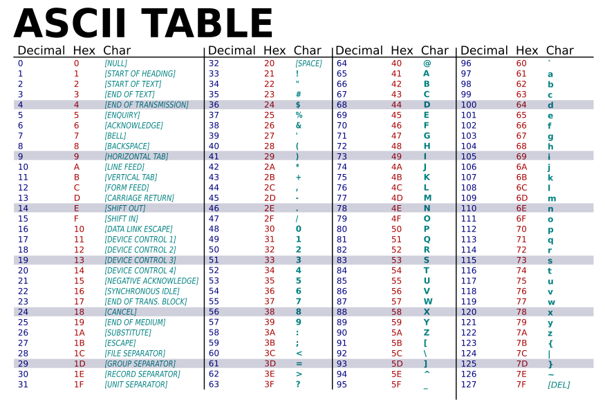

---

# Un caractère, plusieurs encodages

| Caractère | ASCII | ISO 8859-1 (latin1) | ISO 8859-15 (latin9) | UTF-8 |
|---|---|---|---|---|
| `A` | `41` | `41` | `41` | `41` |
| `é` | absent | `e9` | `e9` | `c3 a9` |
| `€` | absent | absent | `a4` | `e2 82 ac` |

```bash
$ echo -n "é" | od -An -tx1
 c3 a9
$ echo -n "é" | iconv -f UTF-8 -t ISO8859-1 | od -An -tx1
 e9
```

> Un texte UTF-8 lu comme du latin1 affiche « é » au lieu de « é ».

---

# Créer et afficher

```bash
$ mkdir tmp ; cd tmp ; pwd
/home/fab/tmp
$ touch vide                          # fichier vide
$ echo "Hello world" > bonjour.txt    # fichier avec un contenu
$ echo "by $USER" >> bonjour.txt      # ajout à la fin
$ cat bonjour.txt                     # afficher (cat -n : numéroter)
$ less bonjour.txt                    # page par page (q pour quitter)
$ head -1 bonjour.txt                 # première ligne
$ tail -2 bonjour.txt                 # deux dernières lignes
$ wc -l bonjour.txt                   # nombre de lignes
```

---

# Copier, déplacer, supprimer, rechercher

```bash
$ cp /etc/passwd .                          # copier
$ cp -r temp temp1                          # copier un répertoire
$ mv utilisateurs liste.txt                 # renommer ou déplacer
$ rm liste.txt                              # supprimer
$ rm -r temp                                # supprimer un répertoire
$ find $HOME -name "*.txt"                  # rechercher
$ find $HOME -name "*.txt" -exec ls -l {} \;
```

> Pas de corbeille en ligne de commande : `rm` est **définitif**.
> Le motif de `find` doit être **entre guillemets**.

---

# L'éditeur vim


| Commande | Action |
|---|---|
| `:w` / `:q!` / `:wq` | sauvegarder / quitter sans sauvegarder / les deux |
| `dd` / `yy` / `p` | couper / copier / coller une ligne |
| `u` | annuler |
| `/mot` puis `n` / `N` | rechercher |
| `:set nu` | afficher les numéros de ligne |

`vimtutor` : un tutoriel interactif de 30 minutes

---

<!-- _class: lead invert -->

# 7. Gestion des droits

---

# Utilisateurs et groupes

- un utilisateur : un nom, un **UID**, un groupe principal (**GID**), des groupes secondaires
- **root** : UID 0, aucune restriction
- `/etc/passwd` (comptes), `/etc/shadow` (mots de passe hachés), `/etc/group` (groupes)

```bash
$ id
uid=1000(fab) gid=1000(fab) groupes=1000(fab),4(adm),27(sudo)
$ grep fab /etc/passwd
fab:x:1000:1000:,,,:/home/fab:/bin/bash
```

| `fab` | `x` | `1000` | `1000` | `,,,` | `/home/fab` | `/bin/bash` |
|---|---|---|---|---|---|---|
| nom | mot de passe (dans `/etc/shadow`) | UID | GID | commentaire | répertoire personnel | shell |

Commandes : `id`, `groups`, `whoami`, `who`, `w`, `last`

---

# Lire les permissions

```bash
$ ls -l script.sh
-rwxr-x--- 1 fab promo00 38 sept. 26 10:12 script.sh
```

| Type | Utilisateur (`u`) | Groupe (`g`) | Autres (`o`) | Propriétaire | Groupe propriétaire |
|---|---|---|---|---|---|
| `-` | `rwx` | `r-x` | `---` | `fab` | `promo00` |

Types : `-` fichier · `d` répertoire · `l` lien symbolique · `c` / `b` périphérique · `s` socket · `p` tube nommé

Chaque bloc de trois caractères donne les droits `r` (lecture), `w` (écriture) et `x` (exécution) ; un `-` indique un droit absent.

---

# Les permissions de base

| Droit | Sur un fichier | Sur un répertoire |
|---|---|---|
| `r` | lire le contenu | lister le contenu (`ls`) |
| `w` | modifier le contenu | créer, supprimer, renommer des fichiers |
| `x` | exécuter (programme, script) | traverser (`cd`, accès aux fichiers) |

Attribuées à : `u` l'utilisateur · `g` le groupe · `o` les autres · `a` tout le monde

> Pour supprimer un fichier, il faut le droit `w` sur le **répertoire**, pas sur le fichier.

---

# Qui a quels droits ?

- les droits sont vérifiés dans l'ordre **u**, **g**, **o** : dès qu'une catégorie correspond, **seuls ses droits** s'appliquent
- avec `----rwx---` (`chmod 070`), le propriétaire n'a **aucun** accès, même s'il fait partie du groupe


---

# Modifier les permissions : chmod

| Qui | Opération | Droits |
|---|---|---|
| `u` utilisateur · `g` groupe · `o` autres · `a` tous | `+` ajouter · `-` retirer · `=` fixer | `r` `w` `x` |

```bash
$ chmod g+rx fichier     # ajoute r et x au groupe
$ chmod a-x fichier      # retire x à tout le monde
$ chmod u=rw fichier     # fixe les droits de l'utilisateur
$ chmod -R g+w projet    # récursivement
```

---

# chmod : le mode octal

| Octal | 0 | 1 | 2 | 3 | 4 | 5 | 6 | 7 |
|---|---|---|---|---|---|---|---|---|
| Droits | `---` | `--x` | `-w-` | `-wx` | `r--` | `r-x` | `rw-` | `rwx` |

Exemple : `chmod 750 fichier`

| | Utilisateur | Groupe | Autres |
|---|---|---|---|
| Droits | `rwx` | `r-x` | `---` |
| Calcul (`r` = 4, `w` = 2, `x` = 1) | 4 + 2 + 1 | 4 + 0 + 1 | 0 + 0 + 0 |
| Octal | **7** | **5** | **0** |

Courants : **644** `rw-r--r--` (fichiers) · **755** `rwxr-xr-x` (scripts, répertoires) · **600** `rw-------` (fichiers privés)

---

<!-- _class: compact -->

# Les droits spéciaux

| Droit | Sur un exécutable | Sur un répertoire | Octal |
|---|---|---|---|
| SUID `s` (bloc u) | s'exécute avec l'UID du propriétaire | aucun effet | 4 |
| SGID `s` (bloc g) | s'exécute avec le GID du groupe | les fichiers créés héritent du groupe | 2 |
| sticky bit `t` (bloc o) | ignoré par Linux | seul le propriétaire d'un fichier peut le supprimer | 1 |

```bash
$ ls -l /usr/bin/sudo
-rwsr-xr-x 2 root root 70K mars  12 17:35 /usr/bin/sudo
$ ls -ld /tmp
drwxrwxrwt 20 root root 4096 sept. 26 10:12 /tmp
$ chmod 2775 projet      # répertoire d'équipe : rwxrwsr-x
```

> Attention : un SUID mal placé est une faille de sécurité (jamais sur `cat` !).

---

# SUID : l'exemple de sudo

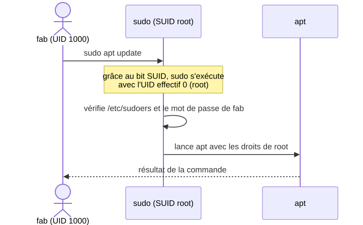

---

# Les droits par défaut : umask

```bash
$ umask
0022
$ umask -S
u=rwx,g=rx,o=rx
```


Fichier : 666 & ~022 = **644** · répertoire : 777 & ~022 = **755**

---

# chown, chgrp et pour aller plus loin

```bash
# chown fab fichier            # propriétaire (root uniquement)
# chown fab:promo00 fichier    # propriétaire et groupe
$ chgrp promo00 fichier        # groupe (dont on est membre)
```

- **sudo** : exécuter une commande en tant que root (`/etc/sudoers`)
- **ACL** : des droits pour d'autres utilisateurs ou groupes (`getfacl`, `setfacl`)
- Vidéos : [Sticky bit, SetUID, SetGID](https://www.youtube.com/watch?v=Wuv5S2IqiWQ) · [Special Linux Permissions](https://www.youtube.com/watch?v=zU43cReOBsc) · [umask](https://www.youtube.com/watch?v=cbNoaC6CSO0)

---

<!-- _class: lead invert -->

# 8. Caractères spéciaux et filtres

---

# Les caractères génériques du shell

Interprétés **par le shell**, avant le lancement de la commande :

| Motif | Désigne |
|---|---|
| `*` | n'importe quelle chaîne, même vide |
| `?` | un caractère quelconque |
| `[abc]`, `[a-c]` | un caractère de la liste |
| `[!abc]` | un caractère hors de la liste |
| `{abc,cod}` | l'une des chaînes |

```bash
$ ls *.txt          $ ls a?c*          $ ls [a-c]*          $ ls *.{c,txt}
```

---

<!-- _class: compact -->

# Les expressions régulières : opérateurs

Un **motif** (*pattern*) décrit un ensemble de chaînes : `grep`, `sed`, `awk`, `vim`...

| Opérateur | Signification | Exemple | Correspond à |
|---|---|---|---|
| `.` | un caractère quelconque | `a.c` | « abc », « a2c » |
| `[...]` | un caractère de la liste | `[aeiou]`, `[a-d]` | « a », « e » |
| `[^...]` | un caractère hors de la liste | `[^aeiou]` | « b », « c » |
| `^` | début de ligne | `^a` | « a » en début de ligne |
| `$` | fin de ligne | `a$` | « a » en fin de ligne |
| `\|` | alternative | `a\|b` | « a » ou « b » |
| `(...)` | groupement | `(ab)+` | « ab », « abab » |
| `\` | échappement | `\.` | un point |

---

<!-- _class: compact -->

# Les expressions régulières : quantificateurs

| Quantificateur | Signification | Exemple | Correspond à | Pas à |
|---|---|---|---|---|
| `?` | zéro ou une fois | `toto?` | « tot », « toto » | « totoo » |
| `*` | zéro, une ou plusieurs fois | `toto*` | « tot », « toto », « totoo » | |
| `+` | une ou plusieurs fois | `toto+` | « toto », « totoo » | « tot » |
| `{n}` | exactement n fois | `a{3}` | « aaa » | « aa » |
| `{n,m}` | entre n et m fois | `a{2,4}` | « aa », « aaaa » | « a » |
| `{n,}` | au moins n fois | `a{3,}` | « aaa », « aaaa » | « aa » |

Classes POSIX : `[[:digit:]]` `[[:alpha:]]` `[[:alnum:]]` `[[:upper:]]` `[[:lower:]]` `[[:space:]]`

---

# BRE, ERE et PCRE

- **BRE** (par défaut pour `grep` et `sed`) : `\?` `\+` `\{ \}` `\( \)` `\|` doivent être échappés
- **ERE** (`grep -E`, `sed -E`) : ces caractères sont spéciaux sans échappement
- **PCRE** (`grep -P`) : la syntaxe de Perl

```bash
$ grep '\(84\|13\)[[:digit:]]\{3\}' liste.txt     # BRE
$ grep -E '(84|13)[[:digit:]]{3}' liste.txt       # ERE
$ sed -En '/(84|13)[[:digit:]]{3}/p' liste.txt    # ERE
Sarrians 84260
Avignon 84000
...
```

---

# Protéger les caractères spéciaux

| Protection | Effet |
|---|---|
| `\` | annule le caractère suivant |
| `'...'` | annule tous les caractères spéciaux |
| `"..."` | annule tout sauf `$`, `` ` `` et `\` |

```bash
$ nom=fab
$ echo "hello $nom"      # hello fab
$ echo 'hello $nom'      # hello $nom
$ echo "hello \$nom"     # hello $nom
```

---

# Les filtres grep, sed et awk

```bash
$ grep bash /etc/passwd                     # lignes contenant bash
$ grep -v '^#' fichier.conf                 # lignes ne commençant pas par #
$ grep -c '[[:upper:]]' fichier             # lignes contenant une majuscule
$ sed 's/Windows/Linux/g' texte.txt         # remplacer
$ sed '/^$/d' texte.txt                     # supprimer les lignes vides
$ df | sed 1d | awk '{print $1 " = " $4}'   # colonnes 1 et 4
$ cut -d: -f1,7 /etc/passwd                 # champs 1 et 7
```

> `egrep` et `fgrep` sont obsolètes : on utilise `grep -E` et `grep -F`.

---

<!-- _class: lead invert -->

# 9. Automatiser des tâches

---

# Pourquoi des scripts ?

- automatiser les tâches **répétitives** : sauvegarde, surveillance, installation
- simplifier l'utilisation de logiciels complexes
- mémoriser des commandes aux nombreuses options
- planifier des traitements (`at`, `cron`)

Un **script shell** est un fichier **texte**, **exécutable** (droit `x`) et **interprété** par un shell.

---

# Premier script

```bash
$ vim script.sh
```

```bash
#!/bin/bash
echo "je suis un script"
```

```bash
$ chmod +x script.sh
$ ./script.sh
je suis un script
```

> La première ligne, le **shebang** `#!`, indique l'interpréteur à utiliser.

---

# Exécuter un script


```bash
$ ./monscript        # sous-shell
$ sh monscript       # sous-shell
$ source monscript   # shell courant
```

- `./monscript` nécessite le droit `x`
- avec `source` (ou `.`), les variables et le répertoire courant modifiés par le script restent en place

---

# Les variables

```bash
$ chaine=bonjour           # pas d'espace autour de =
$ echo $chaine ${chaine}
$ nom=fab
$ echo "hello $nom"        # hello fab
$ unset chaine             # détruit la variable
$ export EDITOR=vim        # visible par les programmes lancés
$ echo $HOME $USER $PATH   # variables d'environnement
```

- une variable existe dès qu'on lui donne une valeur
- par défaut, tout est **chaîne de caractères** (typage faible)

---

# Variables locales et d'environnement

Seules les variables **exportées** sont transmises aux programmes lancés par le shell :


```bash
$ COULEUR=bleu
$ export EDITOR=vim
$ bash -c 'echo "couleur=$COULEUR éditeur=$EDITOR"'
couleur= éditeur=vim
```

---

# Les substitutions

```bash
$ fichier=texte.htm
$ echo ${#fichier}                    # longueur : 9
$ echo ${fichier%htm}html             # texte.html
$ echo ${fichier##*.}                 # extension : htm
$ echo ${nom:-inconnu}                # valeur par défaut
$ NB=$(ls | wc -l)                    # substitution de commande
$ somme=$((2 + 3))                    # évaluation arithmétique
$ echo "scale=2; 2500/1000" | bc -l   # calcul sur les réels : 2.50
```

---

# Paramètres et variables internes

| Variable | Contenu |
|---|---|
| `$0` | nom du script |
| `$1`, `$2`, ... | paramètres |
| `$#` | nombre de paramètres |
| `$@`, `$*` | tous les paramètres |
| `$?` | code retour de la dernière commande |
| `$$` | PID du shell |
| `$!` | PID du dernier processus lancé en arrière-plan |

```bash
echo "Ce script se nomme $0 et a reçu $# paramètre(s) : $@"
```

---

# Afficher et saisir

```bash
#!/bin/bash
echo -n "Entrez votre nom : "
read nom
echo "Bonjour $nom"
printf "%s a %d ans\n" "$nom" 20
read -s -n 1 -t 5 touche     # une touche, sans écho, 5 s maximum
exit 0
```

Commandes internes utiles : `echo`, `printf`, `read`, `exit`, `let`, `eval`, `shift`, `export`, `source`

---

# Les tests

| Test | Vrai si | Test | Vrai si |
|---|---|---|---|
| `[ -e f ]` | f existe | `[ -z "$s" ]` | chaîne vide |
| `[ -f f ]` | f est un fichier | `[ "$a" = "$b" ]` | chaînes égales |
| `[ -d f ]` | f est un répertoire | `[ $n -eq 5 ]` | nombres égaux |
| `[ -x f ]` | f est exécutable | `[ $n -lt 5 ]` | n inférieur à 5 |

```bash
[[ $cp =~ ^(84|13)[0-9]{3}$ ]]     # expression régulière (ERE)
```

> Des **espaces** autour de `[`, `]` et des opérateurs ! Voir `help test`.

---

# if / then / else


```bash
if [ ! -d "$1" ]
then
    mkdir "$1"
fi

if cmp a b &> /dev/null
then echo "identiques"
else echo "différents"
fi
```

La condition est le code retour d'une commande : `0` = VRAI

---

# case et select

```bash
case $1 in
    1|3|5|7|9) echo "chiffre impair";;
    2|4|6|8)   echo "chiffre pair";;
    0)         echo "zéro";;
    *)         echo "c'est un chiffre qu'il me faut !";;
esac

PS3='Menu : '
select choix in "création" "modification" "quitter"
do
    echo "Votre choix est $choix"
    break
done
```

---

# La boucle for


```bash
for i in 1 2 3 4 5
do
    echo "i=$i"
done

for fic in *.txt
do
    echo "$fic"
done

for ((i=1; i <= 10; i++))
do
    echo -n "$i "
done
```

---

# Les boucles while et until


```bash
a=1
while [ "$a" -le 10 ]
do
    echo -n "$a "
    ((a += 1))
done

ctr=0
until (( ctr >= 10 ))
do
    ((ctr += 1))
done
```

`until` boucle tant que la condition est **fausse** · `break` sort de la boucle · `continue` passe au tour suivant

---

# Les fonctions

```bash
#!/bin/bash
root_check() {
    [ "$(id -u)" -eq 0 ]          # code retour 0 si root
}

bonjour() {
    local nom=$1                  # variable locale
    echo "Bonjour $nom"
}

bonjour "$USER"
root_check || { echo "Ce script doit être lancé par root"; exit 1; }
```

Paramètres `$1`, `$2`... · variables locales (`local`) · `return` pour le code retour

---

<!-- _class: lead -->

# À vous de jouer !

[Commandes de base](linux_commandes_base.md) · [TP « Commandes de base Linux »](tp_start/readme.md)

Le cours complet : [README.md](README.md)

---

<!-- _class: credits -->

# Crédits des images

Photos et logos issus de [Wikimedia Commons](https://commons.wikimedia.org)

| Image | Auteur | Licence |
|---|---|---|
| [Ken Thompson et Dennis Ritchie](https://commons.wikimedia.org/wiki/File:Ken_Thompson_and_Dennis_Ritchie--1973.jpg) | auteur inconnu | domaine public |
| [PDP-7](https://commons.wikimedia.org/wiki/File:Pdp-7-oslo-2004.jpeg) | Matiashf | CC BY-SA 3.0 |
| [PDP-11/40](https://commons.wikimedia.org/wiki/File:Pdp-11-40.jpg) | Stefan Kögl | CC BY-SA 3.0 |
| [UNIX Version 7 (SIMH)](https://commons.wikimedia.org/wiki/File:Version_7_Unix_SIMH_PDP11_Emulation_DMR.png) | Huihermit | CC0 |
| [VAX-11/780](https://commons.wikimedia.org/wiki/File:VAX_11-780_intero.jpg) | Emiliano Russo, VerdeBinario | domaine public |
| [Logo GNU](https://commons.wikimedia.org/wiki/File:Heckert_GNU_white.svg) | Aurelio A. Heckert | CC BY-SA 2.0 |
| [Richard Stallman](https://commons.wikimedia.org/wiki/File:Richard_Stallman_(124442297).jpeg) | Frank Karlitschek | CC BY-SA 3.0 |
| [Tux](https://commons.wikimedia.org/wiki/File:Tux.svg) | Larry Ewing (lewing@isc.tamu.edu, avec The GIMP), Simon Budig, Garrett LeSage | attribution |
| [Linus Torvalds](https://commons.wikimedia.org/wiki/File:LinuxCon_Europe_Linus_Torvalds_03_(cropped).jpg) | Krd, Von Sprat | CC BY-SA 4.0 |
| [Apple I](https://commons.wikimedia.org/wiki/File:Apple-1,_1976,_Computer_History_Museum.jpg) | The wub | CC BY-SA 4.0 |
| [NeXTcube, premier serveur web](https://commons.wikimedia.org/wiki/File:NeXTcube_first_webserver.JPG) | Geni | CC BY-SA 4.0 |
| [Table ASCII](https://commons.wikimedia.org/wiki/File:ASCII-Table-wide.svg) | ZZT32, Yufeng Huang | domaine public |
