[Cours GNU/Linux](../README.md#travaux-pratiques) · [← TP 1](tp1-fichiers-texte.md) · **TP 2 / 5** · [TP 3 →](tp3-ligne-de-commande.md)

# TP 2 — Les fichiers exécutables

- **Objectifs** : éditer un fichier avec `vim` ; compiler un programme C et exécuter le binaire obtenu ; distinguer un fichier source (texte), un exécutable binaire et un script (texte interprété) ; automatiser la compilation avec `make`
- **Prérequis** : [TP 1](tp1-fichiers-texte.md) (`file`, `hexdump`, `hexedit`, redirections)
- **Durée indicative** : 2 h
- **Commandes** : `vim` · `gcc` · `file` · `strings` · `hexedit` · `objdump` · `ldd` · `bash` · `chmod` · `make`
- **Cours** : [Éditer un fichier texte (vim)](../README.md#éditer-un-fichier-texte-vim) · [Les shell scripts](../README.md#les-shell-scripts)

---

## Avant de commencer

### Espace de travail

```bash
$ mkdir -p ~/tpos/tpos2
$ cd ~/tpos/tpos2
```

### Outils nécessaires

Vérifiez que le compilateur `gcc` et la commande `make` sont installés :

```bash
$ gcc --version
$ make --version
```

S’ils sont absents, installez-les avec `sudo apt install build-essential`. Sur Ubuntu, la commande `vi` lance une version minimale de vim (`vim.tiny`) ; la version complète, avec le tutoriel `vimtutor`, s’installe avec `sudo apt install vim`.

Les conventions (`$`, questions numérotées, compte rendu) sont celles du [TP 1](tp1-fichiers-texte.md#conventions).

---

## Manipulations

### Étape 1 — Le kit de survie de vim

`vim` (_vi improved_) est l’éditeur de texte présent sur tous les systèmes Unix, y compris sur les serveurs sans interface graphique : savoir s’en servir, même un minimum, est indispensable. Sa particularité : il a plusieurs **modes**.

- Au lancement, vim est en **mode normal** : les touches sont des commandes (se déplacer, supprimer, copier…), elles n’écrivent pas de texte.
- `i` (ou `a`, `o`) passe en **mode insertion** : on tape du texte, `-- INSERTION --` s’affiche en bas de l’écran. `Échap` revient au mode normal.
- `:` passe en **mode commande** (en bas de l’écran) : enregistrer, quitter, chercher, remplacer…



Les commandes indispensables :

| Mode normal | Effet |
|---|---|
| `i` | insère du texte avant le curseur |
| `Échap` | revient au mode normal (dans le doute, appuyez sur `Échap`) |
| `:w` | enregistre |
| `:wq` ou `:x` | enregistre et quitte |
| `:q!` | quitte **sans** enregistrer |
| `u` | annule la dernière modification |
| `dd` | supprime (coupe) la ligne courante |
| `yy` puis `p` | copie la ligne courante, puis la colle après le curseur |
| `/mot` | cherche `mot` (`n` : occurrence suivante, `N` : précédente) |
| `:set nu` | affiche les numéros de ligne |

<details>
<summary>Aide-mémoire complet de vim</summary>

```text
Se déplacer
  w          début du mot suivant
  b          début du mot
  e          fin du mot
  $          fin de la ligne
  0          début de la ligne
  H  M  L    haut, milieu, bas de l'écran
  Ctrl+f     page suivante
  Ctrl+b     page précédente
  Ctrl+d     demi-page suivante
  Ctrl+u     demi-page précédente
  gg         début du fichier
  G  (:$)    fin du fichier
  :12        aller à la ligne 12
  zz (z.)    ligne courante au centre de l'écran
  zt         ligne courante en haut de l'écran
  zb (z-)    ligne courante en bas de l'écran

Modifier
  x          supprime le caractère sous le curseur
  dd         supprime la ligne courante
  2dd        supprime la ligne courante et la suivante
  D          supprime de la position du curseur à la fin de la ligne
  yy         copie la ligne courante
  3yy        copie la ligne courante et les 2 suivantes
  p  P       colle après (p) ou avant (P) le curseur
  u          annule
  Ctrl+r     rétablit

Commandes (mode commande)
  :3,7d      supprime les lignes 3 à 7
  :3,7t 10   copie les lignes 3 à 7 après la ligne 10
  :3,7m 10   déplace les lignes 3 à 7 après la ligne 10
  :%s/a/b/g  remplace a par b dans tout le fichier
  ZZ         enregistre et quitte (mode normal)
```

</details>

Créez le fichier source `hello.c` avec vim :

```bash
$ vim hello.c
```

Tapez `i` pour passer en mode insertion, saisissez le contenu ci-dessous, puis `Échap` et `:wq` pour enregistrer et quitter.

```c
// Affiche à l'écran le message Hello world
#include <stdio.h>
#define TEXTE "Hello world"

int main(void)
{
    printf("%s\n", TEXTE);
    return 0;
}
```

> **Question 1** — Rouvrez `hello.c` avec vim : placez-vous sur la ligne `printf`, dupliquez-la (`yy` puis `p`), annulez (`u`), puis quittez **sans** enregistrer. Quelles touches avez-vous utilisées ?

_Remarque : hello world (« bonjour le monde ») sont les mots traditionnellement écrits par un programme informatique simple dont le but est de faire la démonstration rapide d’un langage de programmation (par exemple à but pédagogique) ou le test d’un compilateur. La tradition d’utiliser « hello world » comme message de test a été initiée par le livre The C Programming Language de Brian Kernighan et Dennis Ritchie._

_Conseil : prenez 30 minutes, en dehors du TP, pour suivre le tutoriel interactif `vimtutor`._

### Étape 2 — Du fichier source au fichier exécutable

Un **fichier exécutable** est un fichier contenant un programme (des instructions en langage machine) et identifié par le système d’exploitation en tant que tel. Son chargement entraîne la création d’un processus dans le système, et l’exécution du programme.

Le compilateur `gcc` transforme le fichier source en fichier exécutable. Par défaut, il fabrique un fichier nommé `a.out` ; l’option `-o` permet de choisir un autre nom. Il n’y a pas d’extension spécifique pour les exécutables sous UNIX/Linux.

Un fichier source est-il un fichier binaire ? Et un fichier en-tête (_header_) ?

```bash
$ file hello.c
hello.c: C source, Unicode text, UTF-8 text
$ file /usr/include/stdio.h
/usr/include/stdio.h: C source, ASCII text
```

> **Question 2** — Pourquoi `file` indique-t-il « UTF-8 » pour `hello.c` et « ASCII » pour `stdio.h` ?

Compilez le programme, puis exécutez-le :

```bash
$ gcc hello.c
$ ls -l a.out
-rwxrwxr-x 1 fab fab 15960 sept. 26 23:33 a.out
$ ./a.out
Hello world
$ file a.out
a.out: ELF 64-bit LSB pie executable, x86-64, version 1 (SYSV), dynamically linked, interpreter /lib64/ld-linux-x86-64.so.2, BuildID[sha1]=8213af3b..., for GNU/Linux 3.2.0, not stripped
```

> **Question 3** — Le fichier fabriqué par `gcc` est-il un fichier binaire ? Comparez sa taille à celle de `hello.c`. Que signifient `64-bit` et `x86-64` dans la réponse de `file` ?

> **Question 4** — Tapez `a.out` sans le `./` devant. Que se passe-t-il ? Pourquoi faut-il préciser le chemin `./` ? (indice : la variable `PATH`, `echo $PATH`)

**ELF** (_Executable and Linkable Format_) est le format des programmes compilés (exécutables, bibliothèques) sur GNU/Linux et la plupart des Unix (`man elf`). macOS utilise le format Mach-O et Windows le format PE (_Portable Executable_) : par son format, un fichier exécutable est donc lié à un système d’exploitation, et par ses instructions machine à un type de processeur.

### Étape 3 — Regarder à l’intérieur d’un binaire

Un fichier binaire peut-il contenir du texte ? La commande `strings` affiche les suites de caractères affichables qu’il contient (`cat a.out` fonctionne aussi, mais affiche beaucoup de caractères parasites ; si votre terminal devient illisible, tapez `reset`).

```bash
$ strings a.out | less
$ strings a.out | grep Hello
Hello world
```

On retrouve bien notre chaîne de caractères. Modifiez-la directement dans le binaire, comme au TP 1 : remplacez le `w` par un `W` avec `hexedit` (`/` ou `Ctrl+S` pour chercher `Hello`), puis relancez le programme.

```bash
$ hexedit a.out
$ ./a.out
Hello World
```

> **Question 5** — Pourrait-on, de la même manière, remplacer « Hello world » par un texte plus long ? Pourquoi ?

Un exécutable ne contient pas seulement des instructions machine : il possède une **structure** (des sections), décrite par le format ELF. Par exemple, la section `.comment` indique quel compilateur l’a fabriqué :

```bash
$ objdump -s -j .comment a.out
$ gcc --version
```

Les instructions machine de la fonction `main` s’affichent en langage assembleur avec :

```bash
$ objdump -d a.out | grep -A 12 '<main>:'
```

> **Question 6** — Quelle version de `gcc` a produit votre exécutable ? Repérez l’instruction `call` de la fonction `main` : quelle fonction appelle-t-elle ? Est-ce bien `printf`, comme dans le source ? Retrouvez ce nom dans la sortie de `strings a.out`.

### Étape 4 — Édition de liens dynamique ou statique

Notre programme utilise la fonction `printf`, qu’il n’a pas écrite : elle se trouve dans la bibliothèque C (`libc`). Par défaut, `gcc` réalise une **édition de liens dynamique** : l’exécutable ne contient pas le code de `printf`, il sera chargé depuis la bibliothèque partagée au lancement du programme.

```bash
$ ldd a.out
	linux-vdso.so.1 (0x0000758af2e76000)
	libc.so.6 => /lib/x86_64-linux-gnu/libc.so.6 (0x0000758af2c00000)
	/lib64/ld-linux-x86-64.so.2 (0x0000758af2e78000)
$ gcc -static hello.c -o hello_static
$ ls -l a.out hello_static
$ file hello_static
```

> **Question 7** — Quelle bibliothèque partagée utilise `a.out` ? Comparez la taille des deux exécutables et expliquez la différence. Quel est l’avantage de l’édition de liens dynamique ?

### Étape 5 — Un script est un fichier texte exécutable

Un programme n’est pas toujours compilé : un **script** est un fichier texte dont les instructions sont lues et exécutées par un **interpréteur** (`bash`, `python3`…). Créez le fichier `bonjour.sh` :

```bash
#!/bin/bash
# Affiche un message de bienvenue
echo "Bonjour $USER, nous sommes le $(date +%A)."
```

La première ligne (_shebang_), `#!/bin/bash`, indique au système quel interpréteur doit exécuter le script.

```bash
$ file bonjour.sh
bonjour.sh: Bourne-Again shell script, ASCII text executable
$ bash bonjour.sh
$ ./bonjour.sh
bash: ./bonjour.sh: Permission non accordée
$ chmod +x bonjour.sh
$ ./bonjour.sh
```

> **Question 8** — Pourquoi `bash bonjour.sh` fonctionne-t-il alors que `./bonjour.sh` est d’abord refusé ? Que fait `chmod +x` ? (les droits sont l’objet du [TP 4](tp4-gestion-des-droits.md))

> **Question 9** — Comparez les réponses de `file` pour `a.out` et pour `bonjour.sh`. Qui exécute les instructions de `a.out` ? Et celles de `bonjour.sh` ?

---

## Exercices

### Exercice 1 — Compilation séparée avec `make`

Dans un vrai projet, le code est réparti en plusieurs fichiers, et on ne veut recompiler que ce qui est nécessaire. Refaites l’exemple de l’étape 2 en séparant le code en 2 fichiers :

- `hello.h` contient la définition de `TEXTE` (la ligne `#define`) ;
- `hello.c` contient le code principal et inclut `hello.h` avec `#include "hello.h"` (les guillemets indiquent un fichier du répertoire courant).

La commande `make` lit un fichier nommé `Makefile` qui décrit, pour chaque fichier à produire (la **cible**), les fichiers dont il dépend et la commande qui le fabrique :

```make
cible: dépendance1 dépendance2
	commande qui fabrique la cible
```

`make` ne relance la commande que si la cible n’existe pas ou si l’une des dépendances a été modifiée **après** elle (il compare les dates de modification).

> ⚠️ La ligne de commande commence obligatoirement par une **tabulation**, pas par des espaces. Sinon, `make` répond : `Makefile:2: *** séparateur manquant (vouliez-vous dire TAB au lieu des 8 espaces ?). Arrêt.`

> **Question 10** — Écrivez `hello.h`, `hello.c` et un `Makefile` qui fabrique l’exécutable `hello`. Donnez le contenu du `Makefile`.

> **Question 11** — Vérifiez le comportement de `make`, et expliquez chaque résultat :
>
> ```bash
> a) $ make
> b) $ make
> c) $ touch hello.h
> d) $ make
> e) Modifiez le texte dans hello.h, puis : $ make && ./hello
> ```

> **Question 12** — Ajoutez une cible `clean` qui supprime l’exécutable, et testez `make clean`.

---

## Questions de révision

> **Question 13** — Un fichier source C est-il un fichier texte ou un fichier binaire ? Et l’exécutable produit par `gcc` ?

> **Question 14** — Il n’y a pas d’extension `.exe` sous Linux. À quoi le système reconnaît-il qu’un fichier peut être exécuté ?

> **Question 15** — Un exécutable compilé sous Linux peut-il être lancé tel quel sous Windows ? Pourquoi ?

> **Question 16** — Quelle est la différence entre une édition de liens dynamique et une édition de liens statique ?

> **Question 17** — Quelle est la différence entre un programme compilé et un script ? À quoi sert la ligne `#!/bin/bash` ?

> **Question 18** — Dans vim, comment passer du mode insertion au mode normal ? Comment quitter en enregistrant ? Sans enregistrer ?

---

## Bilan

- `vim` a plusieurs modes : on **commande** en mode normal, on **tape** du texte en mode insertion (`i`), on revient avec `Échap`.
- `gcc` transforme un **fichier source** (texte) en **exécutable binaire** (format ELF), lié à un système et à un processeur.
- Un binaire contient une structure, des instructions machine… et parfois du texte (`strings`). Le compilateur ne traduit pas le source mot à mot : il peut l’optimiser (ici, `printf` remplacé par `puts`).
- Par défaut, l’édition de liens est **dynamique** : les fonctions des bibliothèques partagées sont chargées au lancement (`ldd`).
- Un **script** est un fichier texte exécuté par un interpréteur, désigné par la ligne `#!`.
- Pour lancer un programme du répertoire courant, on précise son chemin : `./programme`.
- `make` ne recompile que ce qui a changé, d’après les dépendances décrites dans le `Makefile`.

## Pour aller plus loin

- Les étapes de la compilation : `gcc -E hello.c` (préprocesseur), `gcc -S hello.c` (assembleur, fichier `hello.s`), `gcc -c hello.c` (fichier objet `hello.o`).
- `strip hello` retire les informations de débogage : comparez la taille avant et après.
- Les variables de `make` (`CC`, `CFLAGS`) et les règles implicites : `info make`.

---

[Cours GNU/Linux](../README.md#travaux-pratiques) · [← TP 1](tp1-fichiers-texte.md) · **TP 2 / 5** · [TP 3 →](tp3-ligne-de-commande.md)
