[Cours GNU/Linux](../README.md#travaux-pratiques) · [← TP 2](tp2-fichiers-executables.md) · **TP 3 / 5** · [TP 4 →](tp4-gestion-des-droits.md)

# TP 3 — La ligne de commande

- **Objectifs** : se déplacer dans l’arborescence avec des chemins absolus et relatifs ; créer, copier, déplacer, renommer et supprimer des fichiers et des répertoires ; trouver de l’aide sur une commande ; rechercher des fichiers avec `find` ; obtenir des informations sur le système d’exploitation
- **Prérequis** : [TP 1](tp1-fichiers-texte.md) (redirections, tubes)
- **Durée indicative** : 2 h
- **Commandes** : `pwd` · `cd` · `ls` · `mkdir` · `cp` · `mv` · `rm` · `rmdir` · `find` · `man` · `help` · `apropos` · `type` · `which` · `alias` · `uname`
- **Cours** : [Chemin d’accès](../README.md#chemin-daccès) · [Structure de l’arborescence Unix/Linux](../README.md#structure-de-larborescence-unixlinux) · [Différents types de commande](../README.md#différents-types-de-commande) · [Obtenir de l’aide](../README.md#obtenir-de-laide)

---

## Avant de commencer

### Espace de travail

```bash
$ mkdir -p ~/tpos/tpos3
$ cd ~/tpos/tpos3
```

Les conventions (`$`, questions numérotées, compte rendu) sont celles du [TP 1](tp1-fichiers-texte.md#conventions). Gardez ouvert le [mémento des commandes de base](../linux_commandes_base.md) : il résume les commandes et leurs options les plus utiles.

### La complétion : la touche Tab

À chaque fois que vous tapez une commande, le shell vous aide à la compléter avec la touche **Tab** : il complète le mot s’il n’y a qu’une possibilité ; sinon, un second appui sur **Tab** affiche les possibilités. Le shell complète les noms de commandes, les chemins de fichiers, les noms de variables (s’ils commencent par `$`) et, souvent, les options des commandes.

Essayez (`[Tab]` signifie : appuyez sur la touche Tab) :

```text
$ cd /h[Tab]           le shell complète en cd /home/
$ ls /usr/sh[Tab]      le shell complète en ls /usr/share/
$ wh[Tab][Tab]         toutes les commandes qui commencent par wh
$ echo $HO[Tab]        le shell complète en echo $HOME
```

Prenez l’habitude d’utiliser **Tab** : moins de frappe, et surtout moins de fautes dans les noms de fichiers.

---

## Rappels

### L’arborescence

Un **système de fichiers** (_filesystem_) organise les données stockées sur un support (disque, clé USB…) sous forme de fichiers regroupés dans des répertoires. Ces répertoires contiennent soit des fichiers, soit d’autres répertoires : l’ensemble forme un arbre.

Les systèmes Unix/Linux disposent d’une **arborescence unique**, dont la racine est `/` : il n’y a pas de lettres de lecteur (`C:`, `D:`) comme sous Windows ; les autres disques sont rattachés (« montés ») dans un répertoire de l’arbre.



### Chemins absolus et relatifs

Le **chemin d’accès** d’un fichier ou d’un répertoire décrit sa position dans l’arborescence. On distingue deux types de chemins :

- le **chemin absolu**, dont la référence est la **racine** : il commence toujours par `/` (exemple : `/home/fab/tmp/bonjour.txt`) ;
- le **chemin relatif**, dont la référence est le **répertoire courant** (celui où l’on se trouve) : il ne commence pas par `/` (exemple : `tmp/bonjour.txt` depuis `/home/fab`).

Trois noms particuliers servent à construire des chemins :

| Nom | Désigne |
|---|---|
| `.` | le répertoire courant |
| `..` | le répertoire parent (celui qui se trouve immédiatement au-dessus) |
| `~` | votre répertoire personnel (la valeur de la variable `$HOME`) |



---

## Manipulations

### Étape 1 — Se repérer et se déplacer

| Commande | Effet |
|---|---|
| `pwd` | affiche le chemin absolu du répertoire courant |
| `ls` | liste le contenu du répertoire courant (`ls chemin` : celui d’un autre répertoire) |
| `ls -a` | liste aussi les fichiers **cachés** (leur nom commence par un `.`) |
| `ls -l` | affiche le format long : type, droits, propriétaire, taille, date |
| `cd chemin` | se déplace dans le répertoire `chemin` |
| `cd` | revient dans le répertoire personnel |
| `cd -` | revient dans le répertoire précédent |

> **Question 1** — Prédisez le répertoire où vous vous trouverez après chacune de ces commandes, puis vérifiez avec `pwd` :
>
> ```bash
> $ cd /
> $ cd etc
> $ cd ../usr
> $ cd ./bin
> $ cd ..
> $ cd
> $ cd -
> ```

> **Question 2** — Depuis `/usr/bin`, donnez un chemin **absolu** puis un chemin **relatif** pour aller dans `/usr/share/doc`. Vérifiez-les.

> **Question 3** — Listez le contenu de votre répertoire personnel avec `ls`, puis avec `ls -a`. Quels fichiers apparaissent en plus ? Pourquoi `ls -a` affiche-t-il aussi `.` et `..` ?

### Étape 2 — Manipuler des fichiers et des répertoires

Pour ne rien abîmer, travaillez dans un « bac à sable » :

```bash
$ cd ~/tpos/tpos3
$ mkdir -p bac_a_sable/temp
$ cd bac_a_sable/temp
```

Copier le fichier `/etc/passwd` dans le répertoire courant (désigné par un `.`), puis lister le contenu du répertoire :

```bash
$ cp /etc/passwd .
$ ls
passwd
```

Remarque : le fichier `passwd` contient la liste des utilisateurs de la machine et le répertoire `/etc` contient l’ensemble des fichiers de configuration de la machine (ce sont des fichiers texte).

Faire une copie de sauvegarde dans le répertoire parent, puis renommer le fichier :

```bash
$ cp ./passwd ../passwd.bak
$ mv ./passwd ./listeUtilisateurs.txt
$ ls . ..
```

> **Question 4** — Où se trouve maintenant `passwd.bak` ? Donnez son chemin absolu. Pourquoi la commande `mv` sert-elle à la fois à **renommer** et à **déplacer** ?

Visualiser le contenu du fichier (`q` pour quitter `less`) :

```bash
$ less listeUtilisateurs.txt
```

Rechercher des fichiers dans votre arborescence de TP :

```bash
$ find ~/tpos -name listeUtilisateurs.txt
$ find ~/tpos -name '*.txt'
```

Remarque : l’étoile `*` est un caractère joker qui remplace n’importe quelle suite de caractères. Les apostrophes empêchent le shell de l’interpréter lui-même : c’est `find` qui doit la recevoir.

> **Question 5** — Placez-vous dans `~/tpos/tpos1` (qui contient plusieurs fichiers `.txt`) et lancez `find ~/tpos -name *.txt`, **sans** apostrophes. Que se passe-t-il ? Expliquez ce qu’a fait le shell avant de lancer `find` (indice : `echo find ~/tpos -name *.txt`). Que se passerait-il si le répertoire courant contenait un seul fichier `.txt` ? Revenez ensuite dans `~/tpos/tpos3/bac_a_sable/temp`.

Effacer un fichier :

```bash
$ rm listeUtilisateurs.txt
```

⚠️ Il n’y a pas de corbeille en ligne de commande : le fichier est supprimé **définitivement**.

Déplacer un répertoire et un fichier dans votre répertoire personnel, puis supprimer le bac à sable :

```bash
$ cd ~/tpos/tpos3
$ mv bac_a_sable/temp ~
$ mv bac_a_sable/passwd.bak ~
$ rmdir bac_a_sable
$ rm ~/passwd.bak
```

> **Question 6** — Pourquoi `rmdir bac_a_sable` a-t-il fonctionné ? Dans quel cas aurait-il échoué, et quelle commande aurait alors été nécessaire ?

> **Question 7** — Il ne doit plus rester aucune trace de cette manipulation sur votre système. Est-ce le cas ? Vérifiez avec `ls ~`, puis supprimez ce qui reste avec la commande la plus sûre possible.

_Remarque : `rm -r` supprime un répertoire et tout son contenu, et `rm -rf` le fait sans jamais demander de confirmation. Relisez toujours une commande `rm -r` avant de valider : une erreur de chemin peut effacer des années de travail._

### Étape 3 — Les commandes et l’aide

Il existe plusieurs types de commandes :

- les **commandes internes** (au _shell_), exécutées par le shell lui-même : `cd`, `echo`, `history`… ;
- les **commandes externes**, qui sont des programmes : des fichiers exécutables rangés dans un répertoire de nom `bin` (`/usr/bin`, `/usr/sbin` pour les commandes d’administration) ;
- les **alias**, des raccourcis définis par l’utilisateur (étape 4).

Pour trouver une commande externe, le shell parcourt, dans l’ordre, les répertoires listés dans la variable `PATH` :



```bash
$ type cd
$ type cat
$ type ll
$ type -a echo
$ which cat
$ whereis file
$ echo $PATH
```

> **Question 8** — Quel est le type de chacune des commandes `cd`, `cat` et `ll` ? Pourquoi `type -a echo` donne-t-il plusieurs réponses, et laquelle est utilisée quand on tape `echo` ?

> **Question 9** — Pourquoi la commande `cd` ne peut-elle pas être un programme externe ? (indice : un programme externe s’exécute dans un nouveau processus)

> **Question 10** — Affichez les détails de `/bin` et `/sbin` avec `ls -ld /bin /sbin`. Qu’est-ce que la flèche `->` ? Où se trouvent réellement les commandes ?

**Obtenir de l’aide**

| Commande | Pour |
|---|---|
| `man commande` | la page de manuel d’une commande externe (`man man` pour l’aide de `man`) |
| `help commande` | l’aide d’une commande interne du shell (`help cd`) |
| `commande --help` | le résumé des options, affiché par la commande elle-même |
| `whatis commande` | la description d’une ligne de la commande |
| `apropos mot` (ou `man -k mot`) | les pages de manuel dont la description contient `mot` |

Dans `man` : les flèches font défiler le texte, `Espace` affiche la page suivante et `b` la page précédente, `g` va au début et `G` à la fin, `/mot` cherche `mot` (`n` : occurrence suivante, `N` : précédente), `q` quitte.

Le manuel est découpé en **sections** ; une même page peut exister dans plusieurs sections :

| Section | Contenu |
|---|---|
| 1 | commandes utilisateur |
| 2 | appels système (fonctions du noyau) |
| 3 | fonctions de bibliothèque (langage C) |
| 5 | formats de fichiers |
| 7 | divers : conventions, normes, présentations générales |
| 8 | commandes d’administration (_root_) |

```bash
$ whatis mkdir
$ apropos mkdir
$ man mkdir
$ man 2 mkdir
$ man 5 passwd
```

> **Question 11** — Quelle est la différence entre `man mkdir` et `man 2 mkdir` ? Que décrit `man 5 passwd` ? Quelle est la signification du 3e champ d’une ligne de `/etc/passwd` ?

> **Question 12** — À l’aide de `apropos`, trouvez les commandes qui affichent l’espace occupé sur les disques (les descriptions sont en anglais : cherchez _space usage_). Quelle est la différence entre les deux commandes trouvées ?

_Remarque : Il existe d’autres sources d’informations : les HowTo, qui expliquent comment faire une installation, une configuration…, les FAQ (Frequently Asked Questions ou Foire Aux Questions), recueils des questions les plus fréquemment posées, et les documentations des paquets, archivées dans `/usr/share/doc/`._

### Étape 4 — Les alias

Le terme alias signifie synonyme : un alias permet de créer de nouvelles commandes ou d’en redéfinir d’autres pour obtenir des comportements différents.

```bash
$ alias                    # liste les alias définis
$ type dir
$ alias dir='ls -alh'      # crée un alias (pas d'espace autour du =)
$ dir
$ type dir
$ unalias dir              # supprime l'alias
$ type dir
```

Remarque : dans le shell, tout ce qui suit un `#` est un commentaire, ignoré par bash.

> **Question 13** — Que devient la commande `dir` d’origine pendant que l’alias existe ? Ouvrez un nouveau terminal : l’alias `dir` existe-t-il encore ?

Remarque : les alias nouvellement créés n’existent que dans le shell où ils ont été définis. Pour les conserver, on les ajoute au fichier `~/.bashrc`, lu au démarrage de chaque shell (c’est là qu’est défini `ll` sur Ubuntu).

### Étape 5 — La fiche d’identité de votre machine

Un administrateur doit savoir identifier rapidement le système sur lequel il travaille. Complétez la fiche suivante dans votre compte rendu, en indiquant pour chaque ligne la commande utilisée et votre résultat.

> **Question 14** — Complétez la fiche d’identité de votre machine :
>
> | Information | Commande(s) à essayer | Votre résultat |
> |---|---|---|
> | Nom de la machine | `hostname` | |
> | Distribution et version | `cat /etc/os-release` | |
> | Version du noyau Linux | `uname -r` (voir aussi `uname -a`) | |
> | Architecture du processeur | `uname -m` | |
> | Modèle et nombre de processeurs | `lscpu`, `cat /proc/cpuinfo` | |
> | Mémoire vive totale et disponible | `free -h`, `cat /proc/meminfo` | |
> | Disques et espace libre | `lsblk`, `df -h` | |
> | Durée depuis le dernier démarrage | `uptime` | |
> | Utilisateurs connectés | `who`, `w` | |
> | Votre identifiant et vos groupes | `whoami`, `id` | |
> | Votre shell | `echo $SHELL` | |
> | Nombre de processus en cours | `ps -e --no-headers \| wc -l` | |

Remarque : `/proc` ne contient pas de vrais fichiers : ce sont des fichiers virtuels, fabriqués à la demande par le noyau pour exposer des informations sur le système.

Certaines informations sont réservées au super-utilisateur (_root_). La commande `sudo` exécute une commande avec les privilèges de root (elle demande votre mot de passe) :

```bash
$ dmesg
dmesg: échec de lecture du tampon de noyau: Opération non permise
$ sudo dmesg | tail
```

> **Question 15** — Que contient le journal affiché par `dmesg` ? Pourquoi un simple utilisateur n’a-t-il pas le droit de le lire ?

_Remarque : sous WSL, dans une machine virtuelle ou sur un serveur VPS, certaines commandes (`lsblk`, `lspci`, `lsusb`, `dmesg`) montrent le matériel **virtuel** présenté au système, ou ne sont pas disponibles._

---

## Exercices

### Exercice 1 — Divers

> **Question 16** — Donnez l’option de la commande `ls` qui permet de lister une arborescence complète (fichiers, répertoires et sous-répertoires). Testez-la sur `~/tpos`.

> **Question 17** — Créez le fichier `.hello.txt` dans `~/tpos/tpos3`. Pourquoi ne s’affiche-t-il pas lors d’un `ls -l` ? Quelle option de `ls` permet de l’afficher quand même ?

> **Question 18** — Quelles sont les erreurs dans la commande `cd/ETC` ? Corrigez-la.

### Exercice 2 — Les pouvoirs de la commande `find`

L’administrateur d’un système n’a pas les mêmes besoins qu’un simple utilisateur. Il est souvent amené à :

- automatiser des traitements longs (par des scripts) et à
- exploiter les services offerts par le système (par les options des commandes)

La commande `find` permet d’effectuer des recherches approfondies dans une arborescence, selon des critères variés : nom, type, taille, date, propriétaire… Elle est souvent utilisée pour sélectionner des fichiers sur lesquels une autre commande va agir. Syntaxe : `find chemin critères actions` (voir `man find`).

| Critère ou action | Signification |
|---|---|
| `-name 'motif'` | le nom correspond au motif (`-iname` : sans tenir compte de la casse) |
| `-type f` / `-type d` | fichier ordinaire / répertoire |
| `-size +10M` | taille supérieure à 10 Mo (`k` : Ko, `c` : octets) |
| `-mtime -3` | modifié il y a moins de 3 jours (`-mmin` : en minutes) |
| `-exec commande {} \;` | exécute `commande` sur chaque fichier trouvé : `{}` est remplacé par le nom du fichier, `\;` termine la commande |

Astuce : quand la recherche parcourt des répertoires interdits, ajoutez `2>/dev/null` pour ne pas voir les messages d’erreur.

> **Question 19** — Donnez la commande `find` qui recherche seulement les **fichiers cachés** de votre répertoire personnel.

> **Question 20** — Donnez la commande `find` qui recherche les fichiers de taille supérieure à 1000 Ko dans votre répertoire personnel, et affiche leur taille avec une unité adaptée (K, M…) grâce à `du -h`.

> **Question 21** — Donnez la commande `find` qui recherche les fichiers de votre répertoire personnel modifiés depuis moins de 24 heures.

---

## Questions de révision

> **Question 22** — Par quel caractère un chemin absolu commence-t-il toujours ? Et un chemin relatif ?

> **Question 23** — Donnez le chemin absolu de votre répertoire personnel. Quelle variable contient cette valeur ?

> **Question 24** — Je suis dans le répertoire `/usr/bin`. Quel est le chemin absolu du répertoire désigné par `..` ? Et par `.` ?

> **Question 25** — Quelle est la différence entre une commande interne et une commande externe ? Comment connaître le type d’une commande ?

> **Question 26** — Comment chercher une commande dont on ne connaît pas le nom ?

> **Question 27** — Peut-on connaître la durée depuis laquelle le système fonctionne ? Comment ?

> **Question 28** — Qu’est-ce qu’un PID ?

---

## Bilan

- L’arborescence Unix est **unique**, sa racine est `/`. Un chemin **absolu** part de la racine, un chemin **relatif** part du répertoire courant (`.`, `..`, `~`).
- `cp`, `mv`, `rm`, `mkdir`, `rmdir` manipulent fichiers et répertoires ; il n’y a **pas de corbeille** en ligne de commande.
- Le shell interprète les caractères jokers (`*`) **avant** de lancer la commande : protégez-les avec des apostrophes quand ils sont destinés à la commande (`find -name '*.txt'`).
- Une commande peut être interne, externe (recherchée dans le `PATH`) ou un alias : `type` le dit.
- `man`, `help`, `--help` et `apropos` sont les premiers réflexes pour trouver de l’aide.
- `find` recherche des fichiers selon de nombreux critères et peut agir sur chacun d’eux avec `-exec`.

## Pour aller plus loin

- Les [commandes de base](../linux_commandes_base.md) et l’[annexe 2 du cours](../README.md#annexe-2--larborescence-unixlinux) sur le rôle de chaque répertoire (`man hier`).
- `tree` (paquet `tree`) affiche une arborescence sous forme d’arbre.
- `locate` (paquet `plocate`) retrouve un fichier instantanément grâce à une base de données, mise à jour par `updatedb`.

---

[Cours GNU/Linux](../README.md#travaux-pratiques) · [← TP 2](tp2-fichiers-executables.md) · **TP 3 / 5** · [TP 4 →](tp4-gestion-des-droits.md)
