[Cours GNU/Linux](../README.md#travaux-pratiques) · [← TP 3](tp3-ligne-de-commande.md) · **TP 4 / 5** · [TP 5 →](tp5-commandes.md)

# TP 4 — Gestion des droits sur les fichiers et les répertoires

- **Objectifs** : lire et modifier les droits d’un fichier ou d’un répertoire (`chmod`, en notation symbolique et octale) ; comprendre l’effet des droits `r`, `w`, `x` sur un fichier et sur un répertoire ; prévoir les droits d’un nouveau fichier (`umask`) et d’une copie ; connaître les droits spéciaux (SUID, SGID, sticky bit) ; auditer et modifier les droits d’une arborescence avec `find`
- **Prérequis** : [TP 2](tp2-fichiers-executables.md) (compiler `hello.c`, script) et [TP 3](tp3-ligne-de-commande.md) (chemins, `find`)
- **Durée indicative** : 3 h
- **Commandes** : `ls -l` · `chmod` · `umask` · `cp` · `id` · `groups` · `chgrp` · `find`
- **Cours** : [Gestion des droits](../README.md#gestion-des-droits) · [Les permissions de base](../README.md#les-permissions-de-base) · [Les droits spéciaux](../README.md#les-droits-spéciaux--suid-sgid-et-sticky-bit) · [Les droits par défaut : umask](../README.md#les-droits-par-défaut--umask)

---

## Avant de commencer

### Espace de travail

```bash
$ mkdir -p ~/tpos/tpos4
$ cd ~/tpos/tpos4
```

Les conventions (`$`, questions numérotées, compte rendu) sont celles du [TP 1](tp1-fichiers-texte.md#conventions).

### Trois précautions

1. **Ne faites pas ce TP en tant que root** : `whoami` ne doit pas répondre `root`. Le super-utilisateur n’est pas soumis aux droits : aucune interdiction n’apparaîtrait.
2. **Fixez le masque à `022`** dans votre terminal : `umask 022`. Beaucoup de distributions, dont Ubuntu, utilisent `002` par défaut ; les affichages de l’énoncé supposent `022`. Ce réglage ne vaut que pour le terminal où vous le tapez : refaites-le si vous en ouvrez un autre.
3. **Sous WSL**, travaillez dans votre répertoire personnel Linux (`~`), jamais sous `/mnt/c/…` : les disques Windows ne gèrent pas les droits Unix.

---

## Rappels

### Lire les droits : `ls -l`

Chaque fichier du système est associé à un propriétaire, un groupe propriétaire et des droits d’accès, affichés par `ls -l` (`ls -ld` pour un répertoire lui-même) :

```text
-rwxr-x--- 1 fab fab 15960 sept. 26 23:47 hello
│└┬┘└┬┘└┬┘   └┬┘ └┬┘
│ │  │  │     │   └── groupe propriétaire
│ │  │  │     └────── utilisateur propriétaire
│ │  │  └──────────── droits des autres (o : others)
│ │  └─────────────── droits du groupe (g : group)
│ └────────────────── droits du propriétaire (u : user)
└──────────────────── type de fichier
```

Les droits sont affichés dans l’ordre **ugo** (_user_, _group_, _others_), toujours dans l’ordre `rwx` ; un tiret remplace un droit non accordé.

_« Tout est fichier »_ : sous Unix, tous les éléments du système sont manipulés comme des fichiers. Le premier caractère indique le type :

| Caractère | Type | Exemple à essayer |
|---|---|---|
| `-` | fichier ordinaire | `ls -l /etc/passwd` |
| `d` | répertoire | `ls -ld /tmp` |
| `l` | lien symbolique (un raccourci vers un autre fichier) | `ls -ld /bin` |
| `c` | périphérique en mode caractère (terminal, `/dev/null`…) | `ls -l /dev/null` |
| `b` | périphérique en mode bloc (disque, partition) | `ls -l /dev \| grep '^b'` |
| `s` | _socket_ : communication locale entre processus | `find /run -type s 2>/dev/null` |
| `p` | tube nommé (_FIFO_) | `mkfifo tube ; ls -l tube` |

### Les droits `r`, `w`, `x`

Les droits n’ont pas le même sens pour un fichier et pour un répertoire (un répertoire est un fichier qui contient une liste de noms) :

| Droit | Sur un fichier | Sur un répertoire |
|---|---|---|
| `r` (_read_) | lire le contenu | lister les noms des éléments qu’il contient |
| `w` (_write_) | modifier le contenu | créer, supprimer, renommer des éléments (avec `x`) |
| `x` (_execute_) | exécuter le fichier (programme ou script) | le traverser : y entrer (`cd`), accéder aux éléments dont on connaît le nom |

_Remarque : la permission de supprimer un fichier n’est pas attribuée au fichier lui-même, mais elle dépend uniquement du droit d’écriture dans le répertoire qui le contient._

### Qui est concerné ?

Lorsqu’un processus accède à un fichier, le système choisit **un seul** bloc de droits :



_Remarque : attention, la vérification des droits d’accès se fait dans l’ordre ugo. Dès qu’une concordance est trouvée, elle s’applique._ Le propriétaire d’un fichier n’obtient donc que les droits du bloc `u`, même si le bloc `g` ou `o` est plus généreux.

Un utilisateur appartient à un **groupe principal**, défini dans `/etc/passwd`, et éventuellement à des **groupes secondaires**, définis dans `/etc/group` :

```bash
$ id
uid=1000(fab) gid=1000(fab) groupes=1000(fab),27(sudo),100(users)
$ getent passwd $USER
fab:x:1000:1000:fab:/home/fab:/bin/bash
$ groups
fab sudo users
```

### Modifier les droits : `chmod`

Seul le propriétaire d’un fichier (ou root) peut modifier ses droits. Deux notations sont possibles :

- la notation **symbolique** : les catégories `u`, `g`, `o` et `a` (_all_, pour tous), l’opération `+` (ajouter), `-` (retirer) ou `=` (fixer), puis les droits `r`, `w`, `x`.
  Exemples : `chmod u+x script.sh`, `chmod go-w fichier`, `chmod a=r fichier`, `chmod u=rw,g=r,o= fichier`
- la notation **octale** : un chiffre par catégorie, somme de `r` = 4, `w` = 2, `x` = 1.
  Exemples : `chmod 644 fichier` (`rw-r--r--`), `chmod 755 programme` (`rwxr-xr-x`), `chmod 600 secret` (`rw-------`)

L’option `-R` modifie récursivement les droits d’un répertoire et de tout son contenu.

### Les droits par défaut : `umask`

Un fichier est toujours créé par un programme : une commande (`touch`, `cp`…), un éditeur, un compilateur… Ce programme demande des droits (en général `666` pour un fichier, `777` pour un répertoire ou un exécutable), puis le système **retire** les droits indiqués par le **masque** de l’utilisateur (`umask`) :


Exemple avec un masque `022` : `666 & ~022 = 644`, soit `rw-r--r--`.

Lors d’une **copie**, `cp` demande les droits du fichier source, auxquels le masque est appliqué. Mais si le fichier destination **existe déjà**, il est simplement réécrit : il **conserve ses propres droits**. Les options `-p` et `-a` de `cp` préservent les droits (et les dates) du fichier source.

### Les droits spéciaux

| Droit | Octal | Affichage | Effet |
|---|---|---|---|
| SUID (_Set-UID_) | `4000` | `s` à la place du `x` de `u` | le programme s’exécute avec l’identité de son **propriétaire** au lieu de celle de l’utilisateur qui le lance |
| SGID (_Set-GID_) | `2000` | `s` à la place du `x` de `g` | sur un programme : il s’exécute avec le groupe propriétaire ; sur un répertoire : les fichiers créés dedans **héritent de son groupe** (très pratique pour le travail en groupe) |
| sticky bit | `1000` | `t` à la place du `x` de `o` | sur un répertoire : un utilisateur ne peut supprimer que **ses propres** fichiers, même s’il a le droit `w` sur le répertoire |

Le droit spécial s’affiche en minuscule (`s`, `t`) si le droit `x` correspondant est accordé, en majuscule (`S`, `T`) sinon. En octal, il s’ajoute en premier chiffre : `chmod 2775 rep`, `chmod 1777 rep`.

### Changer de propriétaire : `chown` et `chgrp`

- `chown` change le propriétaire (et éventuellement le groupe) : c’est réservé à **root** (`sudo chown fab:fab fichier`).
- `chgrp` change le groupe propriétaire : le propriétaire du fichier peut le faire, mais seulement vers un groupe dont il est membre.

---

## Manipulations

### Étape 1 — Les droits sur les fichiers

Créez le fichier source `hello.c` avec vim ou nano, avec le même contenu qu’au [TP 2](tp2-fichiers-executables.md#étape-1--le-kit-de-survie-de-vim) :

```c
// Affiche à l'écran le message Hello world
#include <stdio.h>
#define TEXTE "Hello world"

int main(void)
{
    printf("%s\n", TEXTE);
    return 0;
}
```

Fabriquer un fichier binaire, l’exécuter et afficher les droits des deux fichiers :

```bash
$ gcc hello.c -o hello
$ ./hello
Hello world
$ ls -l hello hello.c
-rwxr-xr-x 1 fab fab 15960 sept. 26 23:47 hello
-rw-r--r-- 1 fab fab   154 sept. 26 23:47 hello.c
```

> **Question 1** — Qui est le propriétaire de ces fichiers ? Quels droits le groupe a-t-il sur chacun d’eux ? Donnez les droits de chaque fichier en notation octale.

Retirer tous les droits à ces deux fichiers :

```bash
$ chmod 000 hello hello.c          # ou : chmod a-rwx hello hello.c
$ ls -l hello hello.c
---------- 1 fab fab 15960 sept. 26 23:47 hello
---------- 1 fab fab   154 sept. 26 23:47 hello.c
$ cat hello.c
cat: hello.c: Permission non accordée
```

=> impossible : vous n’avez pas le droit de lecture `r`.

Ajouter le droit `r` pour le propriétaire du fichier `hello.c`, puis essayer d’y ajouter une ligne :

```bash
$ chmod u+r hello.c                # ou : chmod 400 hello.c
$ cat hello.c
$ echo "// modification" >> hello.c
bash: hello.c: Permission non accordée
```

=> impossible : vous n’avez pas le droit d’écriture `w`.

Remarque : l’éditeur vim ouvre ce fichier en `[lecture seule]`, mais vous autorise à outrepasser la protection (avec `:w!`) parce que vous êtes le propriétaire de ce fichier : le propriétaire peut toujours modifier les droits de ses fichiers.

Supprimer un fichier protégé en écriture (répondez `n` pour le conserver) :

```bash
$ rm hello.c
rm : supprimer 'hello.c' qui est protégé en écriture et est du type « fichier » ?
```

> **Question 2** — Si vous aviez répondu `o`, le fichier aurait-il été supprimé ? De quel droit la suppression dépend-elle réellement ? (relisez le tableau des droits)

Exécuter le programme `hello` :

```bash
$ ./hello
bash: ./hello: Permission non accordée
```

=> impossible : vous n’avez pas le droit d’exécution `x`.

Ajouter le droit d’exécution au programme `hello` et l’exécuter :

```bash
$ chmod u+x hello                  # ou : chmod 100 hello
$ ./hello
Hello world
$ ls -l hello hello.c
---x------ 1 fab fab 15960 sept. 26 23:47 hello
-r-------- 1 fab fab   154 sept. 26 23:47 hello.c
```

> **Question 3** — Le droit `r` est-il nécessaire pour exécuter un programme binaire ?

Créez maintenant le script `gagnerAuLoto.sh` avec le contenu suivant :

```bash
#!/bin/bash
echo "Perdu !"
ls -l gagner*
```

Mettez le droit `x` sur le fichier et exécutez-le, puis ne laissez que le droit `x` :

```bash
$ chmod +x gagnerAuLoto.sh
$ ./gagnerAuLoto.sh
Perdu !
-rwxr-xr-x 1 fab fab 41 sept. 26 23:47 gagnerAuLoto.sh
$ chmod 100 gagnerAuLoto.sh
$ ./gagnerAuLoto.sh
```

> **Question 4** — Que se passe-t-il la seconde fois ? Comparez avec la question 3 : pourquoi un script a-t-il besoin du droit `r`, alors qu’un binaire n’en a pas besoin ? Quels sont les droits minimaux pour exécuter un script ?

Rétablissez des droits normaux pour la suite :

```bash
$ chmod 755 hello gagnerAuLoto.sh
$ chmod 644 hello.c
```

### Étape 2 — Les droits sur les répertoires

Créer un répertoire `temp`, afficher ses droits et y copier des fichiers :

```bash
$ mkdir temp
$ ls -ld temp
drwxr-xr-x 2 fab fab 4096 sept. 26 23:47 temp
$ cp hello hello.c temp
```

Enlever tous les droits au répertoire `temp`, puis essayer de lister son contenu et d’y entrer :

```bash
$ chmod 000 temp                   # ou : chmod a-rwx temp
$ ls temp
ls: impossible d'ouvrir le répertoire 'temp': Permission non accordée
$ cd temp
bash: cd: temp: Permission non accordée
```

=> impossible : il manque le droit `r` pour lister, le droit `x` pour entrer.

Mettre seulement le droit `x` sur `temp` et exécuter le programme `hello` qu’il contient :

```bash
$ chmod 100 temp                   # ou : chmod u+x temp
$ ./temp/hello
Hello world
$ cd temp
$ ls
ls: impossible d'ouvrir le répertoire '.': Permission non accordée
$ cd ..
```

=> on peut traverser le répertoire et exécuter le programme `hello` car on savait qu’il existait, mais on ne peut pas lister son contenu.

Mettre seulement le droit `r` sur `temp` et refaire les manipulations :

```bash
$ chmod 400 temp
$ ./temp/hello
bash: ./temp/hello: Permission non accordée
$ ls temp
hello  hello.c
$ ls -l temp
ls: impossible d'accéder à 'temp/hello': Permission non accordée
ls: impossible d'accéder à 'temp/hello.c': Permission non accordée
total 0
-????????? ? ? ? ?              ? hello
-????????? ? ? ? ?              ? hello.c
```

=> on peut lire le nom des fichiers, mais on ne peut pas accéder aux informations sur ces fichiers !

Mettre les droits `r-x`, puis `-w-`, puis `-wx` sur `temp`, et essayer à chaque fois d’y copier le fichier `/etc/passwd` :

```bash
$ chmod 500 temp
$ cp /etc/passwd temp
cp: impossible de créer le fichier standard 'temp/passwd': Permission non accordée
$ chmod 200 temp
$ cp /etc/passwd temp
cp: impossible d'évaluer 'temp/passwd': Permission non accordée
$ chmod 300 temp
$ cp /etc/passwd temp
```

=> il faut au moins les droits `wx` pour écrire dans un répertoire ! Les droits normaux pour un propriétaire sont `rwx` sur un répertoire.

> **Question 5** — Complétez ce tableau à partir de vos observations (oui / non) :
>
> | Droits de `temp` | `ls temp` (les noms) | `ls -l temp` (les détails) | `cd temp` | exécuter `temp/hello` | créer un fichier dans `temp` |
> |---|---|---|---|---|---|
> | `---` | | | | | |
> | `--x` | | | | | |
> | `r--` | | | | | |
> | `r-x` | | | | | |
> | `-w-` | | | | | |
> | `-wx` | | | | | |

Mettre les droits `rwx` pour tous, puis faire une copie du répertoire `temp` et de son contenu :

```bash
$ chmod 777 temp
$ cp -R temp tmp
$ ls -ld temp tmp
drwxrwxrwx 2 fab fab 4096 sept. 26 23:47 temp
drwxr-xr-x 2 fab fab 4096 sept. 26 23:47 tmp
```

> **Question 6** — Pourquoi la copie `tmp` n’a-t-elle pas les mêmes droits que `temp` ?

### Étape 3 — Le masque et les copies

Afficher le masque, en octal puis en notation symbolique (`help umask`) :

```bash
$ umask
0022
$ umask -S
u=rwx,g=rx,o=rx
```

Créer un fichier et un répertoire avec deux masques différents :

```bash
$ touch f_022 ; mkdir d_022
$ umask 077
$ touch f_077 ; mkdir d_077
$ umask 022
$ ls -ld f_* d_*
```

> **Question 7** — Quels droits obtenez-vous pour chacun des quatre éléments ? Retrouvez-les par le calcul (droits demandés & ~masque). Dans quelle situation un masque `077` est-il utile ?

Observer les droits des copies :

```bash
$ chmod 666 hello.c
$ cp hello.c hello.bak
$ ls -l hello.c hello.bak
-rw-rw-rw- 1 fab fab 154 sept. 26 23:47 hello.c
-rw-r--r-- 1 fab fab 154 sept. 26 23:47 hello.bak
$ chmod 600 hello.bak
$ cp hello.c hello.bak
$ ls -l hello.bak
-rw------- 1 fab fab 154 sept. 26 23:47 hello.bak
$ cp -p hello.c hello.p
$ ls -l hello.p
-rw-rw-rw- 1 fab fab 154 sept. 26 23:47 hello.p
```

> **Question 8** — Expliquez les droits obtenus pour chacune des trois copies.

### Étape 4 — Les droits spéciaux

Observer trois fichiers du système :

```bash
$ ls -l /usr/bin/passwd /etc/shadow
-rwsr-xr-x 1 root root   64152 mai   30  2024 /usr/bin/passwd
-rw-r----- 1 root shadow  1454 mai   12 14:31 /etc/shadow
$ ls -ld /tmp
drwxrwxrwt 185 root root 61440 sept. 26 23:37 /tmp
```

> **Question 9** — Les mots de passe (chiffrés) sont stockés dans `/etc/shadow`. Un simple utilisateur peut-il modifier ce fichier ? Comment la commande `passwd` lui permet-elle pourtant de changer son mot de passe ?

> **Question 10** — Tout le monde peut créer des fichiers dans `/tmp`. Pourquoi un utilisateur ne peut-il pas y supprimer les fichiers des autres ?

Positionner des droits spéciaux :

```bash
$ touch special
$ chmod u+s special ; ls -l special
-rwSr--r-- 1 fab fab 0 sept. 26 23:47 special
$ chmod u+x special ; ls -l special
-rwsr--r-- 1 fab fab 0 sept. 26 23:47 special
$ chmod 2644 special ; ls -l special
-rw-r-Sr-- 1 fab fab 0 sept. 26 23:47 special
$ mkdir partage ; chmod 1777 partage ; ls -ld partage
drwxrwxrwt 2 fab fab 4096 sept. 26 23:47 partage
```

> **Question 11** — Que signifie un `S` majuscule ? Quelle commande `chmod` en octal donne les droits `rwsr-xr-x` ? Et `rwxrwx--T` ?

Le SGID sur un répertoire facilite le travail en groupe. Choisissez l’un de vos groupes secondaires (commande `groups`, par exemple `users`) :

```bash
$ mkdir projet
$ chgrp users projet
$ chmod 2775 projet
$ touch projet/f1 ; mkdir projet/sous
$ ls -la projet
drwxrwsr-x 3 fab users 4096 sept. 26 23:47 .
drwxr-xr-x 6 fab fab   4096 sept. 26 23:47 ..
-rw-r--r-- 1 fab users    0 sept. 26 23:47 f1
drwxr-sr-x 2 fab users 4096 sept. 26 23:47 sous
```

> **Question 12** — À quel groupe appartiennent `f1` et `sous` ? Et `hello.c`, créé hors de `projet` ? Qu’observez-vous sur les droits de `sous` ? Pourquoi ce comportement est-il très adapté au travail de groupe ?

---

## Exercices

### Exercice 1 — Lire des droits (sur papier)

Voici un extrait du contenu d’un répertoire avec les différents droits :

```text
drwxr-xr-x 15 dupont prof    4096 Jan  1 11:20 .
drwxr-xr-x 83 root   root    4096 Jan  1 13:47 ..
-rwxrwxrwx  1 dupont prof      42 Oct 21 15:16 boucle
drwxrwxr-x  3 dupont prof    1200 Oct 24 09:54 c
drwxrwxr-x  2 dupont prof      80 Apr 16  1991 cobol
drwxr-xr-x  2 dupont prof      48 Apr  3  1991 comptes_util
drwxrwxr-x  4 dupont prof     336 Oct 24 15:32 courrier
drwxrwxr-x  2 dupont prof     336 Mar 18  1991 dbase
-rw-rw-rw-  1 dupont prof    3999 Oct 21 16:12 demo
drwxrwxrwx  2 dupont prof     704 Nov 13  1990 exoshell
-rw-r--r--  1 dupont prof     300 Oct 21 16:03 fich
-rw-rw-rw-  1 root   sys        0 Oct 24 16:06 fichier
-rwx------  1 dupont prof      17 Oct 21 11:09 long
drwxr-xr-x  2 dupont prof      80 Oct 15 14:20 sql
-r--rw-rw-  1 dupont dupont   103 Oct 23 09:23 texte
-rwxrwxrwx  1 dupont projet    59 Oct 24 16:35 a.out
-rw-rw----  1 dupont projet    59 Oct 24 16:33 test.c
```

Hypothèses : l’utilisateur `dupont` fait partie du groupe `dupont` et d’aucun autre groupe ; « un utilisateur du groupe prof » désigne un membre du groupe `prof` autre que `dupont`. Justifiez chaque réponse en indiquant le bloc de droits (u, g ou o) qui s’applique.

> **Question 13** — L’utilisateur `dupont` peut-il exécuter `fich` ?

> **Question 14** — L’utilisateur `dupont` peut-il lire `fichier` ? Peut-il le modifier ?

> **Question 15** — Un utilisateur du groupe `prof` peut-il lire `fich` ? Peut-il le modifier ?

> **Question 16** — Un utilisateur du groupe `prof` a-t-il le droit de supprimer des fichiers du répertoire `sql` ? De les renommer ?

> **Question 17** — L’utilisateur `dupont` peut-il modifier `texte` ? Que peut-il faire pour y parvenir ?

> **Question 18** — L’utilisateur `dupont` peut-il exécuter `long` ?

> **Question 19** — Un utilisateur `robert`, qui n’est pas membre du groupe `prof`, a-t-il le droit de supprimer des fichiers qui ne lui appartiennent pas dans le répertoire `exoshell` ? Quel droit spécial faudrait-il ajouter pour l’en empêcher ?

> **Question 20** — Un utilisateur du groupe `prof` a-t-il le droit de supprimer le répertoire `c` ?

> **Question 21** — Un autre répertoire, `archives`, a les droits `drwx---r-x dupont prof`. Un membre du groupe `prof` peut-il y entrer ? Et un utilisateur qui n’est pas membre de `prof` ? Ce réglage vous semble-t-il logique ?

### Exercice 2 — Le masque et les copies (sur papier, puis vérifiez)

> **Question 22** — Donnez la valeur en octal du `umask` permettant de créer des fichiers `rw-rw-r--`.

> **Question 23** — Donnez les droits (en notation symbolique et en octal) d’un fichier nouvellement créé si la valeur du `umask` est `127`.

> **Question 24** — Avec un `umask` de `0022`, donnez les droits du fichier destination pour chacune des copies suivantes, dans le répertoire de l’exercice 1 : `cp test.c test2.c`, puis `cp test.c a.out`.

### Exercice 3 — Travailler à plusieurs

Vous travaillez avec un collègue appartenant au même groupe que vous. Faites cet exercice à deux sur une machine partagée (serveur de la salle, VPS) ; à défaut, créez un second utilisateur de test (`sudo adduser collegue`, puis `su - collegue` pour agir en son nom) ou raisonnez sur papier.

> **Question 25** — Modifiez les permissions d’un fichier de telle façon que votre collègue puisse le lire et l’exécuter, mais ne puisse ni le modifier ni le supprimer.

> **Question 26** — Pouvez-vous modifier les permissions d’un fichier de telle façon que votre collègue puisse le lire, le modifier et l’exécuter alors que vous-même ne pouvez pas le modifier ? Cette protection est-elle vraiment efficace contre vous-même ?

> **Question 27** — Un membre de mon groupe peut-il effacer tout le contenu d’un fichier même s’il n’a pas les droits de suppression ?

> **Question 28** — Créez un fichier que votre collègue peut modifier mais pas supprimer, et un autre qu’il peut supprimer mais pas modifier. Est-il logique de pouvoir attribuer de tels droits ? Quelles sont les conséquences pratiques de cette expérience ?

> **Question 29** — Combien y a-t-il de combinaisons de droits `rwx` possibles pour un fichier ? Et en comptant les droits spéciaux ?

### Exercice 4 — Politiques de droits

> **Question 30** — Donnez la commande `ls` (en format long) qui affiche les répertoires avant les fichiers, ceux-ci étant triés alphabétiquement par leur extension.

> **Question 31** — Pour chacune des politiques de droits ci-dessous, donnez les droits d’un fichier en notation symbolique et en octal, puis la valeur du masque correspondante :
>
> - **Paranoïaque** : seul le propriétaire a le droit de lecture et d’exécution (mais pas de modification)
> - **Public** : tous les droits pour tous, sauf le droit d’écriture pour les autres
> - **Privé** : seul le propriétaire a tous les droits

> **Question 32** — Expliquez l’intérêt d’une politique paranoïaque. Commentez le danger d’une politique publique qui autoriserait tous les droits pour tous, puis l’utilité du sticky bit pour cette politique publique.

> **Question 33** — Quelle(s) option(s) de la commande `cp` utiliseriez-vous pour faire des sauvegardes des espaces utilisateurs ? Pourquoi ?

> **Question 34** — Combien de fichiers de configuration (fichiers ordinaires de `/etc` et de ses sous-répertoires) y a-t-il sur votre système ? Combien de commandes (fichiers de `/usr/bin` et `/usr/sbin`) ?

### Exercice 5 — Surveiller les droits avec `find`

En tant qu’administrateur, vous devez surveiller l’ensemble des fichiers des utilisateurs afin de détecter des failles de sécurité potentielles. La première tâche de surveillance est de découvrir les fichiers et répertoires possédant les droits `rwx` pour les autres (`o`) ! On limitera la recherche à votre répertoire personnel. Pour que la recherche trouve quelque chose, créez d’abord un fichier « dangereux » :

```bash
$ touch ~/tpos/tpos4/danger ; chmod 777 ~/tpos/tpos4/danger
```

Les critères utiles sont décrits dans `man find` : `-perm`, `-user`, `-size`, `-atime`, l’opérateur `!` (négation), `-o` (ou) et les parenthèses `\( … \)`.

> **Question 35** — Donnez la commande `find` qui recherche les fichiers et répertoires ayant (au moins) les droits `rwx` pour les autres. Quels éléments trouve-t-elle ? Si elle trouve aussi des liens symboliques, expliquez pourquoi et modifiez la commande pour les exclure.

> **Question 36** — Donnez la commande `find` qui recherche, dans votre répertoire personnel, les fichiers qui ne vous appartiennent pas.

> **Question 37** — Donnez la commande `find` qui recherche les fichiers qui vous appartiennent dans votre répertoire personnel et dont la taille est supérieure à 10000 octets **ou** dont le dernier accès remonte à moins de 30 jours.

### Exercice 6 — Automatiser un changement de droits

Il arrive souvent qu’on soit obligé de modifier les droits d’accès d’une arborescence complète en fonction d’une politique qui distingue les fichiers des répertoires : après l’installation d’une application, pour une nouvelle politique des espaces utilisateurs… Créez une arborescence d’essai :

```bash
$ mkdir -p arbo/docs arbo/src/lib
$ touch arbo/a.txt arbo/docs/b.txt arbo/src/c.c arbo/src/lib/d.c
```

On veut appliquer la politique de droits suivante :

- `640` pour les fichiers contenus dans `arbo`
- `550` pour les répertoires contenus dans `arbo` (`arbo` compris)

Remarque : Si on utilise la commande `chmod` avec l’option `-R`, on ne saura pas distinguer les fichiers des répertoires. Là encore, on va avoir recours à la commande `find` et à son action `-exec`.

> **Question 38** — Donnez les deux commandes `find` demandées, puis vérifiez le résultat avec `ls -lR arbo`.

> **Question 39** — Essayez de supprimer `arbo` avec `rm -r arbo`. Que se passe-t-il ? Pourquoi ? Rétablissez le droit nécessaire, puis supprimez l’arborescence.

---

## Questions de révision

> **Question 40** — De quel droit, et sur quel objet, dépend la suppression d’un fichier ?

> **Question 41** — Dans quel ordre le système examine-t-il les blocs de droits ? Donnez un exemple où cet ordre retire un droit au propriétaire.

> **Question 42** — Pourquoi le masque par défaut ne donne-t-il jamais le droit `x` aux fichiers créés par `touch` ou par un éditeur ?

> **Question 43** — À quoi servent le SUID, le SGID et le sticky bit ? Donnez un exemple réel de chacun.

---

## Bilan

- `ls -l` affiche le type, les droits (**ugo**), le propriétaire et le groupe ; `chmod` les modifie en notation symbolique (`u+x`) ou octale (`755`).
- Sur un **répertoire**, `r` permet de lister, `x` de traverser, `w` (avec `x`) de créer, supprimer et renommer : supprimer un fichier dépend du répertoire, pas du fichier.
- Un seul bloc de droits s’applique, dans l’ordre **u, g, o** ; root n’est pas soumis aux droits.
- Les droits d’un nouveau fichier sont ceux demandés par le programme, moins le **masque** (`umask`). Une copie vers un fichier existant conserve les droits de la destination.
- **SUID** et **SGID** changent l’identité d’un programme en cours d’exécution ; le SGID d’un répertoire fait hériter son groupe ; le **sticky bit** protège les fichiers de chacun dans un répertoire partagé.
- `find` (`-perm`, `-user`, `-type`, `-exec`) permet d’auditer et de modifier les droits de toute une arborescence.

## Pour aller plus loin

- `stat fichier` affiche les droits en octal et en symbolique, ainsi que les trois dates d’un fichier.
- Les ACL (`getfacl`, `setfacl`) permettent de donner des droits à plusieurs utilisateurs ou groupes précis, au-delà du modèle ugo.
- Vidéos : [Sticky bit, SetUID, SetGID](https://www.youtube.com/watch?v=Wuv5S2IqiWQ) · [Special Linux Permissions](https://www.youtube.com/watch?v=zU43cReOBsc) · [umask](https://www.youtube.com/watch?v=cbNoaC6CSO0)

---

[Cours GNU/Linux](../README.md#travaux-pratiques) · [← TP 3](tp3-ligne-de-commande.md) · **TP 4 / 5** · [TP 5 →](tp5-commandes.md)
