[Cours GNU/Linux](../README.md#travaux-pratiques) · [← TP 4](tp4-gestion-des-droits.md) · **TP 5 / 5**

# TP 5 — Enchaîner les commandes et filtrer du texte

- **Objectifs** : exploiter le code de retour d’une commande (`$?`, `&&`, `||`, `test`) ; désigner des ensembles de fichiers avec les caractères génériques du shell ; protéger les caractères spéciaux ; écrire des expressions régulières et filtrer du texte avec `grep`, `sed` et `awk`
- **Prérequis** : [TP 1](tp1-fichiers-texte.md) (redirections, tubes) et [TP 3](tp3-ligne-de-commande.md) (chemins, `find`)
- **Durée indicative** : 3 h
- **Commandes** : `;` · `&&` · `||` · `!` · `test` · `grep` · `sed` · `awk` · `cut` · `sort` · `uniq`
- **Cours** : [Groupement de commandes](../README.md#groupement-de-commandes) · [Caractères spéciaux et filtres](../README.md#caractères-spéciaux-et-filtres) · [Les expressions régulières](../README.md#les-expressions-régulières) · [Les filtres grep, sed et awk](../README.md#les-filtres-grep-sed-et-awk)

---

## Avant de commencer

### Espace de travail

```bash
$ mkdir -p ~/tpos/tpos5
$ cd ~/tpos/tpos5
```

Les conventions (`$`, questions numérotées, compte rendu) sont celles du [TP 1](tp1-fichiers-texte.md#conventions).

### Le fichier de données

Les filtres de ce TP travaillent sur une copie de la liste des comptes de la machine :

```bash
$ getent passwd > utilisateurs.txt
$ head -3 utilisateurs.txt
root:x:0:0:root:/root:/bin/bash
daemon:x:1:1:daemon:/usr/sbin:/usr/sbin/nologin
bin:x:2:2:bin:/bin:/usr/sbin/nologin
```

Chaque ligne décrit un compte en 7 champs séparés par des `:` (`man 5 passwd`) :

| N° | Champ | Exemple |
|---|---|---|
| 1 | nom de connexion (_login_) | `root` |
| 2 | mot de passe (`x` : il est stocké dans `/etc/shadow`) | `x` |
| 3 | UID, identifiant de l’utilisateur | `0` |
| 4 | GID, identifiant du groupe principal | `0` |
| 5 | commentaire (souvent le nom complet) | `root` |
| 6 | répertoire personnel | `/root` |
| 7 | shell lancé à la connexion (`nologin` : connexion interdite) | `/bin/bash` |

---

## Rappels

### Groupement de commandes

| Syntaxe | Effet |
|---|---|
| `cmd &` | exécute la commande `cmd` en tâche de fond |
| `(cmd)` | exécute la commande `cmd` dans un sous-shell |
| `! cmd` | inverse le code de retour de la commande `cmd` (il y a un espace entre `!` et `cmd`) |
| `cmd1 ; cmd2` | exécution séquentielle : `cmd1` puis `cmd2`, dans tous les cas |
| `cmd1 \| cmd2` | tube (_pipe_) entre `cmd1` et `cmd2` |
| `cmd1 && cmd2` | si `cmd1` retourne VRAI, alors `cmd2` sera exécutée |
| `cmd1 \|\| cmd2` | si `cmd1` retourne FAUX, alors `cmd2` sera exécutée |

Tous les processus se terminant renvoient un **code de retour** au _shell_, accessible dans la variable `$?`. Il traduit (le plus souvent) l’état de l’exécution du programme :

- `0` : la tâche a été accomplie avec succès, le shell considère la commande comme **VRAIE** ;
- toute autre valeur (de 1 à 255) : la tâche a rencontré une erreur, la commande est **FAUSSE** ; la valeur peut indiquer le type d’erreur (voir la section _EXIT STATUS_ de la page de manuel).

⚠️ C’est l’inverse du langage C, où 0 signifie « faux ».



Les messages d’erreur (flux n° 2) se redirigent à part : `cmd 2> erreurs.txt`, ou `cmd 2>/dev/null` pour les faire disparaître (`/dev/null` est un fichier spécial qui absorbe tout ce qu’on y écrit).

### Les caractères génériques du shell

Les caractères génériques (_wildcard characters_) désignent un ensemble de **noms de fichiers**. Ils sont interprétés par le **shell**, avant le lancement de la commande : la commande reçoit la liste des noms de fichiers existants qui correspondent.

| Motif | Désigne |
|---|---|
| `*` | toute chaîne de caractères (y compris la chaîne vide) |
| `?` | un caractère quelconque |
| `[abc]`, `[a-c]` | un caractère quelconque appartenant à la liste, ou à l’intervalle |
| `[!abc]` ou `[^abc]` | un caractère quelconque n’appartenant pas à la liste |

Remarques : `*` ne désigne pas les fichiers cachés (dont le nom commence par `.`) ; si aucun fichier ne correspond, bash laisse le motif tel quel.

Les **accolades** ne sont pas un motif : `{a,b,c}` génère tous les mots de la liste, **que les fichiers existent ou non**. Exemple : `mkdir -p projet/{src,doc,test}`.

### Protéger les caractères spéciaux

Il est possible d’annuler l’interprétation d’un caractère spécial de trois manières :

| Protection | Effet |
|---|---|
| `\` | l’antislash annule la signification du caractère suivant |
| `'...'` | les apostrophes (_simples quotes_) annulent tous les caractères spéciaux |
| `"..."` | les guillemets (_doubles quotes_) annulent tous les caractères spéciaux, sauf `$`, `` ` `` et `\` |

### Les expressions régulières

Une **expression rationnelle** (ou **expression régulière**, _regex_) est un motif qui décrit un ensemble de **chaînes de caractères** selon une syntaxe précise. Elle est interprétée par la **commande** (`grep`, `sed`, `awk`, `vim`…), pas par le shell : on la protège donc toujours par des apostrophes. Il en existe deux syntaxes : **basique** (BRE, par défaut pour `grep` et `sed`) et **étendue** (ERE, avec `grep -E`, `sed -E` et `awk`).

| ERE (`grep -E`) | BRE (`grep`) | Désigne |
|---|---|---|
| `.` | `.` | un caractère quelconque |
| `*` | `*` | le caractère (ou le groupe) qui précède, répété 0 fois ou plus |
| `+` | `\+` | … répété 1 fois ou plus |
| `?` | `\?` | … présent 0 ou 1 fois |
| `{3}` `{2,}` `{1,3}` | `\{3\}` `\{2,\}` `\{1,3\}` | … répété exactement 3 fois, au moins 2 fois, entre 1 et 3 fois |
| `[...]` `[^...]` | `[...]` `[^...]` | un caractère de la liste, un caractère hors de la liste |
| `^` `$` | `^` `$` | le début de la ligne, la fin de la ligne |
| `(...)` | `\(...\)` | un groupe |
| `a\|b` | `a\\|b` | une alternative : `a` ou `b` |
| `\<` `\>` `\b` | `\<` `\>` `\b` | le début d’un mot, la fin d’un mot, une limite de mot |

Des **classes** de caractères prédéfinies s’utilisent entre crochets : `[[:digit:]]` (chiffres), `[[:upper:]]` (majuscules), `[[:lower:]]` (minuscules), `[[:alpha:]]` (lettres), `[[:alnum:]]` (lettres et chiffres), `[[:space:]]` (espaces), `[[:punct:]]` (ponctuation). En savoir plus : `man 7 regex`.

⚠️ Les mêmes symboles n’ont pas le même sens pour le shell et dans une expression régulière : `*` seul signifie « n’importe quoi » pour le shell, mais « répétition de ce qui précède » dans une regex, où « n’importe quoi » s’écrit `.*`.

---

## Manipulations

### Étape 1 — Codes de retour et groupements

Déterminons la signification de la valeur du code de retour d’une commande :

```bash
$ ls ; echo $?
$ ! ls ; echo $?
$ ls fichier_absent ; echo $?
$ rm abc* ; echo $?
```

> **Question 1** — Quels codes de retour obtenez-vous ? D’après la section _EXIT STATUS_ de `man ls`, que signifient-ils ? Pourquoi le message de `rm` contient-il le motif `abc*` lui-même ?

Le groupement `||` est notamment adapté à l’envoi conditionné de messages d’erreurs :

```bash
$ rm fff || echo "Houston, on a un problème !"
$ ls || echo "Houston, on a un problème !"
```

Le groupement `&&` est notamment adapté à l’exécution d’une commande (`cmd2`) conditionnée par la bonne exécution d’une autre (`cmd1`) :

```bash
$ mkdir -p essai && cd essai && pwd
$ cd ..
$ cd dossier_absent ; pwd
$ cd dossier_absent && pwd
```

> **Question 2** — Quelle est la différence entre `;` et `&&` ? Expliquez pourquoi `cd dossier && rm *` est bien plus sûr que `cd dossier ; rm *` (ne l’essayez pas !).

Étant donné que les groupements `||` et `&&` permettent des exécutions conditionnées de commandes, il devient intéressant de présenter la commande `test`. Elle réalise de nombreux tests et retourne leur résultat sous forme d’un code de retour ; elle s’écrit aussi `[ … ]` (les espaces sont obligatoires).

```bash
$ touch test.log
$ test -s test.log || echo "le fichier est vide"
$ test -e test.log && echo "le fichier existe"
$ [ -d /tmp ] && echo "/tmp est un répertoire"
$ help test
```

> **Question 3** — Que testent les options `-e`, `-s` et `-d` ? Écrivez une ligne de commande qui affiche « trouvé » si le fichier `utilisateurs.txt` existe, « absent » sinon.

### Étape 2 — Les caractères génériques

Créez les fichiers suivants dans un répertoire dédié :

```bash
$ mkdir ~/tpos/tpos5/joker && cd ~/tpos/tpos5/joker
$ touch abc.s codage codage.c fichier.txt texte
```

> **Question 4** — Pour chaque commande, prédisez **d’abord** les fichiers affichés, puis vérifiez. Astuce : `echo` montre ce que le shell a fait du motif, sans lancer `ls` (`echo *.?`).
>
> ```bash
> a) $ ls *
> b) $ ls *.*
> c) $ ls *.?
> d) $ ls ?.?
> e) $ ls f*
> f) $ ls a?c*
> g) $ ls *[ac]*
> h) $ ls [^a]*
> i) $ ls *.???
> j) $ ls *{abc,cod}*
> k) $ ls [a-c]*
> l) $ ls *.{c,txt}
> ```

> **Question 5** — Comparez `echo fichier{1,2,3}.txt` et `echo fichier[123].txt`. Créez `fichier2.txt` avec `touch`, puis recommencez. Expliquez la différence.

### Étape 3 — Protéger les caractères spéciaux

```bash
$ echo $HOME "$HOME" '$HOME' \$HOME
$ echo "Nous sommes $(date +%A)" 'Nous sommes $(date +%A)'
$ touch "mon fichier.txt"
$ ls -l mon fichier.txt
$ ls -l "mon fichier.txt"
$ ls -l mon\ fichier.txt
```

> **Question 6** — Expliquez chacun des affichages. Pourquoi `ls -l mon fichier.txt` échoue-t-il ?

> **Question 7** — Tapez `echo 'Aujourd'hui'`. Que se passe-t-il (`Ctrl+C` pour en sortir) ? Proposez deux façons correctes d’afficher `Aujourd'hui`.

Revenez dans `~/tpos/tpos5` pour la suite.

### Étape 4 — Rechercher des lignes avec `grep`

`grep` affiche les lignes qui correspondent à un motif. C’est l’une des commandes les plus utilisées, notamment dans des tubes. (`egrep` et `fgrep` sont obsolètes : on utilise `grep -E` et `grep -F`.)

```bash
$ grep bash utilisateurs.txt
$ grep -c bash utilisateurs.txt
$ grep -v nologin utilisateurs.txt
$ grep '^s' utilisateurs.txt
$ grep '[[:upper:]]' utilisateurs.txt
$ grep -n "^$USER:" utilisateurs.txt
$ grep -E ':/bin/(bash|sh)$' utilisateurs.txt
```

> **Question 8** — Que font les options `-c`, `-v` et `-n` ? Et l’option `-i` ? Décrivez en français ce que recherche chacun des motifs.

> **Question 9** — Pourquoi `grep sh utilisateurs.txt` ne permet-il pas de trouver les comptes dont le shell est `sh` ? Pourquoi le motif `"^$USER:"` est-il entre guillemets et non entre apostrophes ?

### Étape 5 — Transformer le texte avec `sed`

`sed` est un éditeur ligne non interactif. Il reçoit du texte en entrée, que ce soit à partir de stdin ou d’un fichier, réalise certaines opérations sur les lignes spécifiées de l’entrée, une ligne à la fois, puis sort le résultat vers stdout. De toutes les opérations de la boîte à outils `sed`, on utilise principalement : l’affichage (_printing_), la suppression (_deletion_) et la substitution.

| Commande `sed` | Effet |
|---|---|
| `1d` | supprime la première ligne de l’entrée |
| `/^$/d` | supprime toutes les lignes vides |
| `/Windows/d` | supprime toutes les lignes contenant Windows |
| `-n '/Linux/p'` | affiche seulement les lignes contenant Linux (`-n` : pas d’affichage automatique) |
| `s/Windows/Linux/` | substitue Linux à la première occurrence de Windows de chaque ligne |
| `s/Windows/Linux/g` | substitue Linux à toutes les occurrences de Windows |
| `s/Windows//g` | supprime toutes les occurrences de Windows, en laissant le reste intact |
| `s/ *$//` | supprime tous les espaces à la fin de toutes les lignes |
| `s/00*/0/g` | compresse toutes les séquences consécutives de zéros en un seul zéro |

```bash
$ sed -n '1,3p' utilisateurs.txt
$ sed '/nologin/d' utilisateurs.txt
$ sed 's/:/ | /g' utilisateurs.txt | head -3
$ sed 's#/bin/bash#/bin/zsh#' utilisateurs.txt | grep zsh
```

> **Question 10** — Après ces commandes, le fichier `utilisateurs.txt` a-t-il été modifié ? Pourquoi, dans la dernière commande, utilise-t-on `#` au lieu de `/` comme séparateur ?

### Étape 6 — Traiter des colonnes avec `awk`

`awk` est un langage d’examen et de traitement de motifs, avec une syntaxe proche du C. `awk` découpe chaque ligne d’entrée en **champs** (`$1`, `$2`…, `$0` étant la ligne entière). Par défaut, les champs sont séparés par des espaces ; l’option `-F` choisit un autre séparateur. Un programme `awk` s’écrit `condition { action }` : l’action est exécutée pour chaque ligne qui vérifie la condition.

```bash
$ awk -F: '{print $1}' utilisateurs.txt
$ awk -F: '{print $1 " -> " $7}' utilisateurs.txt
$ awk -F: '$7 ~ /bash$/ {print $1}' utilisateurs.txt
$ awk -F: 'END {print NR " comptes"}' utilisateurs.txt
$ df -h | sed 1d | awk '{print $1 " = " $2}'
```

> **Question 11** — Que représentent `-F:`, `$7`, `~` et `NR` ? Que fait `sed 1d` dans la dernière commande ? Modifiez-la pour afficher, pour chaque système de fichiers, son point de montage et l’espace disponible.

---

## Exercices

### Exercice 1 — Lire des commandes

Pour chaque ligne de commande, expliquez d’abord ce qu’elle fait, puis vérifiez en l’exécutant.

> **Question 12** — `getent passwd | grep $USER | cut -d: -f1 > data.txt`
> Dans quelle situation cette commande peut-elle donner un résultat faux ? Corrigez-la.

> **Question 13** — `nom_commande 2>/dev/null && echo "ok" || echo "ko"`
> Testez-la en remplaçant `nom_commande` par `ls`, puis par `ls fichier_absent`, puis par `commande_inexistante`. Quel est le rôle de `2>/dev/null` ?

> **Question 14** — `getent passwd | awk -F: '$3 >= 1000 {print $1}'`
> Sur les distributions actuelles, les comptes des utilisateurs « humains » ont un UID supérieur ou égal à 1000. Pourquoi le compte `nobody` apparaît-il aussi ? Modifiez la commande pour l’exclure.

### Exercice 2 — Construire des tubes

Chaque question se résout par une seule ligne de commande, qui travaille sur `utilisateurs.txt`.

> **Question 15** — Affichez le nombre de comptes dont le shell est `/bin/bash`.

> **Question 16** — Affichez la liste des shells utilisés, avec pour chacun le nombre de comptes qui l’utilisent, du plus fréquent au moins fréquent. (indice : `cut`, `sort`, `uniq -c`)

> **Question 17** — Pour les comptes dont l’UID est supérieur ou égal à 1000, affichez le login et le répertoire personnel sous la forme `fab -> /home/fab`.

> **Question 18** — Créez le fichier `utilisateurs_zsh.txt`, copie de `utilisateurs.txt` dans laquelle le shell `/bin/bash` est remplacé par `/bin/zsh`, sans modifier l’original. Vérifiez les différences avec `diff utilisateurs.txt utilisateurs_zsh.txt`.

> **Question 19** — La commande `ip -4 addr` affiche la configuration réseau de la machine. Extrayez-en uniquement les adresses IPv4, à l’aide du motif `([0-9]{1,3}\.){3}[0-9]{1,3}` (voir la question 27) et de l’option `-o` de `grep`. Pourquoi certaines adresses se terminent-elles par `.255` ?

---

## Questions de révision

> **Question 20** — Quel est l’intérêt de grouper des commandes ?

> **Question 21** — Quel est le type des données qui composent les flux d’entrée et de sortie d’une commande ?

> **Question 22** — Quelle est la différence entre une redirection d’E/S (par exemple `>`) et un tube (_pipe_) ?

> **Question 23** — Quel est le délimiteur par défaut entre les mots sur la ligne de commande ?

> **Question 24** — Peut-on utiliser le caractère `*` dans un nom de fichier ? Est-ce une bonne idée ?

> **Question 25** — Que signifie pour le shell une valeur 0 renvoyée (code de retour) par une commande ? Et un code de retour égal à 1 ?

> **Question 26** — Qu’est-ce qu’une expression rationnelle ? Qui l’interprète : le shell ou la commande ? Et pour un motif comme `*.txt` ?

> **Question 27** — Donnez la signification de ce motif (syntaxe étendue) : `([0-9]{1,3}\.){3}[0-9]{1,3}`. À quoi peut-il servir ? Reconnaît-il uniquement des adresses valides ?

---

## Bilan

- Chaque commande renvoie un **code de retour** (`$?`) : `0` = succès = VRAI. `&&` et `||` enchaînent des commandes selon ce code ; `test` (ou `[ … ]`) sert à écrire des conditions.
- Les **caractères génériques** (`*`, `?`, `[…]`) désignent des noms de fichiers et sont interprétés par le **shell** ; les **expressions régulières** désignent des chaînes de caractères et sont interprétées par la **commande**.
- On **protège** les caractères spéciaux avec `\`, `'…'` (tout est protégé) ou `"…"` (sauf `$`, `` ` `` et `\`).
- `grep` sélectionne des lignes, `sed` les transforme, `awk` traite des colonnes : reliés par des tubes avec `cut`, `sort`, `uniq`, `wc`, ils répondent à la plupart des besoins d’analyse de texte.

## Pour aller plus loin

- Le chapitre [Automatiser des tâches](../README.md#automatiser-des-tâches) du cours : ces commandes deviennent encore plus puissantes dans des scripts.
- `man 7 regex`, `info sed` ; sur Ubuntu, `awk` est `mawk` : la version GNU, plus complète, s’installe avec `sudo apt install gawk`.
- `sed -i` modifie un fichier « sur place » : à utiliser avec prudence, après avoir testé la commande sans `-i`.

---

[Cours GNU/Linux](../README.md#travaux-pratiques) · [← TP 4](tp4-gestion-des-droits.md) · **TP 5 / 5**
