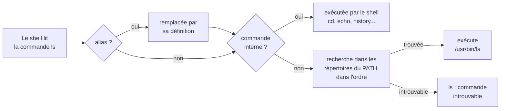

[Sommaire](../readme.md) · [← Étape 4](04-copier-deplacer-supprimer.md) · **Étape 5 / 10** · [Étape 6 →](06-filtres-pipes.md)

# Étape 5 — Rechercher des fichiers et du texte

- **Objectif** : trouver un fichier par son nom, une ligne de texte dans un fichier, et l'emplacement d'une commande
- **Commandes** : `find` · `grep` · `which` · `type`
- **À produire** : 3 fichiers dans `workspace/preuves/`
- **Aides** : [Aide-mémoire](../aide/memo.md) · [Guide de man](../aide/man.md) · [Dépannage](../aide/depannage.md)

---

## Comprendre

Dans un système avec des milliers de fichiers, savoir chercher efficacement est essentiel. Linux offre des outils puissants pour trouver des fichiers par leur nom et pour chercher du texte à l'intérieur des fichiers.

### Rechercher des fichiers

Parcourt l'arborescence pour trouver des fichiers selon des critères (nom, type, taille, date...).

- Recherche insensible à la casse : ignore majuscules/minuscules (ex: "Fruits" = "fruits" = "FRUITS")
- Jokers : `*` remplace n'importe quelle séquence de caractères
- Guillemets : écrivez le motif entre guillemets (`"*fruits*"`), sinon le shell remplace lui-même `*` par les noms de fichiers du dossier courant avant de lancer la commande

### Rechercher du texte

Analyse le contenu des fichiers ligne par ligne.

- Numéros de ligne : utile pour localiser précisément où se trouve le texte
- Expressions régulières : motifs de recherche puissants (avancé)

### Trouver une commande : la variable `PATH`

`PATH` est la liste des répertoires où le shell cherche les commandes exécutables.

- `which` : trouve le chemin complet d'un exécutable
- `type` : indique si un nom est un alias, un builtin, ou un fichier exécutable

Ce que fait le shell quand vous tapez une commande :



---

## À réaliser

> [!IMPORTANT]
> Le script ne voit pas votre écran : chaque résultat s'enregistre dans `workspace/preuves/` avec une redirection `commande > fichier`. Affichez d'abord le résultat à l'écran, puis relancez la même commande (flèche ↑) en ajoutant la redirection.

### Tâche 1 — Rechercher des fichiers par leur nom

Rechercher sous `data/` tous les fichiers dont le nom contient "fruits" (sans tenir compte de la casse), et enregistrer le résultat dans `workspace/preuves/find_fruits.txt`.

- **Résultat** : le fichier `workspace/preuves/find_fruits.txt`
- **Documentation** : [`man find`](#man-find)

Pour contrôler :

```bash
cat workspace/preuves/find_fruits.txt
```

<details>
<summary>💡 Indice</summary>

La syntaxe est `find DÉPART CRITÈRE MOTIF`. Le motif doit contenir des jokers (`*fruits*`), entre guillemets pour que le shell ne le remplace pas lui-même. `-name` distingue majuscules et minuscules : `data/` contient un fichier dont le nom commence par une majuscule.

</details>

### Tâche 2 — Rechercher du texte dans un fichier

Dans le fichier `data/fruits.txt`, trouver les lignes contenant "poire" (quelle que soit la casse) avec leurs numéros de ligne, et enregistrer le résultat dans `workspace/preuves/grep_poire.txt`.

- **Résultat** : le fichier `workspace/preuves/grep_poire.txt`
- **Documentation** : [`man grep`](#man-grep)

Pour contrôler :

```bash
cat workspace/preuves/grep_poire.txt
```

<details>
<summary>💡 Indice</summary>

Deux options sont nécessaires : l'une ignore la casse, l'autre préfixe chaque ligne par son numéro. Les options se combinent.

</details>

### Tâche 3 — Trouver le chemin d'une commande

Trouver le chemin complet de l'interpréteur Python (`python3`) et l'enregistrer dans `workspace/preuves/which_python3.txt`.

- **Résultat** : le fichier `workspace/preuves/which_python3.txt`
- **Documentation** : [`man which`](#man-which)

### Tâche 4 — Comparer les types de commandes

Comparer ce qu'affichent `type cd`, `type ls` et `type python3` (non vérifié).

```bash
type cd
type ls
type python3
```

- **Résultat** : rien à enregistrer ; observez la différence entre une commande intégrée au shell et un fichier exécutable
- **Documentation** : [`help type`](#help-type)

---

## Documentation

### `man find`

```text
$ man find
SYNOPSIS
       find [-H] [-L] [-P] [-D debugopts] [-Olevel] [starting-point...] [ex‐
       pression]

       -iname pattern
              Like  -name,  but the match is case insensitive.  For example,
              the patterns `fo*' and  `F??'  match  the  file  names  `Foo',
              `FOO', `foo', `fOo', etc.

       -name pattern
              Base  of  file name (the path with the leading directories re‐
              moved) matches shell pattern pattern.
```

`find DÉPART -name MOTIF` cherche les fichiers dont le nom correspond au motif ; `-iname` fait de même sans tenir compte de la casse.

### `man grep`

```text
$ man grep
SYNOPSIS
       grep [OPTION...] PATTERNS [FILE...]

       -i, --ignore-case
              Ignore  case  distinctions in patterns and input data, so that
              characters that differ only in case match each other.

       -n, --line-number
              Prefix each line of output with the 1-based line number within
              its input file.
```

`grep -i` ignore la casse ; `grep -n` préfixe chaque ligne par son numéro.

### `man which`

```text
$ man which
SYNOPSIS
       which [-as] filename ...
DESCRIPTION
       which  returns  the  pathnames of the files (or links) which would be
       executed in the current environment, [...] It does this by
       searching the PATH for executable files matching the names of the ar‐
       guments.
```

`which` cherche un exécutable dans les dossiers de la variable `PATH`.

### `help type`

```text
$ help type
type: type [-afptP] nom [nom ...]
    Affiche des informations sur le type de commande.

    Pour chaque NOM, indique comment il serait interprété s'il était
    utilisé comme un nom de commande.
```

`type` indique si un nom est un alias, une commande intégrée (primitive) ou un fichier.

---

## Valider

```bash
python3 verify.py 5
```

Quand tout est juste :

```text
  → Étape 5 validée (3/3). Étape suivante : 6 (etapes/06-filtres-pipes.md).
```

---

[Sommaire](../readme.md) · [← Étape 4](04-copier-deplacer-supprimer.md) · **Étape 5 / 10** · [Étape 6 →](06-filtres-pipes.md)
