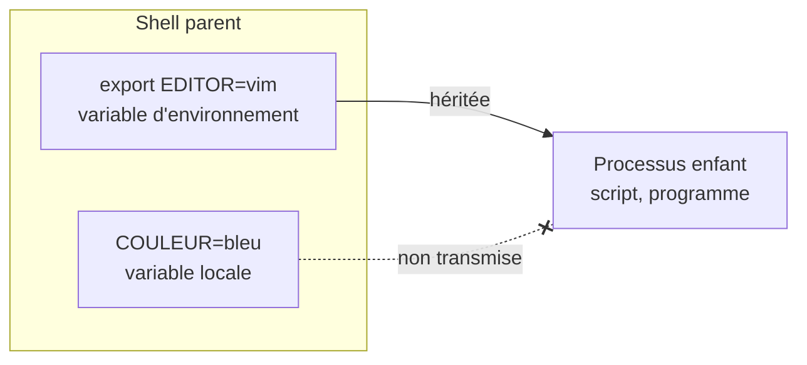

[Sommaire](../readme.md) · [← Étape 8](08-liens-permissions.md) · **Étape 9 / 10** · [Étape 10 →](10-processus.md)

# Étape 9 — Variables d'environnement et alias

- **Objectif** : comprendre la différence entre une variable locale et une variable exportée, créer un raccourci de commande
- **Commandes** : `export` · `alias` · `echo` · `bash -c`
- **À produire** : la variable `MYVAR` exportée, et le fichier `workspace/preuves/alias.txt`
- **Aides** : [Aide-mémoire](../aide/memo.md) · [Guide de man](../aide/man.md) · [Dépannage](../aide/depannage.md)

---

## Comprendre

Le shell Bash vous permet de personnaliser votre environnement de travail avec des **variables** et des **alias** pour gagner du temps et adapter le comportement des programmes.

### Variables shell

Elles stockent des valeurs (texte, nombres, chemins...).

```bash
MYVAR="valeur"     # déclaration : sans espaces autour du =
echo $MYVAR        # utilisation : $MYVAR ou ${MYVAR}
```

Scope : par défaut, visible uniquement dans le shell courant.

Variables importantes :

- `HOME` : votre dossier personnel
- `PATH` : où chercher les exécutables
- `USER` : votre nom d'utilisateur

### Export

Rend une variable visible par les programmes lancés depuis le shell.

- Sans export : la variable reste locale au shell
- Avec export : les sous-processus (programmes enfants) peuvent la lire

```bash
export PATH=/usr/local/bin:$PATH
```

### Processus enfant

Chaque commande lancée depuis le shell (par exemple `python3 verify.py`) est un processus enfant, qui reçoit une copie des variables **exportées** seulement. Les alias, eux, ne sont jamais transmis.



### Alias

Raccourcis pour des commandes fréquentes. Valables uniquement dans la session courante (sauf si ajoutés à `~/.bashrc`).

```bash
alias nom='commande complète'    # syntaxe
alias ll='ls -la'                # exemples courants
alias ..='cd ..'
```

---

## À réaliser

> [!IMPORTANT]
> Faites toute l'étape **dans le même terminal**, y compris la validation : chaque terminal a son propre shell, avec ses propres variables et alias.

### Tâche 1 — Créer une variable

Créer une variable `MYVAR` avec une valeur de votre choix (sans l'exporter), et l'afficher :

```bash
echo $MYVAR
```

### Tâche 2 — Observer un processus enfant

Lancer la commande suivante : elle démarre un nouveau shell, enfant du vôtre. Que constatez-vous ?

```bash
bash -c 'echo "MYVAR vaut : $MYVAR"'
```

### Tâche 3 — Exporter la variable

Exporter `MYVAR`, puis relancer la commande de la tâche 2.

- **Résultat** : `MYVAR` exportée, visible par les processus enfants (dont `verify.py`)
- **Documentation** : [`help export`](#help-export)

### Tâche 4 — Créer un alias

Créer un alias `verif` qui lance `python3 verify.py --step`, puis l'utiliser :

```bash
verif 9
```

- **Documentation** : [`help alias`](#help-alias)

### Tâche 5 — Enregistrer ses alias

Enregistrer la liste de vos alias dans `workspace/preuves/alias.txt`.

- **Résultat** : le fichier `workspace/preuves/alias.txt`, qui contient l'alias `verif`
- **Documentation** : [`help alias`](#help-alias)

Pour contrôler :

```bash
cat workspace/preuves/alias.txt
```

---

## Pour aller plus loin

Bonus (non obligatoire) : rendre l'alias permanent en ajoutant sa définition à la fin de `~/.bashrc`, puis ouvrir un nouveau terminal pour vérifier.

> [!CAUTION]
> `>>` ajoute à la fin du fichier, `>` effacerait toute votre configuration !

---

## Documentation

### `help export`

```text
$ help export
export: export [-fn] [nom[=valeur] ...] ou export -p
    Définit l'attribut « export » pour des variables du shell.

    Marque chaque NOM pour exportation automatique vers l'environnement des
    commandes exécutées ultérieurement.  Si VALEUR est fournie, affecte la VALEUR
    avant l'exportation.
```

Pour voir toutes les variables exportées : `env` ou `printenv`.

### `help alias`

```text
$ help alias
alias: alias [-p] [nom[=valeur] ... ]
    Définit ou affiche des alias.

    Sans argument, « alias » affiche la liste des alias dans le format réutilisable
    « alias NOM=VALEUR » sur la sortie standard.

    Sinon, un alias est défini pour chaque NOM dont la VALEUR est donnée.
```

Pour voir tous les alias : `alias` sans argument.

---

## Valider

Depuis le terminal où vous avez exporté `MYVAR` :

```bash
python3 verify.py 9
```

Le script est un processus enfant de votre shell : il ne voit `MYVAR` que si elle est exportée, c'est exactement ce qu'il vérifie.

Quand tout est juste :

```text
  → Étape 9 validée (2/2). Étape suivante : 10 (etapes/10-processus.md).
```

---

[Sommaire](../readme.md) · [← Étape 8](08-liens-permissions.md) · **Étape 9 / 10** · [Étape 10 →](10-processus.md)
