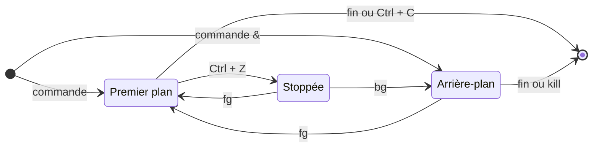

[Sommaire](../readme.md) · [← Étape 9](09-variables-alias.md) · **Étape 10 / 10**

# Étape 10 — Processus et ressources

- **Objectif** : observer les processus, lancer une commande en arrière-plan, la terminer, surveiller l'espace disque
- **Commandes** : `ps` · `jobs` · `pgrep` · `pkill` · `kill` · `df`
- **À produire** : 1 réponse (le script vous la demandera), les fichiers `workspace/preuves/sleep.pid` et `workspace/preuves/disque.txt`
- **Aides** : [Aide-mémoire](../aide/memo.md) · [Guide de man](../aide/man.md) · [Dépannage](../aide/depannage.md)

---

## Comprendre

Sous Linux, chaque programme en cours d'exécution est un **processus**. Savoir les observer, les contrôler et surveiller les ressources système est essentiel pour gérer votre environnement.

### Processus

Instance d'un programme en cours d'exécution.

- Chaque processus a un **PID** (Process ID) unique
- Hiérarchie parent/enfant : chaque processus (sauf init) a un parent

### Avant-plan et arrière-plan

- **Avant-plan (foreground)** : occupe le terminal, vous ne pouvez rien faire d'autre
- **Arrière-plan (background)** : s'exécute en parallèle, vous gardez la main sur le terminal

```bash
commande &    # ajouter & à la fin d'une commande la lance en arrière-plan
```



### Gérer les processus

- Lister : voir tous les processus en cours (ps, top, htop...)
- Filtrer : trouver un processus par nom ou critère
- Terminer : envoyer un signal pour arrêter un processus (proprement ou brutalement)

Signaux courants :

| Signal | Numéro | Effet |
|---|---|---|
| `SIGTERM` | 15 | demande d'arrêt propre (par défaut) |
| `SIGKILL` | 9 | arrêt brutal, sans nettoyage |

### Ressources système

- Espace disque : voir l'occupation des systèmes de fichiers
- Option `-h` : affichage "human-readable" (Ko, Mo, Go...)

---

## À réaliser

### Tâche 1 — Trouver le PID de son shell

Afficher la liste de vos processus en cours, et repérer le PID du shell (bash) de votre terminal.

- **Résultat** : le PID du shell, que le script vous demandera
- **Documentation** : [`man ps`](#man-ps)

<details>
<summary>💡 Indice</summary>

Sans option, `ps` affiche les processus du terminal courant : repérez la ligne `bash`, colonne `PID`. Lancez ensuite `verify.py` depuis ce même terminal.

</details>

### Tâche 2 — Lancer un processus en arrière-plan

Lancer un processus simple en arrière-plan (notez le numéro de tâche et le PID affichés), puis afficher les tâches du shell :

```bash
sleep 1000 &
jobs
```

### Tâche 3 — Enregistrer le PID du processus

Trouver le PID de ce processus `sleep` et l'enregistrer dans `workspace/preuves/sleep.pid`.

- **Résultat** : le fichier `workspace/preuves/sleep.pid`
- **Documentation** : [`man pgrep`](#man-pgrep)

<details>
<summary>💡 Indice</summary>

Redirigez vers ce fichier la sortie de `pgrep`, **avant** de terminer le processus. Sur une machine partagée, `pgrep sleep` trouve aussi les `sleep` des autres utilisateurs : limitez la recherche aux vôtres.

</details>

### Tâche 4 — Terminer le processus

Terminer ce processus en utilisant son nom ou son PID.

- **Résultat** : le `sleep` enregistré à la tâche 3 ne tourne plus
- **Documentation** : [`help kill`](#help-kill) · [`man pgrep`](#man-pgrep) (`pkill`)

Pour contrôler (le `sleep` ne doit plus apparaître « En cours d'exécution ») :

```bash
jobs
```

### Tâche 5 — Mesurer l'espace disque

Enregistrer l'espace disque disponible, en format lisible (humain), dans `workspace/preuves/disque.txt`.

- **Résultat** : le fichier `workspace/preuves/disque.txt`, avec des tailles en K, M, G...
- **Documentation** : [`man df`](#man-df)

---

## Documentation

### `man ps`

```text
$ man ps
DESCRIPTION
       ps displays information about a selection of the active processes.

       -u userlist
              Select  by effective user ID (EUID) or name.  This selects the
              processes whose effective user name or ID is in userlist.
```

- Pour lister vos processus : `ps -u $(whoami)` ou `ps -u $USER`
- `$(whoami)` est une substitution de commande : exécute `whoami` et utilise le résultat

### `man pgrep`

```text
$ man pgrep
SYNOPSIS
       pgrep [options] pattern
       pkill [options] pattern
DESCRIPTION
       pgrep looks through the currently running  processes  and  lists  the
       process  IDs  which  match the selection criteria to stdout.

       -u, --euid euid,...
              Only  match  processes  whose effective user ID is listed.
```

Sur une machine partagée, `pgrep sleep` trouve aussi les `sleep` des autres utilisateurs : limitez la recherche aux vôtres.

### `help kill`

```text
$ help kill
kill: kill [-s sigspec | -n signum | -sigspec] pid | jobspec ... ou kill -l [sigspec]
    Envoie un signal à une tâche.

    Envoie le signal nommé par SIGSPEC ou SIGNUM au processus identifié par
    PID ou JOBSPEC. Si SIGSPEC et SIGNUM ne sont pas donnés, alors SIGTERM est
    envoyé.
```

### `man df`

```text
$ man df
       -h, --human-readable
              print sizes in powers of 1024 (e.g., 1023M)
```

---

## Valider

Depuis le terminal où vous avez lancé `sleep` :

```bash
python3 verify.py 10
```

Le script vous demande le PID de votre shell et vérifie que le `sleep` enregistré est bien terminé.

Quand tout est juste :

```text
  → Étape 10 validée (3/3).
```

---

## Fin du TP

Affichez votre progression complète :

```bash
python3 verify.py
```

Objectif : `38/38 tâches réussies.` et le message « Toutes les étapes sont validées. Bravo ! ». Pour tout rejouer en détail : `python3 verify.py --all`.

Pour continuer, les autres travaux pratiques du cours sont listés dans le [README du cours](../../README.md#travaux-pratiques).

---

[Sommaire](../readme.md) · [← Étape 9](09-variables-alias.md) · **Étape 10 / 10**
