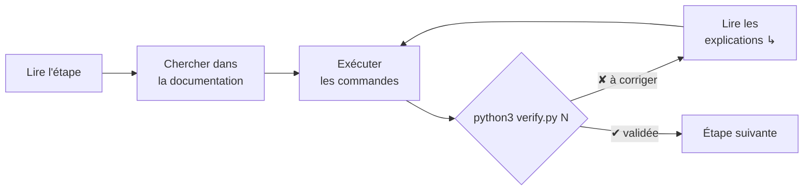

# TP "Commandes de base Linux"

Parcours progressif, guidé, et vérifié automatiquement : 10 étapes pour apprendre les commandes de base en les pratiquant.

**Sommaire** : [Présentation](#présentation) · [Démarrer](#démarrer) · [Les 10 étapes](#les-10-étapes) · [Méthode de travail](#méthode-de-travail) · [Aides](#aides) · [Organisation du dossier](#organisation-du-dossier)

---

## Présentation

- **Contexte** : vous démarrez sous Linux et vous souhaitez "apprendre en faisant". Ce TP vous guide pas à pas pour manipuler le système de fichiers, rechercher, filtrer, archiver, gérer des liens, variables, et observer les processus.
- **Contraintes** : pas de sudo; tout se fait dans votre dossier personnel ($HOME, supposé être /home/user).
- **Vérification** : un script Python vérifie à chaque étape l'état final (résultat concret) et, en cas d'erreur, explique ce qu'il a trouvé et donne une piste pour corriger.
- **Philosophie** : l'énoncé ne donne pas forcément la commande exacte. Vous trouverez la commande et ses options dans les extraits de documentation fournis et dans le manuel (man).

Prérequis : un terminal Linux avec `bash`, `git` et `python3`.

---

## Démarrer

### 1. Cloner le TP

```bash
git clone https://github.com/fabrice1618/intro_linux_tp.git
cd intro_linux_tp/tp_start
```

### 2. Initialiser les fichiers de départ

```bash
bash setup.sh
```

Le script crée les fichiers de départ dans `data/` et votre espace de travail `workspace/` :

```text
Préparation terminée.
  Progression du TP   : python3 verify.py
  Vérifier l'étape 1  : python3 verify.py 1
```

### 3. Afficher votre progression

```bash
python3 verify.py
```

Le tableau liste les 10 étapes, ce qui est déjà réussi, et la prochaine étape à faire. Vous êtes prêt : commencez par l'**[étape 1](etapes/01-aide-historique.md)**.

---

## Les 10 étapes

Faites-les dans l'ordre : chaque étape utilise ce que les précédentes ont appris ou créé.

| N° | Étape | Commandes |
|---|---|---|
| 1 | [Trouver de l'aide, historique, horloge](etapes/01-aide-historique.md) | `man` `--help` `help` `history` `date` |
| 2 | [Se repérer dans l'arborescence](etapes/02-arborescence.md) | `pwd` `cd` `ls` `cat` |
| 3 | [Créer dossiers et fichiers](etapes/03-creer.md) | `mkdir` `touch` `echo` `cat` `>` `>>` |
| 4 | [Copier, déplacer, renommer, supprimer](etapes/04-copier-deplacer-supprimer.md) | `cp` `mv` `rm` `rmdir` |
| 5 | [Rechercher des fichiers et du texte](etapes/05-rechercher.md) | `find` `grep` `which` `type` |
| 6 | [Filtres et redirections (pipes)](etapes/06-filtres-pipes.md) | `head` `tail` `sort` `uniq` `wc` `tr` `cut` `\|` |
| 7 | [Archiver et compresser](etapes/07-archiver.md) | `tar` |
| 8 | [Liens symboliques et permissions](etapes/08-liens-permissions.md) | `ln` `chmod` |
| 9 | [Variables d'environnement et alias](etapes/09-variables-alias.md) | `export` `alias` |
| 10 | [Processus et ressources](etapes/10-processus.md) | `ps` `jobs` `pgrep` `kill` `df` `&` |

---

## Méthode de travail

Divisez l’écran: à gauche votre terminal, à droite l’énoncé. Avancez calmement, lisez les intros, cherchez les commandes dans man, exécutez, puis validez avec le script.



### Mode d'emploi rapide

| Phase | Comment |
|---|---|
| **Préparer** | `bash setup.sh` |
| **Travailler** | lisez l'intro de l'étape, trouvez les commandes via les extraits de documentation et man, réalisez l'objectif observable (résultat concret dans les fichiers) |
| **Vérifier** | `python3 verify.py N`, corrigez les points ✘ en suivant les explications, puis relancez |
| **Consolider** | `python3 verify.py` pour voir votre progression, `python3 verify.py --all` pour tout rejouer en détail |

### Le plan d'une page d'étape

Chaque étape inclut les mêmes parties, dans le même ordre :

| Partie | Contenu |
|---|---|
| En-tête | l'objectif, les commandes utilisées, ce qu'il faut produire |
| **Comprendre** | les concepts, avec des exemples |
| **À réaliser** | les tâches ; chacune indique son résultat attendu, un lien vers sa documentation, une commande pour contrôler, et parfois un 💡 indice à déplier |
| **Documentation** | les options utiles, telles que les affichent `man` ou `help` |
| **Valider** | la commande de vérification et le message obtenu quand tout est juste |

### Les bons réflexes

- Cherchez d'abord seul dans la documentation ; n'ouvrez l'indice qu'ensuite.
- Perdu ? `pwd` indique où vous êtes, `ls` ce qu'il y a ici.
- **Astuce man** : utilisez `man <commande>`, `/mot` pour chercher dans la page, `n` pour "suivant", `q` pour quitter.
- La touche **Tab** complète les noms de fichiers : moins de frappe, moins de fautes.
- Le script vérifie le résultat, pas la manière : plusieurs commandes peuvent convenir.

---

## Aides

| Page | Quand l'ouvrir |
|---|---|
| [Aide-mémoire](aide/memo.md) | retrouver une commande, une option, la syntaxe d'un chemin ou d'une redirection |
| [Guide de man](aide/man.md) | naviguer et chercher dans une page de manuel ; choisir entre `man`, `--help` et `help` |
| [Script de vérification](aide/verification.md) | comprendre ce qu'affiche `verify.py` : symboles, preuves, questions |
| [Dépannage](aide/depannage.md) | un message d'erreur, un terminal bloqué, un fichier introuvable, recommencer le TP |

---

## Organisation du dossier

```text
tp_start/
├── readme.md       ← cette page : sommaire du TP
├── etapes/         ← l'énoncé, une page par étape
├── aide/           ← aide-mémoire, guide de man, script de vérification, dépannage
├── data/           ← fichiers de départ, créés par setup.sh : ne jamais les modifier
├── workspace/      ← votre espace de travail
│   └── preuves/    ← résultats enregistrés pour le script de vérification
├── setup.sh        ← prépare (ou restaure) les fichiers de départ
└── verify.py       ← vérifie votre travail
```

Bon TP, et bonne exploration de la ligne de commande !
